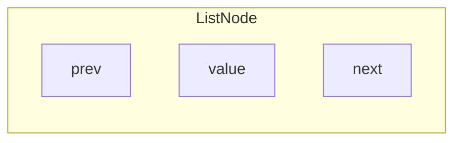
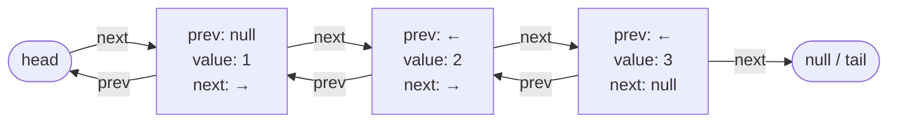
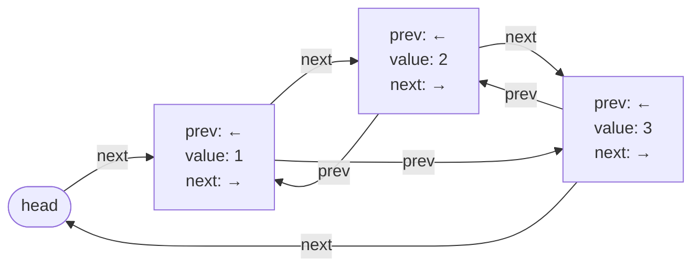

# Doubly Linked Lists

## What is Doubly Linked List?

A doubly linked list is a type of linked list where each node contains
- **value** - The actual **data** (exp: character, integer, object, etc)
- **next** - The **reference (or pointer)** to the **next node** in the sequence
- **prev** - The **reference (or pointer)** to the **previous node** in the sequence



<Callout type="important">
  Remember, the concept of doubly linked list is similar to singly linked list, but with an additional pointer (**prev**) that points to the previous node, allowing traversal in both directions (forward and backward).
</Callout>

| Operation | Big-O Time | Notes |
| --------- | :----------:| ----- |
| Access (by index) | O(n) | Must traverse nodes; can start from head or tail (avg ~ n/2 → O(n)) |
| Search (by value) | O(n) | Linear scan |
| Insert (given node reference) | O(1) | Update prev/next pointers |
| Insert (by index) | O(n) | Need to find insertion point first |
| Delete (given node reference) | O(1) | O(1) because prev pointer is available |
| Delete (by index/value) | O(n) | Must locate node first |
| Display / Traverse | O(n) | Visit every node |

### How it works?

Nodes are **linked together in a chain** through the **"next" and "prev" pointers**. You will start at the **head** and follow the pointers from one node to the next until you reach the **null** (end of the list). You can also traverse backward from the **tail** to the **head** using the **"prev" pointers**.

Image we have a list of numbers like;


- The **head** points to the node `1`
- The **tail** points to `null`
- The node for `1` has a **"prev"** pointer that points to `null` and a **"next"** pointer that points to the node with `2`. This continues until the node with `3`, whose **"next"** pointer is `null` and **"prev"** pointer points to the node with `2`.

### Circular Doubly Linked List

A **circular doubly linked list** is similar to a standard doubly linked list, but the **last node's "next" pointer points back to the head node** instead of `null`, and the **head node's "prev" pointer points to the last node**. This creates a circular structure that allows for continuous traversal in both directions.



## Doubly Linked List Implementation

<Tabs items={['Doubly Linked List', 'Circular Doubly Linked List']}>

  <Tab>
  ```python filename="doubly_linked_list.py"
  class Node:
      def __init__(self, value) -> None:
          self.value = value
          self.prev = None
          self.next = None

  class DoublyLinkedList:
      def __init__(self) -> None:
          self.head = None
          self.tail = None
          self.size = 0

      def append(self, data) -> None:
          new_node = Node(data)
          if not self.head:
              self.head = new_node
              self.tail = new_node
          else:
              new_node.prev = self.tail
              self.tail.next = new_node
              self.tail = new_node
          self.size += 1

      def prepend(self, data) -> None:
          new_node = Node(data)
          if not self.head:
              self.head = new_node
              self.tail = new_node
          else:
              new_node.next = self.head
              self.head.prev = new_node
              self.head = new_node
          self.size += 1

      def insert(self, index: int, data) -> None:
          if index < 0 or index > self.size:
              raise IndexError("Index out of bounds")

          if index == 0:
              self.prepend(data)
          elif index == self.size:
              self.append(data)
          else:
              new_node = Node(data)
              current = self.head

              for _ in range(index):
                  current = current.next
              prev_node = current.prev
              new_node.prev = prev_node
              new_node.next = current
              prev_node.next = new_node
              current.prev = new_node
              self.size += 1

      def get(self, index: int):
          if index < 0 or index >= self.size:
              raise IndexError("Index out of bounds")

          current = self.head
          for _ in range(index):
              current = current.next
          return current.value

      def remove(self, index: int):
          if index < 0 or index >= self.size:
              raise IndexError("Index out of bounds")

          if index == 0:
              data = self.head.value
              if self.head == self.tail:
                  self.head = self.tail = None
              else:
                  self.head = self.head.next
                  self.head.prev = None
              self.size -= 1
              return data
          elif index == self.size - 1:
              return self.pop()
          else:
              current = self.head
              for _ in range(index):
                  current = current.next
              prev_node = current.prev
              prev_node.next = current.next
              current.next.prev = prev_node
              self.size -= 1
              return current.value

      def push(self, data) -> None:
          self.prepend(data)

      def pop(self):
          if self.is_empty():
              raise IndexError("Pop from empty list")

          # remove from end
          data = self.tail.value
          if self.head == self.tail:
              self.head = self.tail = None
          else:
              self.tail = self.tail.prev
              self.tail.next = None
          self.size -= 1
          return data

      def is_empty(self) -> bool:
          return self.size == 0

      def __len__(self) -> int:
          return self.size

      def display(self) -> None:
          current = self.head
          res = []
          while current:
              res.append(str(current.value))
              current = current.next
          print(" -> ".join(res))

  doubly_linked_list = DoublyLinkedList()
  doubly_linked_list.append(10)
  doubly_linked_list.append(20)
  doubly_linked_list.append(30)
  doubly_linked_list.display()

  doubly_linked_list.insert(1, 15)
  doubly_linked_list.display()

  doubly_linked_list.prepend(5)
  doubly_linked_list.display()

  doubly_linked_list.pop()
  doubly_linked_list.display()

  doubly_linked_list.remove(1)
  doubly_linked_list.display()
  ```
  </Tab>

  <Tab>
  ```python filename="circular_doubly_linked_list.py"
  class Node:
      def __init__(self, value) -> None:
          self.value = value
          self.prev = None
          self.next = None

  class CircularDoublyLinkedList:
      def __init__(self) -> None:
          self.head = None
          self.size = 0

      def append(self, data) -> None:
          new_node = Node(data)
          if not self.head:
              self.head = new_node
              self.head.next = new_node
              self.head.prev = new_node
          else:
              # Insert before head (which makes it the new tail)
              tail = self.head.prev

              new_node.next = self.head
              new_node.prev = tail
              tail.next = new_node
              self.head.prev = new_node
          self.size += 1

      def prepend(self, data) -> None:
          new_node = Node(data)
          if not self.head:
              self.head = new_node
              self.head.next = new_node
              self.head.prev = new_node
          else:
              tail = self.head.prev

              new_node.next = self.head
              new_node.prev = tail
              tail.next = new_node
              self.head.prev = new_node
              self.head = new_node
          self.size += 1

      def insert(self, index: int, data) -> None:
          if index < 0 or index > self.size:
              raise IndexError("Index out of bounds")

          if index == 0:
              self.prepend(data)
          elif index == self.size:
              self.append(data)
          else:
              new_node = Node(data)
              current = self.head

              for _ in range(index):
                  current = current.next

              new_node.prev = current.prev
              new_node.next = current
              current.prev.next = new_node
              current.prev = new_node
              self.size += 1

      def get(self, index: int):
          if index < 0 or index >= self.size:
              raise IndexError("Index out of bounds")

          current = self.head
          for _ in range(index):
              current = current.next
          return current.value

      def remove(self, index: int):
          if index < 0 or index >= self.size:
              raise IndexError("Index out of bounds")

          if index == 0:
              if self.size == 1:
                  self.head = None
              else:
                  tail = self.head.prev
                  self.head = self.head.next
                  tail.next = self.head
                  self.head.prev = tail
              self.size -= 1
          elif index == self.size - 1:
              self.pop()
          else:
              current = self.head
              for _ in range(index):
                  current = current.next
              current.prev.next = current.next
              current.next.prev = current.prev
              self.size -= 1

      def push(self, data) -> None:
          self.prepend(data)

      def pop(self):
          if self.is_empty():
              raise IndexError("Pop from empty list")

          if self.size == 1:
              data = self.head.value
              self.head = None
          else:
              tail = self.head.prev
              data = tail.value
              new_tail = tail.prev
              new_tail.next = self.head
              self.head.prev = new_tail
          self.size -= 1
          return data

      def is_empty(self) -> bool:
          return self.size == 0

      def __len__(self) -> int:
          return self.size

      def display(self) -> None:
          current = self.head
          res = []

          for _ in range(self.size):
              res.append(str(current.value))
              current = current.next
          print(" -> ".join(res) + " -> (back to head)")

  circular_doubly_linked_list = CircularDoublyLinkedList()

  print('Apppending elements:', end=' ')
  circular_doubly_linked_list.append(10)
  circular_doubly_linked_list.append(20)
  circular_doubly_linked_list.append(30)
  circular_doubly_linked_list.display()

  print('Prepending element:', end=' ')
  circular_doubly_linked_list.prepend(5)
  circular_doubly_linked_list.display()

  print('Inserting element at index 2:', end=' ')
  circular_doubly_linked_list.insert(2, 15)
  circular_doubly_linked_list.display()

  print('Popping element:', end=' ')
  circular_doubly_linked_list.pop()
  circular_doubly_linked_list.display()

  print('Removing element at index 1:', end=' ')
  circular_doubly_linked_list.remove(1)
  circular_doubly_linked_list.display()

  print('Getting element at index 2:', circular_doubly_linked_list.get(2))
  ```
  </Tab>

</Tabs>

## Doubly Linked List Visualization

<DoublyLinkedListVisualization />
