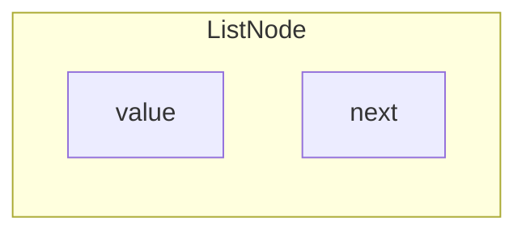

# Singly Linked Lists

## What is Linked lists?

A linked list is a **linear data structure** where elements are stored in **nodes**. Each node contains
- **value** - The actual **data** (exp: character, integer, object, etc)
- **next** - The **reference (or pointer)** to the **next node** in the sequence



<Callout type="important" title="Components of a Linked List">
  - **Node**: Each element in the linked list, containing a **value** and a **reference** to the next node
  - **Head**: The **first** node in the linked list
  - **Tail**: The **last** node in the linked list, which points to `null` (or `None` in Python)
  - **Null**: A special marker **indicating the end of the list**`
</Callout>

<Callout type="success" title="More information">
  I want to point out that **linked list** is a **linear data structure** like **array** but they are **not the same in terms of memory allocation**.
  - **Array** - 
  - **Linked List** - 
</Callout>

Arrays store elements in contiguous memory locations (all elements are next to each other in memory).
Linked lists store nodes anywhere in memory; each node points to the next, so they are not necessarily stored contiguously.
Improved version:

Arrays are stored in contiguous memory locations, but linked lists do not need to be stored this way; each node in a linked list can be located anywhere in memory.


{/* 

<Callout type="info">
    Array are stored the same way in memory but linked list does not necessarily to store the same way in memory like array.
</Callout>

**Head** is the **1st node**, while **Tail** is the **last node**. Make sure you **adjust Head/Tail node** when **appending** a new node or **removing** the node.

| Operation | Big-O Time | Notes |
| --------- | ---------- | ----- |
| Access | O(n) | Have to loop to find the exact |
| Search | O(n) | - |
| Insert | O(1) | Reference to the node (position) |
| Delete | O(1) | Reference to the node (position) |


How it works
- Nodes are linked together in a chain through the "next" pointers. 
- To move through the list, you start at the head and follow the next pointers from one node to the next until you reach null. 
- Operations like insertion and deletion can be performed by changing these next pointers

Example              
Imagine a list of numbers like 
1 -> 2 -> 3 -> 4
- The "head" points to the node containing 1
- The node for \(1\) has a "next" pointer that points to the node with \(2\)
- This continues until the node with \(4\), whose "next" pointer is null

<Tabs items={['Python']}>
  <Tab>
    ```python
    class Node:
        def __init__(self, val) -> None:
            self.val = val
            self.next = None

    class LinkedList:
        def __init__(self) -> None:
            self.head = None

        def get(self, index: int):
            if self.head is None:
                return -1
            else:
                i = 0
                curr_node = self.head
                while curr_node:
                    if i == index:
                        return curr_node.val
                    i += 1
                    curr_node = curr_node.next

        def insert_head(self, val) -> None:
            new_node = Node(val)
            if self.head is None:
                self.head = new_node
            else:
                new_node.next = self.head
                self.head = new_node

        def insert(self, val) -> None:
            new_node = Node(val)
            if self.head is None:
                self.head = new_node
            else:
                curr_node = self.head
                while curr_node.next:
                    curr_node = curr_node.next
                curr_node.next = new_node

        def remove(self, index: int):
            curr_node = self.head
            if index == 0 and curr_node:
                self.head = curr_node.next
            else:
                i = 0
                prev_node = None
                while curr_node:
                    if i == index:
                        prev_node.next = curr_node.next
                        break
                    else:
                        i += 1 
                        prev_node = curr_node
                        curr_node = curr_node.next

        def display(self) -> list:
            curr_node = self.head
            res = []
            while curr_node:
                res.append(curr_node.val)
                curr_node = curr_node.next
            return res
    ```
  </Tab>
</Tabs> */}

## Singly Linked List Implementation

## Singly Linked List Visualization

<SinglyLinkedListVisualization />