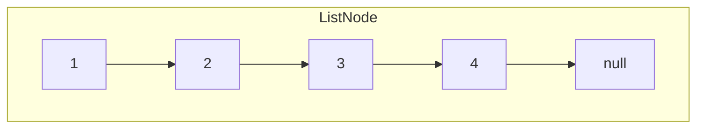
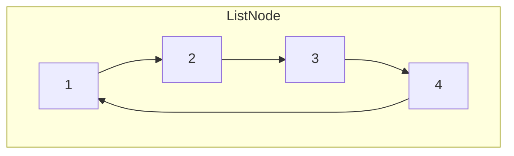

# Singly Linked Lists

## What is Linked lists?

A linked list is a **linear data structure** where elements are stored in **nodes**. Each node contains
- **value** - The actual **data** (exp: character, integer, object, etc)
- **next** - The **reference (or pointer)** to the **next node** in the sequence


<Callout type="important" title="Components of a Linked List">
  - **Node**: Each element in the linked list, containing a **value** and a **reference** to the next node
  - **Head**: The **first** node in the linked list
  - **Tail**: The **last** node in the linked list, which points to `null` (or `None` in Python)
  - **Null**: A special marker **indicating the end of the list**`
</Callout>

<Callout type="success" title="More information">
  I want to point out that **linked list** is a **linear data structure** like **array** but they are **not the same in terms of memory allocation**.
  - **Array** - Store elements in **contiguous memory locations** (all elements are next to each other in memory, for example: 1000, 1004, 1008, etc)
  - **Linked List** - Store nodes (elements) **anywhere in memory**; each node points to the next, so they are not necessarily stored contiguously.
</Callout>

| Operation | Big-O Time | Notes |
| --------- | ---------- | ----- |
| Access (by index) | O(n) | Must traverse from head (avg ~ n/2 → O(n)) |
| Search (by value) | O(n) | Linear scan |
| Insert (at head) | O(1) | Update head pointer |
| Insert (at tail) | O(n) | O(1) if you maintain a tail pointer |
| Insert (given previous node) | O(1) | Insert after a known node; otherwise O(n) |
| Delete (given previous node / head) | O(1) | O(1) when you have the previous node; deleting by node-only ref can be O(1) using the copy-trick but can't remove tail |
| Delete (by index/value) | O(n) | Must locate node (and previous) first |
| Display / Traverse | O(n) | Visit every node |

<Callout title="Real-World Applications">
- Implementation of stacks and queues
- Dynamic memory allocation
- Web browsers (Navigation history)
- Music or video playlists
</Callout>

### How it works?

Nodes are **linked together in a chain** through the **"next" pointers**. You will start at the **head** and follow the pointers from one node to the next until you reach the **null** (end of the list).

Imagine we have a list of numbers like;


- The **head** points to the node `1`
- The **tail** points to `null`
- The node for `1` has a **"next"** pointer that points to the node with `2`. This continues until the node with `4`, whose **"next"** pointer is `null`

### Circular Linked List

A **circular linked list** is actually same as a singly linked list, but the **tail node points back to the head node** instead of `null`. This creates a circular structure where you can traverse the list indefinitely.



## Singly Linked List Implementation

<Tabs items={['Singly Linked List', 'Circular Linked List']}>
  <Tab>
    ```python filename="singly_linked_list.py"
    class Node:
        def __init__(self, value) -> None:
            self.value = value
            self.next = None

    class LinkedList:
        def __init__(self) -> None:
            self.head = None
            self.size = 0

        def append(self, data) -> None:
            new_node = Node(data)
            if not self.head:
                self.head = new_node
            else:
                current = self.head
                while current.next:
                    current = current.next
                current.next = new_node
            self.size += 1

        def insert(self, index: int, data) -> None:
            if index < 0 or index > self.size:
                raise IndexError("Index out of bounds")

            new_node = Node(data)
            current = self.head
            if index == 0:
                self.prepend(data)
                return
            else:
                # You need to find the previous node before the index
                # and adjust the pointers accordingly
                prev = None
                for _ in range(index):
                    prev = current
                    current = current.next
                prev.next = new_node
                new_node.next = current
            self.size += 1

        def get(self, index: int):
            if index < 0 or index >= self.size:
                raise IndexError("Index out of bounds")

            current = self.head
            i = 0
            while current:
                if i == index:
                    return current.value
                i += 1
                current = current.next

        def remove(self, index: int):
            if index < 0 or index >= self.size:
                raise IndexError("Index out of bounds")
            if not self.head:
                raise IndexError("Pop from empty list")

            current = self.head
            if index == 0:
                self.head = current.next
            else:
                i = 0
                prev = None
                while current:
                    if i == index:
                        prev.next = current.next
                        break
                    else:
                        i += 1
                        prev = current
                        current = current.next
            self.size -= 1

        def prepend(self, data) -> None:
            new_node = Node(data)
            if self.head:
                new_node.next = self.head
            self.head = new_node
            self.size += 1

        def push(self, data) -> None:
            self.prepend(data)

        def pop(self):
            if not self.head:
                raise IndexError("Pop from empty list")
            prev = None
            current = self.head
            while current.next:
                prev = current
                current = current.next

            # current is tail
            if prev:
                prev.next = None
            else:
                # only one element
                self.head = None
            self.size -= 1

        def is_empty(self) -> bool:
            return self.size == 0

        def __len__(self) -> int:
            return self.size

        def display(self) -> None:
            current = self.head
            res = []
            while current:
                res.append(str(current.value))
                current = current.next
            print(" -> ".join(res))

    linked_list = LinkedList()
    linked_list.append(10)
    linked_list.append(20)
    linked_list.append(30)
    linked_list.display()

    linked_list.insert(1, 15)
    linked_list.display()

    linked_list.prepend(5)
    linked_list.display()

    linked_list.pop()
    linked_list.display()

    linked_list.remove(1)
    linked_list.display()
    ```
  </Tab>
  <Tab>
    ```python filename="circular_linked_list.py"
    class Node:
        def __init__(self, value) -> None:
            self.value = value
            self.next = None

    class CircularLinkedList:
        def __init__(self) -> None:
            self.head = None
            self.size = 0

        def append(self, data) -> None:
            new_node = Node(data)
            if not self.head:
                self.head = new_node
                self.head.next = self.head # point to itself
            else:
                current = self.head
                while current.next != self.head:
                    current = current.next
                current.next = new_node
                new_node.next = self.head
            self.size += 1

        def insert(self, index: int, data) -> None:
            if index < 0 or index > self.size:
                raise IndexError("Index out of bounds")

            new_node = Node(data)
            
            if self.head is None:
                if index != 0:
                    raise IndexError("Index out of bounds")
                self.head = new_node
                self.head.next = self.head
            elif index == 0:
                current = self.head
                while current.next != self.head:
                    current = current.next
                current.next = new_node
                new_node.next = self.head
                self.head = new_node
            else:
                current = self.head
                prev = None
                for _ in range(index):
                    prev = current
                    current = current.next
                prev.next = new_node
                new_node.next = current
            self.size += 1

        def get(self, index: int):
            if index < 0 or index >= self.size:
                raise IndexError("Index out of bounds")

            current = self.head
            i = 0
            while current:
                if i == index:
                    return current.value
                i += 1
                current = current.next

        def remove(self, index: int):
            if index < 0 or index >= self.size:
                raise IndexError("Index out of bounds")
            if not self.head:
                raise IndexError("Pop from empty list")

            if self.size == 1:
                self.head = None

            current = self.head
            if index == 0:
                while current.next != self.head:
                    current = current.next
                current.next = self.head.next
                self.head = self.head.next
            else:
                prev = None
                for _ in range(index):
                    prev = current
                    current = current.next
                prev.next = current.next
            self.size -= 1

        def prepend(self, data) -> None:
            new_node = Node(data)
            if not self.head:
                self.head = new_node
                self.head.next = self.head
            else:
                current = self.head
                while current.next != self.head:
                    current = current.next
                current.next = new_node
                new_node.next = self.head
                self.head = new_node
            self.size += 1

        def push(self, data) -> None:
            self.prepend(data)

        def pop(self):
            if not self.head:
                raise IndexError("Pop from empty list")

            popped_value = self.head.value
            if self.head.next == self.head:
                self.head = None
            else:
                prev = None
                current = self.head
                while current.next != self.head:
                    prev = current
                    current = current.next
                popped_value = current.value
                prev.next = self.head
            self.size -= 1
            return popped_value

        def is_empty(self) -> bool:
            return self.size == 0

        def __len__(self) -> int:
            return self.size

        def display(self) -> None:
            current = self.head
            res = []
            while True:
                res.append(str(current.value))
                current = current.next
                if current == self.head:
                    break
            print(" -> ".join(res) + " -> (back to head)")

    circular_linked_list = CircularLinkedList()

    print('Apppending elements:', end=' ')
    circular_linked_list.append(10)
    circular_linked_list.append(20)
    circular_linked_list.append(30)
    circular_linked_list.display()

    print('Inserting element at index 1:', end=' ')
    circular_linked_list.insert(1, 15)
    circular_linked_list.display()

    print('Prepending element:', end=' ')
    circular_linked_list.prepend(5)
    circular_linked_list.display()

    print('Popping element:', end=' ')
    circular_linked_list.pop()
    circular_linked_list.display()

    print('Removing element at index 1:', end=' ')
    circular_linked_list.remove(1)
    circular_linked_list.display()

    print('Getting element at index 2:', circular_linked_list.get(2))
    ```
  </Tab>
</Tabs>

## Singly Linked List Visualization

<SinglyLinkedListVisualization />