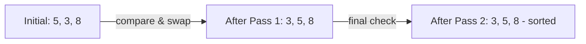

# Bubble Sort

## What is Bubble Sort?

Bubble Sort is one of the **simplest sorting algorithms** that **repeatedly steps through the list** by **comparing adjacent elements** and **swapping them** if they're in the **wrong order**. The process will continue until the list is sorted.

<Callout type="important" title="Time Complexity">
  If we talk about its **time complexity**, Bubble Sort has a **worst-case and average time complexity of O(n^2)**, where n is the number of elements in the list.

  Of course, there is a **best-case time complexity of O(n)** when the list is **already sorted**, as it only **requires a single pass** to confirm that no swaps are needed.

  However, this is not very efficient for large datasets.
</Callout>

### How it works?



Assuming we have an array `[5, 3, 8]`, here's how Bubble Sort would sort it:
- **Compare** the first two elements (5 and 3). Since `5 > 3`, we **swap** them. The array now looks like `[3, 5, 8]`.
- Next, we **compare** the second and third elements (5 and 8). Since `5 < 8`, no swap is needed.
- We **repeat the process** until we make a complete pass without any swaps, indicating that the **array is sorted**.

## Implementation

<Tabs items={['Bubble Sort', 'Enhance Bubble Sort']}>
  <Tab>
  ```python filename="bubble_sort.py"
  def bubble_sort(arr: list) -> list:
      n = len(arr)
      for i in range(n - 1):
          for j in range(n - 1 - i):
              if arr[j] > arr[j + 1]:
                  arr[j], arr[j + 1] = arr[j + 1], arr[j]
      return arr

  arr = [5, 3, 8, 6, 7]
  print(f"Unsorted array: {arr}")

  sorted_arr = bubble_sort(arr)
  print(f"Sorted array: {sorted_arr}")
  ```
  </Tab>

  <Tab>
  Here is a couple of small improvments that uses a flag to detect and exit early if the array is already sorted.

  ```python filename="enhanced_bubble_sort.py"
  def bubble_sort(arr: list) -> list:
      n = len(arr)
      for i in range(n - 1):
          swapped = False
          for j in range(n - 1 - i):
              if arr[j] > arr[j + 1]:
                  arr[j], arr[j + 1] = arr[j + 1], arr[j]
                  swapped = True
          if not swapped:
              break
      return arr

  arr = [5, 3, 8, 6, 7]
  print(f"Unsorted array: {arr}")

  sorted_arr = bubble_sort(arr)
  print(f"Sorted array: {sorted_arr}")
  ```
  </Tab>
</Tabs>

## Visualization

<BubbleSortVisualization />
