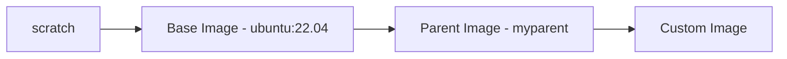

# Best Practices for creating a Docker image

## Base vs Parent vs Custom Image

<Callout>
  Before we dive into the best practices for creating a Docker image, it is important to understand the difference between **base image**, **parent image**, and **custom image**.
</Callout>



This is an example of **base image**. We can see that when an image is built from `scratch` image, it is called as **base image**.

```dockerfile filename="Dockerfile - ubuntu:22.04 (base image)"
FROM scratch
ADD 433cf0b8353e08be3a6582ad5947c57a66bdbb842ed3095246a1ff6876d157f1 /
CMD ["bash"]
```

This is an example of **parent image**. We can see that when an image is built from base image, it is called as **parent image**.

```dockerfile filename="Dockerfile - mypythonparent (parent image)"
FROM ubuntu:22.04
WORKDIR /app
# Install additional dependencies if needed
RUN apt-get update && apt-get install -y \
    python3 \
    python3-pip && \
    pip3 install -r /app/requirements.txt && \
    apt-get clean && rm -rf /var/lib/apt/lists/*
CMD ["bash"]
```

This is an example of **custom image**. We can see that when an image is built from parent image, it is called as **custom image**.

```dockerfile filename="Dockerfile - mycustomimage (custom image)"
FROM mypythonparent

# Copy application files into the container
COPY . /app

# Set environment variables
ENV APP_ENV=production \
    APP_PORT=8080

# Expose the application port
EXPOSE 8080

# Set the default command to run the application
CMD ["python3", "/app/main.py"]
```

## Best Practices for Creating a Docker Image

### Do not build images that combine multiple applications

Each image should be **focused on a single application or service**. For example, if you have a web server and a database, create separate images for each service.

This allows for **better scalability**, **maintainability**, and **reusability** of images. It also helps in **reducing the size of the images**, as each image will **only contain the necessary dependencies** for that specific application.

### Do not store data or state in the container

Containers are **ephemeral** by nature, meaning they can be **created and destroyed** at any time. Therefore, if you store data or state in the container, it will be lost when the container is removed or destroyed.

Instead, use **volumes** or any **external storage (eg, Redis)** solutions to persist data outside of the container.

### Keep images updated

Regularly **update** your **images** and **dependencies** to include the **latest security patches**.

### Scan images for vulnerabilities

Regularly **scan your images for vulnerabilities** using tools like `docker scan` or third-party tools like **Trivy**.

### Avoid installing unnecessary packages

Only **install the dependencies required** for your application to run. **Remove build tools** and **temporary files** after installation.

```dockerfile
RUN apt-get update && apt-get install -y \
  curl && \
  apt-get clean && rm -rf /var/lib/apt/lists/*
```

### Use `.dockerignore` file

**Exclude unnecessary files** and **directories** from the **build context** by using a `.dockerignore` file. This **reduces the image size** and **speeds up the build process**.

```text filename=".dockerignore"
node_modules
.git
*.log
```

### Leverage Multi-Stage Builds

Use **multi-stage builds** to separate the build environment from the runtime environment, ensuring only the necessary files are included in the final image. This helps in **reducing the image size** and **improving security** by not including build tools in the final image.

```dockerfile filename="Dockerfile"
# Stage 1: Build
FROM golang:1.20 AS builder
WORKDIR /app
COPY . .
RUN go build -o main .

# Stage 2: Runtime
FROM alpine:latest
WORKDIR /app
COPY --from=builder /app/main .
CMD ["./main"]
```

### Optimize Layers

Use the `RUN`, `COPY`, and `ADD` commands wisely to **minimize the number of layers** in your image. **Each command creates a new layer**, so combining commands can help **reduce the overall size of the image**, but **keep readability** in mind.

```dockerfile
RUN apt-get update && apt-get install -y curl && \
  apt-get clean && rm -rf /var/lib/apt/lists/*
```

### Set Explicit Tags for Base Images

Always **use specific tags** (e.g., `ubuntu:22.04`) instead of `latest` to **ensure consistent builds** and **avoid unexpected changes**. This helps in **maintaining the stability** of your application and **avoiding compatibility issues** that may arise from using the latest version of a base image.

### Use non-root user

Avoid running your application as the **root user**. Create a **non-root user** for better security. This helps in **reducing the attack surface** of your application and **preventing unauthorized access** to sensitive files and directories.

```dockerfile
RUN addgroup --system appgroup && adduser --system --ingroup appgroup appuser
USER appuser
```

### Document the Image

Use labels to document metadata about the image, such as the maintainer and version. This helps in **keeping track of the image** and **providing information** to users about the image.

Benefits in Practice
- **Automation**: Tools like CI/CD pipelines can use labels to **automate tasks** (e.g., deploying specific versions).
- **Compliance**: Metadata can include **compliance-related information**, such as licensing or security details.
- **Discoverability**: Documented images are easier to **search** and **identify** in container registries.

```dockerfile
LABEL maintainer="karchunt"
LABEL version="1.0.0"
LABEL description="A custom Docker image for my application"
```

### Look images with authenticity

Use **official images** or **verified published tag** from Docker Hub or other trusted registries.

Use **Docker Content Trust (DCT)** to ensure that the images you are using are **signed and verified**. This helps in **ensuring the authenticity** of the images and **preventing the use of malicious images**.

```bash
# Enable Docker Content Trust
export DOCKER_CONTENT_TRUST=1
```

### Use Minimal/Slim Base Images

Start with a **minimal base image** like `alpine` or `debian-slim` to reduce the image size and surface area for vulnerabilities. Only install the necessary dependencies for your application and remove any unnecessary tools like `curl`, `wget`, etc that could be used by attackers to download malicious files.

### Use Distroless Images

<Callout title="Distroless Images">
  https://github.com/GoogleContainerTools/distroless
</Callout>

Use **distroless images** for production deployments. Distroless images contain only the **application and its runtime dependencies**, without any package manager, shell, network tools, text editors or other unwanted programs. This reduces the attack surface and improves security.

For example;
- `gcr.io/distroless/python3-debian12`
- `gcr.io/distroless/base-debian12`
