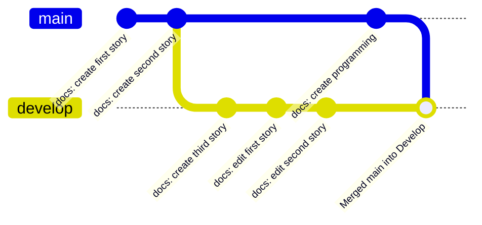
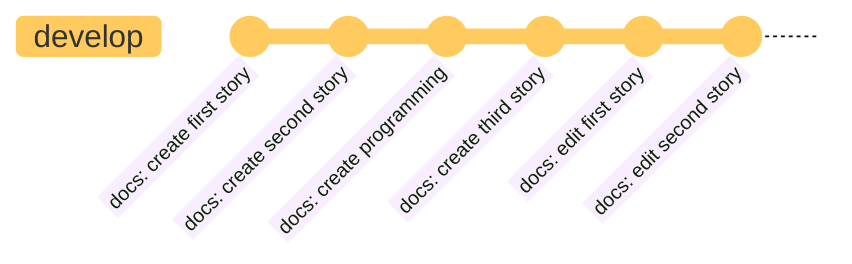
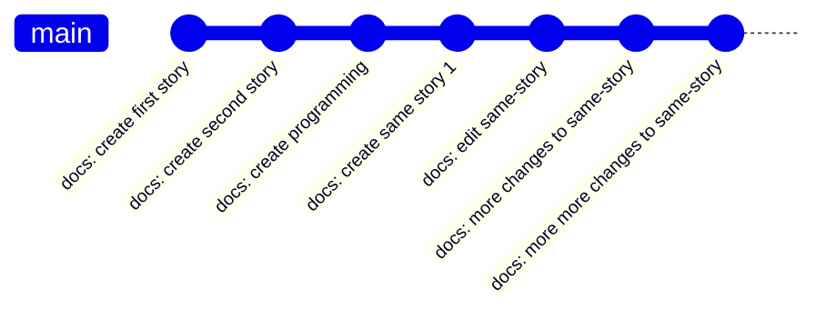
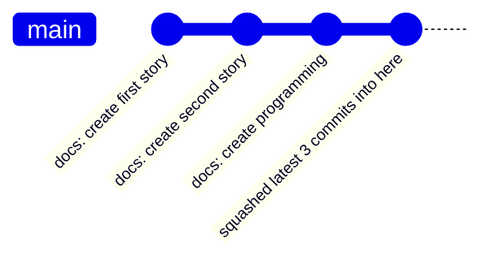
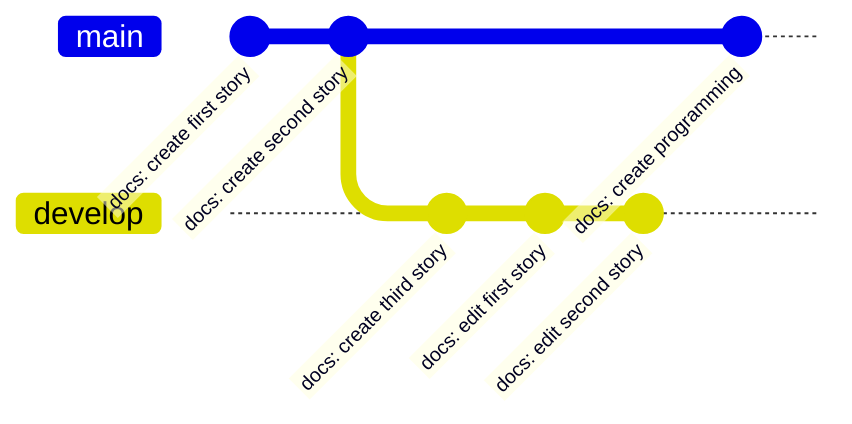
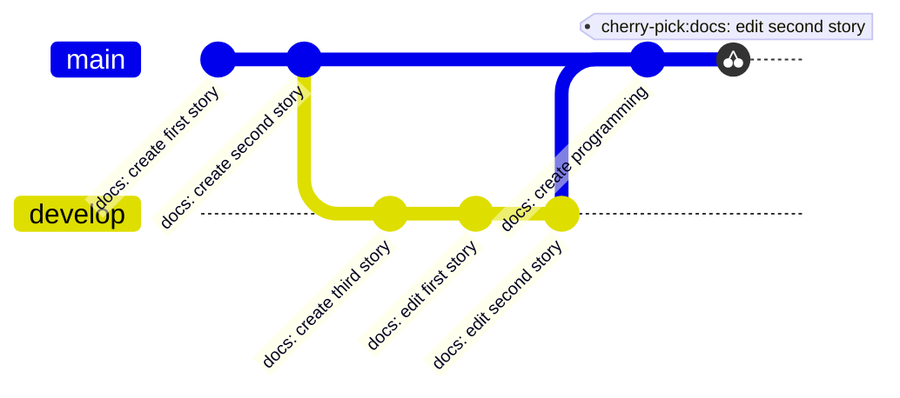

# Rebasing

## Rebase

**Differences between Merge and Rebase**

| Merge                                                                                      | Rebase                                                                                                                                                           |
| ------------------------------------------------------------------------------------------ | ---------------------------------------------------------------------------------------------------------------------------------------------------------------- |
| Unique identifier (hash) won't be modified as we are not modifying the git commits history | Unique identifier (hash) will be updated, as we are modifying the Git history when we are rebasing (copying the commits from one branch to another) the branches |

When Developer A has been working on his own story in his own branch. Meanwhile, his team continues to contribute additional stories and updates to the main branch. The Developer A wants to make sure that his branch is up to date with the latest changes from the main branch.



To do this, the Developer A would need to merge the main branch into his branch, but that will create a new merge commit and the Developer A doesn't want to do that.

```bash
git merge main
```

The other way to accomplish this is by rebasing branches. When we rebase a branch, we are layering/putting it on top of another. That means, we can rebase **develop** branch on top of the **main** branch, so now the **develop** branch will have all the changes that were made to the **main** branch.

```bash
git checkout develop
git rebase main
```




[Watch animation](/docs/git/git-sim-rebase.webm)

## Interactive rebasing

The `git rebase` command also allows us to modify the Git history on a certain branch before rebasing it.

Let's just assume the Developer A is working on his branch (main), but there are many commits that should actually have been just one commit. To do that, we can use `git rebase -i` command to combine/squash/meld into one commit.



Let's modify the latest 4 commits, as now we want to combine/squash/meld the latest 3 commits into the 1st commit.

```bash
git rebase -i HEAD~4
```




## Cherry-pick

In some cases, you may want to apply a certain change made to one branch to another branch without applying the complete changes made to that branch. By cherry-picking that particular commit, we can create a copy of it on your own branch.



For example, let's say that the Developer A is on the main branch and he want to add the changes that were made to the **"docs: edit second story"** commit on the **develop** branch. In that case, we can cherry-pick that commit and it will only take that commit changes.

```bash
git cherry-pick <commit-id>
git cherry-pick <docs: edit second story-commit-id>
```



- the cherry-pick: **"docs: edit second story"** is the copy of that commit (docs: edit second story) on **develop** branch. We now have a copy of that commit on the **main** branch.
- Do take note that, it will only **get the edit second story changes**

Steps to perform cherry-pick:

1. **identified** the commit
2. **checkout** the branch that you want to fetch other branch commit to your branch
3. **perform** cherry-pick command

```bash
git log <branch-name> --oneline # remember to commit hash, example 123
git checkout main
git cherry-pick <commit-id> # 123
```

- It will straight away merge the file and create a new commit on top of the current commit.
- If you end up in merge conflict, merge the file manually and make sure to leave the latest contents in the file itself.


[Watch animation](/docs/git/git-sim-cherry-pick.webm)
