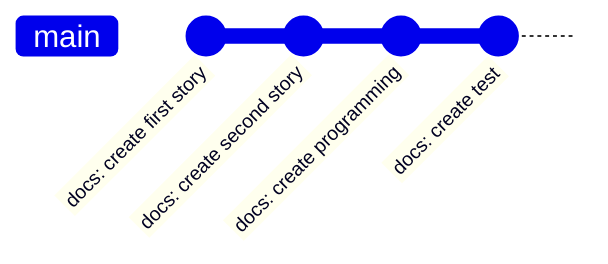
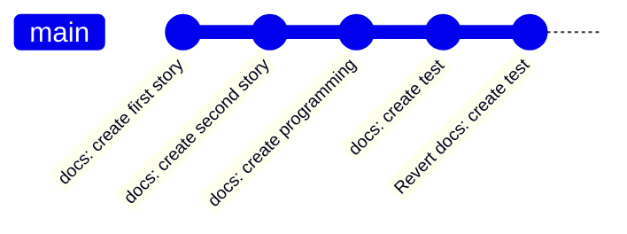
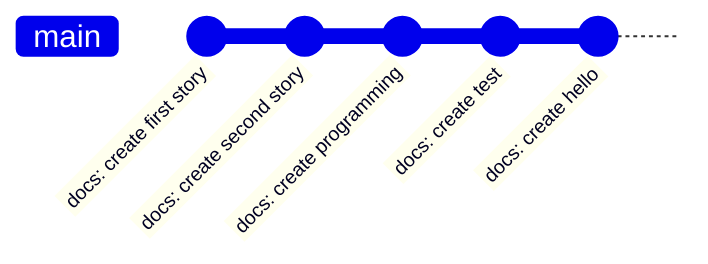

# Reset and Revert

Sometimes we commit changes that we don't intend to commit. If that is the case, we have several options to undo the action.

- [Revert](#revert)
- [Reset](#reset)
  - [soft](#soft)
  - [hard](#hard)
  - [mixed](#mixed)

## Revert

<Callout type="info">
  If you want to undo changes and keep them in your Git history, you can use the `git revert` command
</Callout>

The `git revert` command will **create a new commit**, which **reverses** all the changes made on the specified commit. Let's say that we want to revert the commit where we create the `test` file.



```bash
git revert <docs: create test-commit-id>
```



- In the "docs: create test" commit, `test` file has created. The reverted commit contains all the opposite changes. It will then deletes the `test` file.


[Watch animation](/docs/git/git-sim-revert.webm)

## Reset

The another way is to use the `git reset` command. There are three ways to reset the commit to undo it.

- soft
- hard
- mixed

### soft

With the `--soft` flag, we still have all the changes that we have made, and these changes will **move to staged changes**. You can use `git status` to check all the staged changes.



Let's reset the "docs: create hello" commit with a soft flag. Reset commands also receive the number of commits that we want to reset, in this case we want to reset one commit.

```bash
git reset --soft <commit-id>
git reset --soft HEAD~1
```


[Watch animation](/docs/git/git-sim-reset-soft.webm)

### hard

With the `--hard` flag, we will lose all the changes that we have made on that commit.


Let's reset the "docs: create hello" commit with a hard flag.

```bash
git reset --hard <commit-id>
git reset --hard HEAD~1
```


[Watch animation](/docs/git/git-sim-reset-hard.webm)

### mixed

With the `--mixed` flag, we still have all the changes that we have made, and these changes will **move to unstaged changes**. You can use `git status` to check all the unstaged changes.


Let's reset the "docs: create hello" commit with a mixed flag.

```bash
git reset --mixed <commit-id>
git reset --mixed HEAD~1
```


[Web animation](/docs/git/git-sim-reset-mixed.webm)
