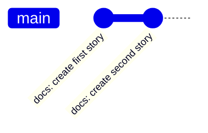

# Save Changes

<Callout type="info">
  Please follow the sequence.
</Callout>

Clone the repository [KarChunT/git-training](https://github.com/KarChunT/git-training) to work-on.

## git add

The `git add` command simply pushes files or directories to staging area/environment. By doing this, you tell Git to include those changes in the next commit. Of course, you can add more than one file/directory at a time.

```bash
git add <file/directory>
git add . # all files and directories

# example
touch third-story programming # create new files
git add third-story
```


[Watch animation](/docs/git/git-sim-add.webm)

## git status

The `git status` command simply lists which files are staged, unstaged, and untracked.

```bash
git status
```


## git commit

The `git commit` command simply saves or commits that file changes into a Git project. You can think of as snapshots or milestones along the timeline of a Git project.



```bash
git commit # opens a new editor
git commit -a # automatically stage files that have been modified and deleted
git commit -m "commit message" # flag of the message
git commit -am "commit message" # combination of am
git commit -s # user signed-off, certifies who is the author of the commit, tracking for patches
git commit --amend # modify the last commit

# example
git commit -m "docs: create third story"
```


[Watch animation](/docs/git/git-sim-commit.webm)

## git log

The `git log` command shows the information that you need to know about all the commits, such as

- commit hash
- author name
- data of the commit: which files to be committed
- commit message

```bash
git log
git log --oneline # don't care about all extra information
git log --name-only # list the changed files
git log --graph --decorate
```


## git diff

The `git diff` command shows the differences between two data sources. Data sources can be

- commits
- branches
- files, etc

```bash
git diff # comparing all changes
git diff <file>
git diff HEAD <filename> # filename is optional
git diff --staged/--cached <filename> # only for staged changes, filename is optional
git diff <commit_hash> <commit_hash>
git diff <branch> <branch>
git diff <branch> <branch> <file> # comparing files from two branches
git diff --color-words # Highlighting changes with much better granularity

# Example
nano first-story # write some texts into it
git diff
```


**How to read this?**

```text
@@ -50,8 +50,12 @@
```

In this example, 8 lines have been extracted starting from line number 50. Then, 12 lines have been added starting at line number 50.

## git restore

The `git restore` command will discard changes in working directory or if a file is tracked then you can restore or unstage that file to match the version in HEAD.

```bash
# discard changes
git restore . # all files
git restore <file> # same as git checkout <file>
git restore <pattern> # pattern = '*.c'

# unstage
git add first-story
git restore --staged <file> # same as git reset HEAD <file>

## unstage all files
git restore --staged .
git reset

# restore both index and working tree ---> same as git checkout
git restore --source=HEAD --staged --worktree <file>

# Example
git restore first-story
git restore --staged second-story
# even it's staged, it will restore all changes to same as HEAD commit
git restore --source=HEAD --staged --worktree second-story
```


[Watch animation](/docs/git/git-sim-restore.webm)

## .gitignore

<Callout title="Sources" type="info">
  - https://git-scm.com/docs/gitignore
  - https://github.com/github/gitignore
  - https://www.toptal.com/developers/gitignore
  - https://www.atlassian.com/git/tutorials/saving-changes/gitignore
</Callout>

`.gitignore` is a file that will include all the [globbing patterns](https://linux.die.net/man/7/glob) to ignore the file to be commited. These could be the files like

- build artifacts like `/bin`, `/target`
- machine generated files like `.pyc`
- dependency caches like `node_modules`
- log file
- environments or secrets like `.env`

```txt filename=".gitignore"
*.log
.env*
test.txt
node_modules/
/bin
```
