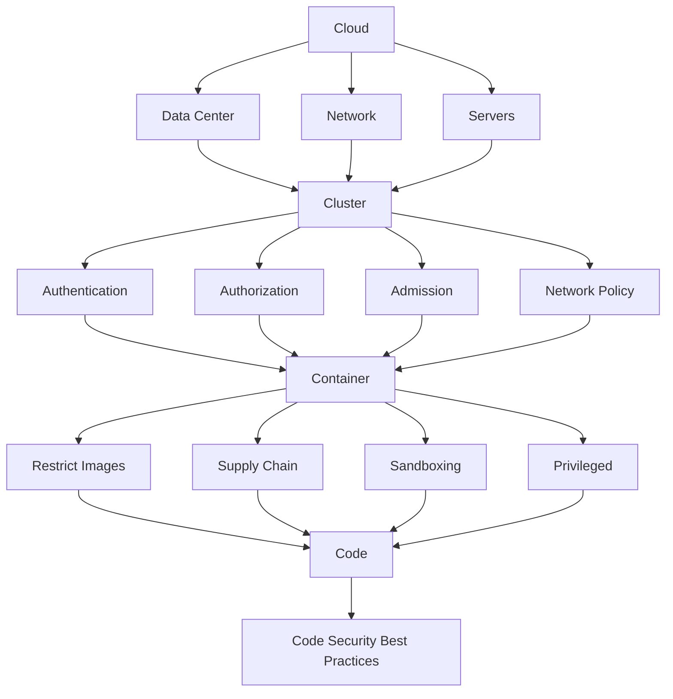
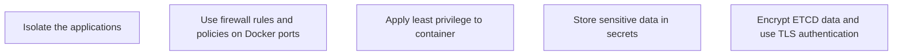
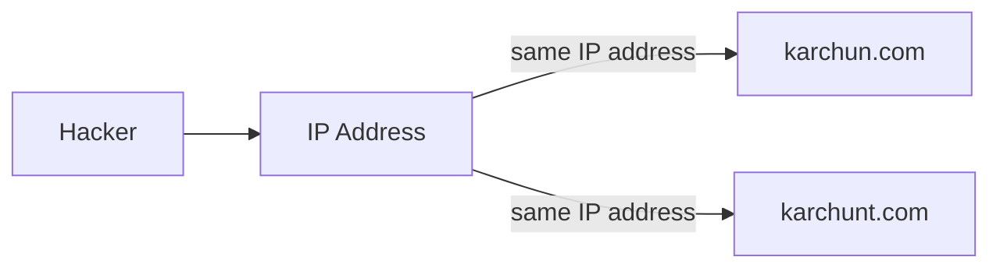
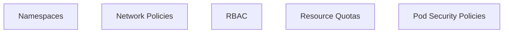
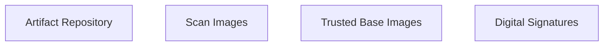

# 4C's of Cloud-Native Kubernetes Security

## Overview of the 4C's

4C's of Cloud-Native Kubernetes Security are:
- **Cloud** - Security of the **cloud infrastructures** that **hosting** the Kubernetes clusters. This could be a **public or private cloud**, **data center**. Also, the **network firewall** must be configured properly so that can prevent unauthorized remote access to the Kubernetes cluster.
- **Cluster** - Security of the **Kubernetes cluster** involves managing **authentication**, **authorization**, **admission controls**, and **network policies**. With proper configuration of these components, we can secure the **Kubernetes cluster** or **docker daemon**.
- **Container** - Security of the **containers** involves restricting the use of **untrusted images**, securing the **supply chain**, utilizing **sandboxing containers (isolate your program from the rest of the system using lightweight virtual machines which start containers inside pods)** for isolation, and avoiding the use of **privileged containers**.
- **Code** - Code refers to the **application code** that is running inside the containers. So, the developers must follow the **code security best practices** to prevent the **vulnerabilities** in the code.

## Cloud provider security

<CustomMermaid chartDefinition={`
flowchart TD
  A["Sources"] --> B
  subgraph B["Cloud Infrastructure"]
    subgraph C["Firewall"]
      D["Application"]
    end
  end
`} />

**Cloud provider** is responsible for the **security of the cloud and physical infrastructure** like **hardware**, while the **customer** is responsible for managing **network and firewall settings**.

To secure the cloud provider,
- **Activate the network firewall** - It can **permit or deny the traffic** based on the source and destination IP address, port, and protocol, and can be used to **prevent unauthorized access** to the system.
- **Shared Responsibility Model** - The **Shared Responsibility Model** outlines the division of security responsibilities between the **cloud provider** and the **customer**. 
  - **Cloud provider** is responsible for the **security of the cloud and physical infrastructure** such as **hardware, software, networking, and facilities**.
  - **Customer** is responsible for managing **network and firewall settings**, as well as securing their **data, applications, identity and access management, and operating systems**.
- **Cloud Provider Security Capabilities** - **Cloud providers** offer **security capabilities** to enhance cloud security. It can be categorized into **Thread Detection**, **Application Firewall**, and **Container Security**.
  - Threat Management & Response Techniques

    | Provider | Tool | Description |
    | -------- | ---- | ----------- |
    | AWS | GuardDuty | Uses **machine learning** to detect threats | 
    | GCP | Security Command Center | Offers a **centralized dashboard** to monitor therats, security health, etc. |
    | Azure | Microsoft Sentinel | It combines **SIEM** (Security Information and Event Management) and **SOAR** (Security Orchestration, Automation, and Response). It will auto detect security threats and deal with them.  |

  - Application Firewall

    | Provider | Tool | Description |
    | -------- | ---- | ----------- |
    | AWS | AWS WAF | **Web Application Firewall** (WAF) helps protect the web applications from common web exploits like **SQL injection**, **cross-site scripting (XSS)**, etc |
    | GCP | Cloud Armor | **DDoS protection** and other common attacks |
    | Azure | Azure WAF | **Web Application Firewall** (WAF) helps protect the web applications from common web exploits like **SQL injection**, **cross-site scripting (XSS)**, etc |

  - Container Security

    | Provider | Tool |
    | -------- | ---- |
    | AWS | EKS, Bottlerocket, kube-bench to meet **Center for Internet Security (CIS) benchmarks |
    | GCP | GKE, Google's Anthos, Open Policy Agent (OPA) to align with security standards** |
    | Azure | AKS |

## Cluster Security

**Server hardening** is the process of **enhancing server security** through **a series of steps**.
- **Isolate the applications** on separate servers/networks to **reduce the risk of cross-contamination**.
- **Use firewall rules and policies** to restrict Docker port access.
- **Apply least privilege to containers** and **secure (restrict access)** Kubernetes dashboard using **RBAC**, so that we can **remove vulnerability (Dirty Cow)**.
- **Store sensitive data** in Kubernetes **secrets**.
- **Encrypt ETCD data** at REST and use **TLS** authentication for **secure communication** between the **Kubernetes components**. You can also set **RBAC** and **perform regular backups**.

Based on this scenario, we know that `karchun.com` and `karchunt.com` are using the same IP address, meaning that they are **hosted on the same physical or virtual server**. This creates a **security risk: lacks of network segmentation**, which means that if one of the websites is **compromised**, the other websites on the same server are also **at risk**.

So the solution is to **isolate the application** on separate networks/servers. Besides, you can **remove the public IP address** of the `kube-apiserver` and use a **private IP address** to **prevent unauthorized access**. Also, you can **implement stringent (strict) access controls** like **VPN**.

---
<CustomMermaid chartDefinition={`
graph LR
  A[Hacker] --> B[Firewall]
  B --> C
  subgraph C[Host Machine]
    direction LR
    D["Docker Port (2375)"] --> E[Docker]
  end
`} />
Based on this scenario, we know that **Docker port 2375** is an **unauthenticated port**, meaning that **anyone can access the Docker daemon** without any authentication. So, the solution is to **implement a proper network security policy**. For example, you can **use firewall rules** to **restrict the access** to the Docker port to only **trusted and authenticated users**.

## Kubernetes Isolation Techniques

- Use **Namespaces** to isolate the resources in the cluster. Namespaces are a way to manage the resources for multiple teams or environments, which known as **multitenancy**. Meaning that, different teams/projects **can use the same cluster without interfering** with each other.
- Implement **Network Policies** to control the traffic flow between the pods. It can be used to **allow or deny** the traffic based on the **source** and **destination**.
- Implement **RBAC (Role-Based Access Control)** to control the access to the resources in the cluster. It can be used to **grant or deny** the access to the resources based on the **roles** and **permissions**.
- Set the **Resource Quotas** to limit the amount of resources that can be used by the pods in the namespace. It can be used to **prevent the resource exhaustion or monopolization**.
- Use **Pod Security Policies** to **control the security settings of the pods**. Pod Security Policies can be used to enforce security standards such as using **security contexts** to **run containers as non-root**, **disallowing privileged escalation**, and **restricting the use of host namespaces**.

## Artifact Repository and Image Security

- Use **Artifact Repository** to store the **container images** securely, for example, **Artifactory**, **Nexus**, etc.
- **Scan the container images** for the **vulnerabilities** before deploying them into the cluster. For example, **Trivy**, **Clair**, etc.
- Use **trusted base images or minimal images** to reduce the attack surface. Using **minimal base image** from a reputable source like **Alpine Linux** can reduce the attack surface, as they will perform regular updates and security scans.
- Use **digital signatures** to **ensure or verify the container image authenticity and integrity**
