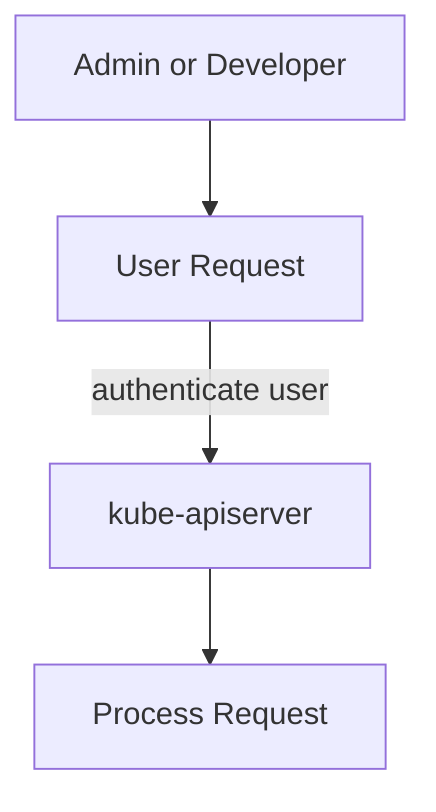

# Authentication

## Different users in Kubernetes

In a Kubernetes cluster, we have different users, for example,
- administrators - who **manage the cluster**
- developers - who **deploy or test applications**
- end-users - who **access the application** running in the cluster
- third-party applications or bots - that **interact with the cluster for integration** purpose

## Authentication in Kubernetes

All **user access** is **managed by the kube-apiserver**. As mentioned before, the **kube-apiserver** is the **front-end** of the Kubernetes control plane. It **authenticates** the user and **authorizes** the user to perform the requested operation.



We have different ways to authenticate users in Kubernetes.
- **Client certificates**
- **Static password file** (Deprecated) - Contains a list of usernames and passwords
- **Static token file** - Containers a list of usernames and tokens
- **Connect to an identity provider (third-party)** - Like LDAP or Kerberos
- **Service account tokens**

### Static password file (Deprecated)

In this method, we will **create a csv file with password, username, and user Id**. This file will be **passed** to the **kube-apiserver** using the `--basic-auth-file` flag. You can find your kube-apiserver configuration file in `/etc/kubernetes/manifests/kube-apiserver.yaml`.

```text filename="passwords.csv"
# password, username, user Id, group (optional)
password1,joe_user,joe_userID
password1,joe_user,joe_userID,group1
```
- You can also specify the fourth column as the **group** to which the user belongs, but it is optional.

To **authenticate users**, you can use the following command.

```bash
curl -v -k https://master-node-ip:6443/api/v1/pods -u "username:password"
```

### Static token file

The concept is similar to the **static password file**. In this method, we will **create a csv file with token, username, and user Id**. This file will be **passed** to the **kube-apiserver** using the `--token-auth-file` flag.

```text filename="tokens.csv"
# token, username, user Id, group (optional)
mjpuauwabcnIXBicj12cnXoaS,joe_user,joe_userID
ajpuauwabcnIXBicj12cnXoaS,joe_user,joe_userID,group1
```

To **authenticate users**, you can use the following command.

```bash
curl -v -k https://master-node-ip:6443/api/v1/pods --header "Authorization: Bearer <replace-your-token>"
```

## Authenticate using kubeconfig

Refer to [kubeconfig](/docs/kubernetes/kubeconfig) for more information.

## Authenticate using kubectl proxy

Refer to [api-groups](/docs/kubernetes/api-groups) for more information.

```bash
kubectl proxy
```

## Authenticate using bootstrap token

[Reference](https://kubernetes.io/docs/reference/access-authn-authz/bootstrap-tokens/)

Boostrap token is a **token** that is **used to authenticate** with the **kube-apiserver** when **creating a new cluster** or **joining a new node** to the cluster. The **bootstrap token** is **valid for 24 hours** by default.
- Once a node has successfully joined the Kubernetes cluster using a bootstrap token, the expiration of the bootstrap token **does not affect the node's membership** in the cluster. Bsc, the node will use a **client certificate** for authentication after joining the cluster.
- Bootstrap token is used only for the **initial join process**.

<Steps>

### Step 1: Create a bootstrap token

There are two ways to create a bootstrap token.
- **Using [kubeadm](https://kubernetes.io/docs/reference/setup-tools/kubeadm/kubeadm-token/)**. Remember run this command on the node that has installed `kubeadm` tool.
  - `kubeadm token generate` - Generate and print a bootstrap token, but do not create it on the server.
  - `kubeadm token create` - Create bootstrap tokens on the server
    - You can append `--dry-run --print-join-command` to get the secret YAML content and join command.

- **Manually**

The bootstrap token format must match the following regex: `^[a-z0-9]{6}\.[a-z0-9]{16}$`

### Step 2: Store the bootstrap token into Kubernetes secret

The bootstrap token must exist in the `kube-system` namespace.

```yaml filename="bootstrap-token-07401b.yaml"
apiVersion: v1
kind: Secret
metadata:
  # Name MUST be of form "bootstrap-token-<token id>"
  name: bootstrap-token-07401b
  namespace: kube-system
type: bootstrap.kubernetes.io/token
stringData:
  # Human readable description. Optional.
  description: "The default bootstrap token generated by 'kubeadm init'."

  token-id: 07401b
  token-secret: f395accd246ae52d
  usage-bootstrap-authentication: "true"
  usage-bootstrap-signing: "true"

  # Extra groups to authenticate the token as. Must start with "system:bootstrappers:"
  auth-extra-groups: system:bootstrappers:worker,system:bootstrappers:ingress,system:bootstrappers:kubeadm:default-node-token
```
- `usage-bootstrap-authentication` - indicates that the **token can be used to authenticate** to the `kube-apiserver` as a **bearer token**
- `usage-bootstrap-signing` - indicates that the token may be used to sign the `cluster-info` ConfigMap.
- `auth-extra-groups`
  - `system:bootstrappers:worker` - This group is typically used for worker nodes that are joining the cluster. Nodes in this group have permissions necessary to register themselves with the control plane and start running workloads.
  - `system:bootstrappers:ingress` - This group is used for nodes that are specifically joining the cluster to run ingress controllers. Nodes in this group have permissions tailored for ingress-related operations.
  - `system:bootstrappers:kubeadm:default-node-token` (default) - This group is used by **kubeadm** during the node join process. Nodes in this group have the default permissions required to join the cluster using a bootstrap token created by **kubeadm**.

### Step 3: Get the worker node join command

On the control plane node, use `kubeadm` with the `token-id` and `token-secret` that you generated in the previous steps to **get the worker node join command**.

```bash
kubeadm token create <token-id>.<token-secret> --dry-run --print-join-command
```

### Step 4: Join the worker node to the cluster

On the worker node or `ssh` into the worker node, **run the join command** that you got from the previous step. In this example, I am using `ssh` to connect to the worker node.
- Ensure that the **worker node** has `kubeadm`, `kubelet`, and `kubectl` **installed**.

```bash
# ssh into the worker node
ssh node1

# run the join command
kubeadm join kind-cluster-control-plane:6443 --token joisdm.akqtwa3n4swya2ol --discovery-token-ca-cert-hash sha256:dae81a955efb64d6e568d1dafc6ad7a3c2afc6be65345c9bb86a3429440e4c07
```

### Step 5: Verify the worker node already joined the cluster

You can **verify the result** from the **master node** (control plane node).

```bash
kubectl get nodes
```

### Step 6: Authenticate using the bootstrap secrets (Optional)

This step is **optional**. You can further **authenticate** using the **secrets**.

```bash
# Get the kube-apiserver address
kubectl cluster-info
kubectl config view

# Get and decode the token id and secret from Kubernetes secrets
kubectl get secret bootstrap-token-07401b -n kube-system -o jsonpath='{.data.token-id}' | base64 --decode
kubectl get secret bootstrap-token-07401b -n kube-system -o jsonpath='{.data.token-secret}' | base64 --decode

export TOKEN=<decoded-token-id>.<decoded-token-secret>
curl -v -k -X GET https://kind-cluster-control-plane:6443/api/v1/pods --header "Authorization: Bearer $TOKEN"
```
</Steps>

## Authenticate using service account token

<Steps>

### Step 1: Create a service account

```yaml filename="data-sa.yaml"
apiVersion: v1
kind: ServiceAccount
metadata:
  name: data-sa
```

### Step 2: Associate the secret with the service account

```yaml filename="data-sa-secret.yaml"
apiVersion: v1
kind: Secret
metadata:
  name: data-sa-secret
  annotations:
    kubernetes.io/service-account.name: data-sa # service account name
type: kubernetes.io/service-account-token
```

### Step 3: View the secret

```bash
kubectl get secret/data-sa-secret -o jsonpath='{.data.token}' | base64 -d
export TOKEN=<decoded-token>
```

### Step 4: Create a Role and RoleBinding

We need to create a **Role** and **RoleBinding** to **grant permissions** to the service account. Let's said we only allow this service account to **list pods** in the `default` namespace.

```bash
kubectl create role pod-reader --verb=list --resource=pods
kubectl create rolebinding pod-reader-binding --role=pod-reader --serviceaccount=default:data-sa
```

### Step 5: Authenticate using the service account token

```bash
curl -v -k -X GET https://kind-cluster-control-plane:6443/api/v1/namespaces/default/pods --header "Authorization: Bearer $TOKEN"
```

</Steps>
