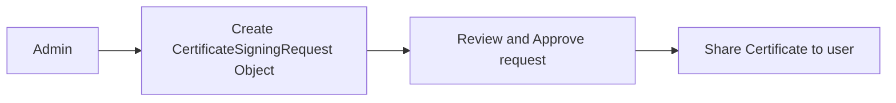

# Certificate API

## Concept & Usage of Certificate API

Kubernetes Certificate API will **help the admin to manage and sign (provision) the certificates** for **authentication** purpose.

Assuming you are the admin of the Kubernetes cluster, now a **new admin** wants to join the cluster. If we're not using Certificate API, then you need to **manually create or renew** the certificate, csr, and key for the new admin. This is a manual process and is tedious.



With the help of the Certificate API, you can **automate the process of creating and renewing the certificates** for the new admin. The admin can **request the certificate** using the **CertificateSigningRequest (CSR) API object**. The admin can **approve or deny the certificate request** using the **CertificateSigningRequest API object**.

You might be wondering where's the CA server located?
- Well, actually, the CA server **normally placed in the Kubernetes master node itself** as it **contains** the **certificate authority key** and **certificate**.

How the CertificateSigningRequest API works?
- We know that kube-controller-manager has a lot of controllers. There are multiple controllers that actually responsible for all the certificate-related stuff.
  - **CSR Approver Controller**: This controller is responsible for **approving or denying** the certificate request.
  - **CSR Signer Controller**: This controller is responsible for **signing** the certificate request.
  - **CSR Cleaner Controller**: This controller is responsible for **cleaning up** the certificate request.

So if you view the **kube-controller-manager** configuration, you will **notice CA server's root certificate and private key** as an option as they need that to sign the certificate.

```yaml filename="kube-controller-manager.yaml" {12-13}
spec:
  containers:
  - command:
    - kube-controller-manager
    - --allocate-node-cidrs=true
    - --authentication-kubeconfig=/etc/kubernetes/controller-manager.conf
    - --authorization-kubeconfig=/etc/kubernetes/controller-manager.conf
    - --bind-address=127.0.0.1
    - --client-ca-file=/etc/kubernetes/pki/ca.crt
    - --cluster-cidr=10.244.0.0/16
    - --cluster-name=kind-cluster
    - --cluster-signing-cert-file=/etc/kubernetes/pki/ca.crt
    - --cluster-signing-cert-file=/etc/kubernetes/pki/ca.crt
    - --cluster-signing-key-file=/etc/kubernetes/pki/ca.key
    - --controllers=*,bootstrapsigner,tokencleaner
    - --enable-hostpath-provisioner=true
    - --kubeconfig=/etc/kubernetes/controller-manager.conf
    - --leader-elect=true
    - --requestheader-client-ca-file=/etc/kubernetes/pki/front-proxy-ca.crt
    - --root-ca-file=/etc/kubernetes/pki/ca.crt
    - --service-account-private-key-file=/etc/kubernetes/pki/sa.key
    - --service-cluster-ip-range=10.96.0.0/16
    - --use-service-account-credentials=true
```

<Steps>

### Generate key and CSR

After the user has **generated the key and CSR**, the user can **send the CSR** to the admin.

```bash
openssl genrsa -out newuser.key 2048
openssl req -new -key newuser.key -out newuser.csr -subj "/CN=newuser"
```

### Create CertificateSigningRequest Object

Convert the CSR to base64 format and pass it to the `request` field in the `CertificateSigningRequest` object.

```bash
cat newuser.csr | base64 | tr -d '\n'
```

```yaml filename="newuser-csr.yaml"
apiVersion: certificates.k8s.io/v1
kind: CertificateSigningRequest
metadata:
  name: newuser-csr
spec:
  expirationSeconds: 3600 # 1 hour
  usages:
    - digital signature
    - key encipherment
    - server auth
  # base64 encoded CSR, of course you can convert it to base64 and paste it here
  request: $(cat newuser.csr | base64 | tr -d '\n')
  groups: # optional field
    - system:authenticated
    - my-custom-group
```

### Review and Approve request

After you approved the request, the Kubernetes will **create and sign the certificate using the CA key pairs**. The signed certificate will be stored in the csr object under the `status.certificate` field.

```bash
# Get the CSR requests
kubectl get csr

# Approve the request
kubectl certificate approve newuser-csr

# Deny the request
kubectl certificate deny newuser-csr
```

### Share signed certificate to user

Remember to **decode the base64 encoded certificate** before sharing it with the user.

```bash
# get the signed certificate
kubectl get csr newuser-csr -o jsonpath='{.status.certificate}' | base64 -d > newuser.crt
```

</Steps>
