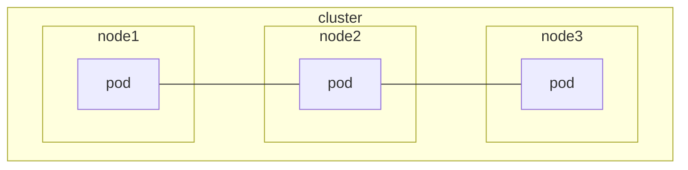

# Cluster components security

## Secure controller manager and scheduler

In summary;
- **Isolate** the **controller manager** and **scheduler** on another node
- **Apply Role-Based Access Control (RBAC)** to limit what the controller manager and scheduler can do
- **Secure communication** using **Transport Layer Security (TLS)** between all the components in the cluster
- **Enable audit logging** to keep track the activities and monitor the activities of the controller manager and scheduler
- **Secure default configurations** and **protect** the **configuration files**.
- **Update/Run** the Kubernetes latest version.
- **Regularly scan for vulnerabilities** in the cluster components.

<CustomMermaid chartDefinition={`
graph LR
  subgraph C[Cluster]
    subgraph n1[Node 1]
      kube-controller-manager
      kube-scheduler
    end

    subgraph n2[Node 2]
      pod1[pod]
      pod2[pod]
    end

    subgraph n3[Node 3]
      pod3[pod]
    end
  end
`} />

When we want to protect the controller manager and scheduler, we have to **isolate them**, and we can do this by running them on a separate node. This way, if the application running on the node is **compromised**, the controller manager and scheduler are **not affected**.

<CustomMermaid chartDefinition={`
graph LR
  RBAC --> n1 

  subgraph C[Cluster]
    subgraph n1[Node 1]
      kube-controller-manager
      kube-scheduler
    end
  end
`} />

We also have to **apply Role-Bsaed Access Control (RBAC)** to **limit** what the controller manager and scheduler can do. For example, replication controller only needs to **manage pod replicas** and the scheduler only needs to **schedule pods**. In this casem you can configure RBAC to **only allow these actions**, so if they are being compromised, the attacker **can't do much** due to the **limited access**.

<CustomMermaid chartDefinition={`
graph LR
  subgraph C[Cluster]
    subgraph n1[Node 1]
      kube-controller-manager --> TLS
      kube-scheduler --> TLS
    end
  end
`} />

We have to **secure communication** using **Transport Layer Security (TLS)** between all the components in the cluster. This way, all data transferred between the components is **encrypted** and **secure**. Remember to **rotate** the **TLS certificates** regularly.

Also, we have to enable **audit logging** to **keep track** the **activities** and **monitor** the **activities** of the controller manager and scheduler. This way, we can **refer** to the **audit logs** to **investigate** any **suspicious activities**. You can use **Prometheus** and **Grafana** to **monitor** the **activities** of the controller manager and scheduler.

## Secure kubelet

<Callout type="info">
  Refer to the [Kubelet](/docs/kubernetes/cluster-architecture#kubelet) section to understand the kubelet.
</Callout>

In summary;
- **Set** the **authorization mode** to **Webhook**
- **Disable** anonymous access and **enable** supported authentication mechanims

Before we secure the kubelet, we need to **identify the kubelet configuration file**. We know that kubelet is installed as a **systemd service**. So, we can use the following command to **identify** the **kubelet configuration file**.

```bash
ps -aux | grep kubelet
cat <configuration-file-path>
```

`kubelet` expose two ports, **10250** and **10255**.

| Port | Description |
| --- | --- |
| 10250 | Serves the kubelet API that allows **full access** |
| 10255 | Serves the kubelet API that allows **unauthenticated/unauthorized read-only access** |

### Set the authorization mode to Webhook

By default, the `kubelet` is configured to **allow** all requests/access from the **kube-apiserver** to its API. So when you do a `curl` request to the **kubelet API**, you can see the **response**. You can find the `kubelet API endpoints` in this [URL](https://github.com/kubernetes/kubernetes/blob/master/pkg/kubelet/server/auth_test.go#L121).

```bash
curl -k https://localhost:10250/pods

# Output
{"kind":"PodList","apiVersion":"v1","metadata":{},"items":[{"metadata":{"name":"kube-scheduler-controlplane","namespace":"kube-system","uid":"471ac3f1f2864d9e1bca566703c10b41","creationTimestamp":null,"labels":{"component":"kube-scheduler","tier":"control-plane"}},...
```

However, this is **not secure** because it allow full access to the kubelet API. So, we have to set authorization mode to `Webhook` in the kubelet configuration file. By setting the authorization mode to `Webhook`, the kubelet will send a request to the **kube-apiserver** to determine if the request is **authorized**.

```yaml filename="/var/lib/kubelet/config.yaml" {4}
apiVersion: kubelet.config.k8s.io/v1beta1
kind: KubeletConfiguration
authorization:
  mode: Webhook
```

### Authenticate and authorize kubelet requests

Now the use of pod `10255` is **deprecated** and it is **disabled** by default in the latest version of Kubernetes. However, let's assume you are using an older version of Kubernetes that still uses the `10255` port.

The `10255` port is similar to the `10250` port, just it only provides **read-only access** to any **unauthorized** and **unauthenticated** user. This exposes a risk to the cluster, as an attacker if knows the host IP address with the `10255` port open, they can get or do some malicious activities.

```bash
curl -k https://localhost:10255/metrics
```

By default, the kubelet **permits all requests** from **anonymous users** (username: system:anonymous and group: system:unauthenticated) to the API without any authentication. So, to prevent that, we have to ensure all requests to the kubelet API are **authenticated** and **authorized**. The following YAML configuration file are applicable to both ports.

```yaml filename="/var/lib/kubelet/config.yaml" {4-7}
apiVersion: kubelet.config.k8s.io/v1beta1
kind: KubeletConfiguration
authentication:
  anonymous:
    enabled: false
  x509:
    clientCAFile: /etc/kubernetes/pki/ca.crt # path to the client CA file
```

There are two authentication mechanims;
- Certificate based
- API bearer token based

After you have set the authentication mechanims, you have to **restart** the kubelet service to **apply** the changes.

```bash
systemctl restart kubelet.service
curl -k https://localhost:10250/pods \
  --cert /etc/kubernetes/pki/apiserver-kubelet-client.crt \
  --key /etc/kubernetes/pki/apiserver-kubelet-client.key
```
- This time, you have to pass in the certificate and key to authenticate the request.

## Secure container runtime

Before we learn how to secure the container runtime, it's important to understand some CVE Ids.

| CVE Id | Description |
| --- | --- |
| CVE-2019-5736 | This vulnerability affects Docker and other container runtimes that use runc. It allows an attacker to overwrite the host runc binary and gain root-level code execution on the host. |
| CVE-2020-15257 | This vulnerability affects containerd, a core container runtime used by Docker and Kubernetes. It allows an attacker to gain access to the containerd API without proper authentication. |
| CVE-2021-30465 | This vulnerability affects Docker and other container runtimes that use runc. It allows an attacker to escape the container and execute arbitrary code on the host. |
| CVE-2021-32760 | This vulnerability affects containerd. It allows an attacker to cause a denial of service (DoS) by sending a specially crafted request to the containerd API. |
| CVE-2022-23648 | This vulnerability affects containerd. It allows an attacker to gain unauthorized access to the containerd API and perform actions such as creating or deleting containers. |
| CVE-2022-0811 | This vulnerability affects CRI-O, a lightweight container runtime for Kubernetes. It allows an attacker to escalate privileges and execute arbitrary code on the host |

<CustomMermaid chartDefinition={`
graph LR
  subgraph C[Cluster]
    subgraph n1[Node 1]
      container-runtime
    end
  end
`} />

Each node in the cluster has a **container runtime**. To secure container runtime;
- Regularly **update** the container runtime to the **latest version**
- Run container with the **least privilege** and avoid running containers as **root**
  ```yaml
  spec:
    securityContext:
      runAsUser: 2000 # user id
      runAsGroup: 3000 # group id
  ```
- Set read-only **root filesystem** to prevent the container from writing to the root filesystem
  ```yaml
  spec:
    securityContext:
      readOnlyRootFilesystem: true
  ```
- **Limit** the **resources (CPU, Memory)** that the container can use. So that we can prevent container from consuming all the resources on the node and can prevent denial-of-service (DoS)attacks.
  ```yaml
  spec:
    resources:
      limits:
        cpu: 1
        memory: 1Gi
  ```
- **Apply security profiles** like **AppArmor** or **SELinux** to **restrict** the **actions** that the container can perform, also to add an extra layer of security by **enforcing mandatory access control policies** on containers.
  - These profiles will **restrict what the container can do**, for example, it can restrict the container from accessing the host filesystem or network.
  - **SELinux** (Security-Enhanced Linux) is a Linux kernel security module that provides a mechanism for **supporting access control security policies**. It's policies can define how processes and users can access resources on the system.
    ```yaml filename="sample.yaml"
    apiVersion: v1
    kind: Pod
    metadata:
      name: sample-pod
    spec:
      containers:
      - name: sample-container
        image: nginx
        securityContext:
          seLinuxOptions:
            user: "system_u" # The SELinux user label that applies to the container
            role: "system_r" # The SELinux role label that applies to the container.
            type: "svirt_lxc_net_t" # The SELinux type label that applies to the container.
            level: "s0:c123,c456" # The SELinux level label that applies to the container.
    ```
  - **AppArmor** (Application Armor) is a Linux security module that allows the system administrator to **restrict programs' capabilities** with profiles.
    ```yaml
    apiVersion: v1
    kind: Pod
    metadata:
      name: sample-pod
      annotations:
        # refers to a profile that is defined locally on the node
        container.apparmor.security.beta.kubernetes.io/sample-container: localhost/sample-profile
    spec:
      containers:
      - name: sample-container
        image: nginx
    ```

- **Transition** to supported **container runtime** like **containerd** or **CRI-O**, as Docker is **deprecated** in Kubernetes, and to ensure compatibility with the latest version of Kubernetes.
- Implement **monitoring** and **logging** like Prometheus, Grafana, etc to **detect** and **investigate** any **suspicious activities** in the container runtime. Enable audit logging to keep track of the activities in the contaienr runtime.

## Secure kube-proxy

<Callout type="info">
  Refer to the [kube-proxy](/docs/kubernetes/cluster-architecture#kube-proxy) section to understand the kube-proxy.
</Callout>

In summary;
- Set **kube-proxy** configuration with **proper permission**
- Secure **communication** using **Transport Layer Security (TLS)** between the kube-proxy and kube-apiserver
- Set **kube-proxy** with **least privilege**
- Set **network policies** to **restrict** the **access** to the **kube-proxy** service
- Set **logging** and **monitoring** to **detect** and **investigate** any **suspicious activities** in the kube-proxy
- **Regularly scan and update** for **vulnerabilities** in the kube-proxy
- **Enable audit logging** to keep track the activities and monitor the activities of the kube-proxy

Before we secure the kube-proxy, we need to **identify the kube-proxy configuration file**. There are two ways to identify the kube-proxy configuration file.

```bash
# If kube-proxy deploys as pods
kubectl describe pod/kube-proxy-xxxx -n kube-system

# YAML output
Command:
  /usr/local/kube-proxy
  --config=/var/lib/kube-proxy/config.conf

# If deploy as systemd service
ps -aux | grep kube-proxy
```

```yaml {8} filename="/var/lib/kube-proxy/config.conf"
apiVersion: kubeproxy.config.k8s.io/v1alpha1
bindAddress: 0.0.0.0
bindAddressHardFail: false
clientConnection:
  acceptContentTypes: ""
  burst: 0
  contentType: ""
  kubeconfig: /var/lib/kube-proxy/kubeconfig.conf
  qps: 0
clusterCIDR: 10.244.0.0/16
configSyncPeriod: 0s
conntrack:
  maxPerCore: 0
  min: null
  tcpBeLiberal: false
  tcpCloseWaitTimeout: null
  tcpEstablishedTimeout: null
  udpStreamTimeout: 0s
  udpTimeout: 0s
detectLocal:
  bridgeInterface: ""
  interfaceNamePrefix: ""
detectLocalMode: ""
enableProfiling: false
healthzBindAddress: ""
hostnameOverride: ""
iptables:
  localhostNodePorts: null
  masqueradeAll: false
  masqueradeBit: null
  minSyncPeriod: 1s
  syncPeriod: 0s
ipvs:
  excludeCIDRs: null
  minSyncPeriod: 0s
  scheduler: ""
  strictARP: false
  syncPeriod: 0s
  tcpFinTimeout: 0s
  tcpTimeout: 0s
  udpTimeout: 0s
kind: KubeProxyConfiguration
logging:
  flushFrequency: 0
  options:
    json:
      infoBufferSize: "0"
    text:
      infoBufferSize: "0"
  verbosity: 0
metricsBindAddress: ""
mode: iptables
nftables:
  masqueradeAll: false
  masqueradeBit: null
  minSyncPeriod: 0s
  syncPeriod: 0s
nodePortAddresses: null
oomScoreAdj: null
portRange: ""
showHiddenMetricsForVersion: ""
winkernel:
  enableDSR: false
  forwardHealthCheckVip: false
  networkName: ""
  rootHnsEndpointName: ""
  sourceVip: ""
```
This kube-proxy configuration file `/var/lib/kube-proxy/config.conf` contains the configuration for the kube-proxy to communicate with the **kube-apiserver**.

First, we have to check the file and group permission of the kube-proxy configuration file. After that, we need to set permission to **644** or stricter and make sure the ownership is set to **root:root** to protect the configuration file, as it does not allow **write** access by other users.

```bash
ls -l /var/lib/kube-proxy/config.conf
chmod 644 /var/lib/kube-proxy/config.conf
chown root:root /var/lib/kube-proxy/config.conf
```
- r (read) = 4, w (write) = 2, x (execute) = 1
- 644 = This ensures that the **owner** can **read and modify** the file, while the **group** and **others** can **only read** the file.

Next, we have to secure communication using **Transport Layer Security (TLS)** between the kube-proxy and kube-apiserver. This way, all data transferred between the kube-proxy and kube-apiserver is **encrypted** and **secure**.

```yaml {6, 20} filename="/var/lib/kube-proxy/kubeconfig.conf"
apiVersion: v1
kind: Config
clusters:
- cluster:
    # validate the TLS certificate of the kube-apiserver
    certificate-authority: /var/run/secrets/kubernetes.io/serviceaccount/ca.crt
    server: https://kind-cluster-control-plane:6443
  name: default
contexts:
- context:
    cluster: default
    namespace: default
    user: default
  name: default
current-context: default
users:
- name: default
  user:
    # uses the service account token to authenticate to the kube-apiserver
    tokenFile: /var/run/secrets/kubernetes.io/serviceaccount/token
```

Also, we will need to enable **audit logging** to keep track the activities and monitor the activities of the kube-proxy. This way, we can refer to the audit logs to investigate any suspicious activities.

```yaml filename="audit.yaml"
apiVersion: audit.k8s.io/v1
kind: Policy
rules:
  # Log all requests at the Metadata level.
  - level: Metadata
    resources:
      - group: ""
        resources: ["pods", "services", "endpoints"]
      - group: "extensions"
        resources: ["ingresses"]
      - group: "networking.k8s.io"
        resources: ["networkpolicies"]
  # Log all requests at the RequestResponse level for kube-proxy.
  - level: RequestResponse
    users: ["system:kube-proxy"]
    verbs: ["create", "update", "patch", "delete"]
    resources:
      - group: ""
        resources: ["pods", "services", "endpoints"]
      - group: "extensions"
        resources: ["ingresses"]
      - group: "networking.k8s.io"
        resources: ["networkpolicies"]
```
This policy logs all requests at the Metadata level for pods, services, endpoints, ingresses, and network policies, and logs all create, update, patch, and delete requests at the RequestResponse level for the kube-proxy user.

## Secure ETCD

<Callout type="info">
  Refer to the [etcd](/docs/kubernetes/cluster-architecture#etcd-cluster) section to understand the etcd.
</Callout>

In summary;
- [Encrypting data at REST (etcd and persistent volumes)](/docs/kubernetes/encrypting-secret-data-at-rest)
- [Regular backup ETCD data](/docs/kubernetes/backup-and-restore-methods#backup--restore---etcd)
- Secure communication using **Transport Layer Security (TLS)** between the etcd and other components in the cluster

## Secure container networking



By default, we know that Kubernetes networking is **flat** and **unsecured**. This means that all pods can **communicate with each other**, and there is **no network policy** to **restrict** the communication between the pods.

In summary;
- Implement **network policies** to **restrict** the communication (incoming and outgoing traffic) between the pods
- Use service mesh like **Istio** to **secure** the **communication** between the pods. Service mesh provides mutual **TLS** for **encrypted** and **authenticated** communication, **traffic management**, and **observability**
- Encrypt the **network traffic** between the pods using **IPSec** or **WireGuard**. This will ensure that all data transferred between the pods is **encrypted** and **secure**
- Isolate **sensitive workloads** by **using namespaces** and **apply network policies**. Segregate workloads by using namespaces and apply network policies can help to reduce impact if one of the workloads is compromised.

## Secure storage

Before we learn how to secure storage, it is important to understand the security issues impact on Kubernetes cluster. For example, 
- **misconfiguration of storage access** will let the attackers to **access the sensitive data**
- **lack of encryption** will lead to **data leakage**
- **insufficient backup** will lead to **data loss** due to system failures or attacks

In summary;
- [Encrypting data at REST](/docs/kubernetes/encrypting-secret-data-at-rest) (etcd and persistent volumes). For example, you can use AWS EBS, Azure Disk Storage, etc, these providers actually offer encryption options.
- Use **Role-Based Access Control (RBAC)** to **limit** the **access** to the **storage**. For example, you can grant only authorized users to access the storage.
- Use **Storage class** to **enforce security, performance limits, and backup policies**. You can enable encryption in **StorageClass**. This will ensure that all data stored in the persistent volume is encrypted.
  ```yaml filename="sample-storage-class.yaml" {9-10}
  apiVersion: storage.k8s.io/v1
  kind: StorageClass
  metadata:
    name: example-st
  provisioner: ebs.csi.aws.com
  parameters:
    csi.storage.k8s.io/fstype: xfs
    type: io1
    iopsPerGB: "50" # performance limits
    encrypted: "true"
    tagSpecification_1: "key1=value1"
    tagSpecification_2: "key2=value2"
  ```
  - IOPS represents the **number of read and write operations per second** that the volume can support. So, the **higher the IOPS**, the **better the performance**.
- Regularly **backup** and prepare for **disaster recovery** plan. You can use **Velero**, **Heptio Ark**, **Kasten**, etc to backup the data in the cluster.
- **Monitor and audit** the **storage metrics** to **detect** and **investigate** any **suspicious activities** in the storage. Enable audit logging to keep track the activities in the storage.
