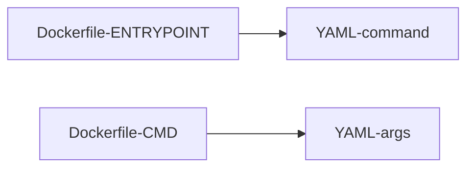

# Commands and Arguments

## Usage of commands and arguments



```yaml filename="pod.yaml"
apiVersion: v1
kind: Pod
metadata:
  name: pod-name
spec:
  containers:
    - name: container-name
      image: ubuntu:22.04
      command: ["sleep"] # entrypoint in Dockerfile
      args: ["10"] # CMD in Dockerfile
```
