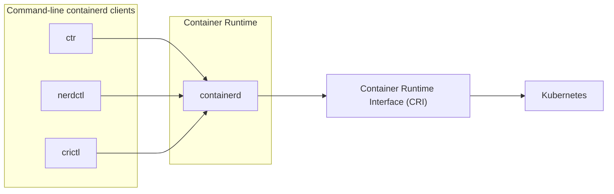

# Container Runtime

<Callout type="info">
  Highly recommended to use crictl to [debug Kubernetes nodes](https://kubernetes.io/docs/tasks/debug/debug-cluster/crictl).
</Callout>

In summary;
- **containerd** provides a **container runtime**
- **ctr** is a **low-level debugging**, mainly for **debugging contained**
- **nerdctl** is a **general purpose**, **Docker-like CLI (alternative to Docker)** to **containerd**
- **crictl** interacts with any **CRI runtime**, mainly for **inspecting and debugging the container runtimes**, it's **good for Kubernetes** users.


## Why Kubernetes no need to install Docker?

<CustomMermaid chartDefinition={`
flowchart LR
  cri["Container Runtime Interface (CRI)"] ---> Kubernetes

  subgraph vendor[Container Runtime]
    rkt
    containerd
    docker[Docker Engine]
    crio[CRI-O]
  end

  vendor ---> cri
`} />

In summary, Kubernetes **supports other runtime engines** that **adhere** to the **OCI standards**, like containerd or Rocket, so it is **not necessary** to install Docker before installing Kubernetes.

Kubernetes only needs the **Container Runtime Interface (CRI)** to **work as a container runtime** to **perform the container operations** as long as they **adhere** to the **OCI standards**. Therefore, Kubernetes is **compatible with any runtime engines via CRI**, such as Rocket, containerd, etc.

### containerD

<Callout title="References" type="info">
  - https://containerd.io/
  - https://github.com/containerd/containerd
  - https://github.com/containerd/containerd/tree/main/cmd/ctr
  - https://labs.iximiuz.com/courses/containerd-cli/ctr/container-management#recap-what-is-ctr
</Callout>



If you don't need Docker's other features, you can just install **containerD** without installing Docker. When you install **containerD**, it will **auto install** it's command line called **"ctr"**. This tool is solely made for **debugging containerd** and it's **not user-friendly**, but it gives you a great way to **understand how containers work** under the hood.

You can refer this link [ctr](https://github.com/containerd/containerd/tree/main/cmd/ctr) to understand more **ctr CLI options**.

```bash
ctr --help
ctr images pull docker.io/library/redis:alpine
ctr run docker.io/library/redis:alpine redis
```

---
Therefore, there is an alternative tool called [nerdctl](https://github.com/containerd/nerdctl) that provides a **stable**, **human-friendly user experience**, and it is mainly used for **general purposes**. It's very similar to Docker command.
- Same **UI/UX** (Docker-like CLI) as docker
- Supports **Docker Compose** `nerdctl compose up`
- Supports **rootless mode**, without slirp overhead
- Supports **lazy-pulling**
- Supports **encrypted container images**
- Supports **P2P image distribution**
- Supports **container image image signing** and **verifying**
- Apply **Kubernetes namespaces** for containers, etc

```bash
nerdctl
nerdctl run -it ubuntu
nerdctl run -p 8080:8080 -d webapplication
nerdctl compose -f ./docker-compose.yaml up
```

---
There is another tool called [crictl](https://github.com/kubernetes-sigs/cri-tools/blob/master/docs/crictl.md), which **provides a CLI** for **CRI-compatible container runtimes** like **"containerd"**.
- This tool need to **install separately**
- It can **interact with any CRI runtime**, so the developers can **debug the runtime** without having to install Kubernetes components
- It's used to **inspect and debug container runtimes** and it is ideal not to create containers

```bash
crictl help
crictl pull busybox
crictl images
crictl ps -a
crictl pods
```

If you try to use **crictl** to create containers on the Kubernetes environment, kubelet will be going to **delete them** as **kubelet ensures a specific number of pods** are **available** on a single node, that means containers created outside Kubelet's environment are unknown to it. So this tool is **mainly used for debugging purposes** (exec into container).
