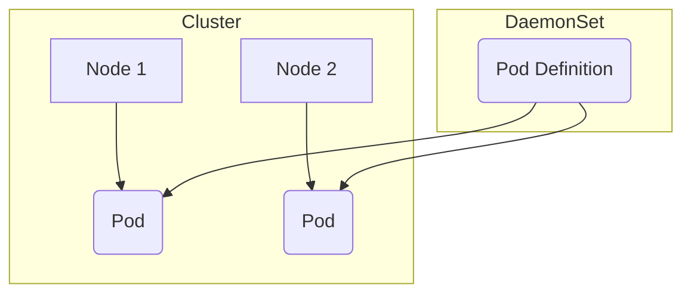

# DaemonSet

## Concept and Usage of DaemonSet

DaemonSet will **ensure that all or some Nodes will run a copy of a Pod**. Whenever a **new Node is added** to the cluster, a Pod is **automatically** added to that Node. When a Node is **removed from the cluster**, the Pod will be **automatically removed** as well. Remember, DaemonSet uses the **default scheduler** and [node affinity](/docs/kubernetes/node-affinity) rules to **schedule the pods** on the nodes.

Use cases;
- Running a **logging agent (collector)** on all nodes
- Running a **monitoring agent** on all nodes
- Setting up network services like **firewall**, **load-balancer**, **network proxies**, **VPN** on all nodes

For example, we know that `kube-proxy` is required on every node to provide network services. Therefore, `kube-proxy` component is actually deployed as a DaemonSet in Kubernetes.



```yaml filename="daemonsets.yaml"
apiVersion: apps/v1
kind: DaemonSet
metadata:
  name: sample-daemonset
spec:
  selector:
    matchLabels:
      app: sample-agent
  template:
    metadata:
      labels:
        app: sample-agent
    spec:
      containers:
        - name: sample-monitoring-agent
          image: sample-monitoring-agent-image
```

```bash
kubectl get daemonsets
```
