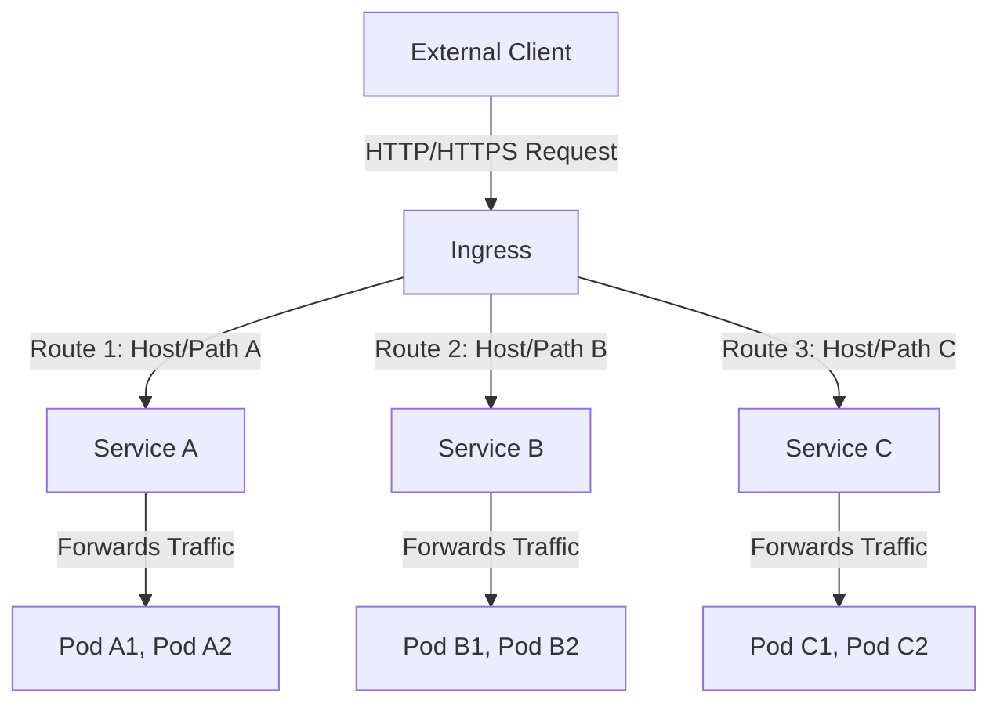

# Ingress

## What is Ingress?




Ingress is a **Kubernetes resource** that provides **HTTP** and **HTTPS** routing to services within a cluster. It **exposes HTTP/S routes** from outside the cluster to services within the cluster by **defining rules** for routing traffic based on the **request's host and path**.

<Callout type="important" title="Why we need Ingress?">
  ```mermaid
  graph LR
    A["karchunt.com"] --> B["172.17.0.5:30100"]
  ```
  If you ask the users to enter the IP address every time in the browser, the user won't be happy. So, we need a way to **route the traffic** to the correct service/IP address. Ingress will help us with that.

  In this case, `karchunt.com` is our **DNS name**, now we can **point this DNS name to the IP address**, therefore the users can access the service using the DNS name instead of the IP address.
</Callout>

<Callout type="important" title="Important">
  Remember, you will need to **expose the Ingress controller** to the **external world**, otherwise, the Ingress resource will not work. You can do this by using a **Cloud Native Load Balancer** or **NodePort**.

  Ingress controller is not deployed by default in Kubernete cluster.
</Callout>

Ingress contains two main components:
- Ingress controller
- Ingress resource

### Ingress controller

<Callout title="More Information">
  - https://kubernetes.io/docs/concepts/services-networking/ingress-controllers/
  - https://docs.nginx.com/nginx-ingress-controller/installation
  - https://github.com/nginx/kubernetes-ingress
  - https://hub.docker.com/r/nginx/nginx-ingress
</Callout>

We will be using **NGINX Ingress Controller** in this example. I highly recomend you to use **helm** to install the Ingress controller.

Link:
- [manifests installation](https://docs.nginx.com/nginx-ingress-controller/installation/installing-nic/installation-with-manifests/) 
- [helm installation](https://docs.nginx.com/nginx-ingress-controller/installation/installing-nic/installation-with-helm/)

### Ingress resource

<Callout title="More Information">
  - https://kubernetes.io/docs/concepts/services-networking/ingress/
  - https://kubernetes.io/docs/reference/generated/kubectl/kubectl-commands#-em-ingress-em-
  - https://github.com/kubernetes/ingress-nginx/blob/main/docs/examples/rewrite/README.md
</Callout>

Ingress resource is a **Kubernetes resource** that defines the rules for routing traffic to the services.

#### Ingress backed by a single service

The following example will route all incoming traffic to the `example-service` on 
port `80`. See `Path based routing` for more details about `defaultBackend`.

```yaml filename="ingress.yaml"
apiVersion: networking.k8s.io/v1
kind: Ingress
metadata:
  name: example-ingress
spec:
  defaultBackend: # This is the default backend for all incoming traffic
    service:
      name: example-service
      port:
        number: 80
```

```bash
kubectl get ingress example-ingress
```

#### Path based routing

If the user tries to access the URL that **does not match the below rules**, the request will be routed to the `defaultBackend` service.

```yaml filename="ingress.yaml"
apiVersion: networking.k8s.io/v1
kind: Ingress
metadata:
  name: example-ingress
spec:
  defaultBackend: # This is the default backend for all incoming traffic
    service:
      name: example-service
      port:
        number: 80
  rules:
    - http:
        paths:
          - path: /api
            pathType: Prefix
            backend:
              service:
                name: api-service
                port:
                  number: 8000
          - path: /docs
            pathType: Prefix
            backend:
              service:  
                name: docs-service
                port:
                  number: 8080
```

```bash
kubectl create ingress example-ingress --default-backend=example-service:80 \
  --rule="/api=api-service:8000" \
  --rule="/docs=docs-service:8080"
```

#### Name based routing

```yaml filename="ingress.yaml"
apiVersion: networking.k8s.io/v1
kind: Ingress
metadata:
  name: example-ingress
spec:
  rules:
    - host: karchunt.com
      http:
        paths:
          - path: "/api"
            pathType: Prefix
            backend:
              service:
                name: api-service
                port:
                  number: 8000
    - host: karchuntan.com
      http:
        paths:
          - path: "/docs"
            pathType: Prefix
            backend:
              service:
                name: docs-service
                port:
                  number: 8080
```

#### Rewrite target

<Callout title="More Information">
  - https://kubernetes.github.io/ingress-nginx/examples/rewrite/
</Callout>

In some cases, you may want to rewrite the URL path before forwarding the request to the backend service. For example, if the pay application expects requests at `/` rather than `/pay`, you can use the `nginx.ingress.kubernetes.io/rewrite-target` annotation to achieve this.

<Tabs items={['Ingress', 'Python']}>
  <Tab value="Ingress">
    ```yaml filename="ingress.yaml" {6}
    apiVersion: networking.k8s.io/v1
    kind: Ingress
    metadata:
      name: example-ingress
      annotations:
        nginx.ingress.kubernetes.io/rewrite-target: /
    spec:
      rules:
        - host: pay-karchunt.com
          http:
            paths:
              - path: /pay
                pathType: Exact
                backend:
                  service:
                    name: pay-service
                    port:
                      number: 8000
    ```
  </Tab>
  <Tab value="Python">
    ```python filename="pay.py" {9}
    from fastapi import FastAPI

    app = FastAPI(
      title='Pay',
      description='This is pay API',
      version='0.1.0'
    )

    @app.post("/")
    def pay():
      return {'success': True}
    ```
  </Tab>
</Tabs>

- Meaning that when you access `http://pay-karchunt.com/pay`, it will be **rewritten** to `http://pay-karchunt.com/` before being forwarded to the `pay-service`. This means that the `pay-service` will receive the request at the root path `/` instead of `/pay`, as `pay-service` only expose the root path `/`.

**Format: replace(path, rewrite-target)**<br />
**In our case: replace("/pay". "/")**

---

```yaml filename="ingress.yaml"
apiVersion: networking.k8s.io/v1
kind: Ingress
metadata:
  annotations:
    nginx.ingress.kubernetes.io/use-regex: "true"
    nginx.ingress.kubernetes.io/rewrite-target: /$2
  name: rewrite
  namespace: default
spec:
  ingressClassName: nginx
  rules:
    - host: rewrite.bar.com
      http:
        paths:
          - path: /something(/|$)(.*)
            pathType: ImplementationSpecific
            backend:
              service:
                name: http-svc
                port: 
                  number: 80
```

**replace("/something(/|$)(.*)", "/$2")**

Any characters captured by **(.*)** will be assigned to the **placeholder $2**, which is then used as a parameter in the `rewrite-target` annotation.
- `rewrite.bar.com/something` rewrites to `rewrite.bar.com/`
- `rewrite.bar.com/something/` rewrites to `rewrite.bar.com/`
- `rewrite.bar.com/something/new` rewrites to `rewrite.bar.com/new`

#### TLS

<Steps>

##### Create a TLS secret

Refer this [link](/docs/kubernetes/env-and-secrets-setup#tls) for more information about how to create a TLS secret.

##### Reference the TLS secret

```yaml filename="ingress.yaml" {6-9}
apiVersion: networking.k8s.io/v1
kind: Ingress
metadata:
  name: example-ingress
spec:
  tls:
    - hosts:
        - karchunt.com
      secretName: karchunt-tls # This is the name of the TLS secret
  rules:
    - host: karchunt.com
      http:
        paths:
          - path: "/api"
            pathType: Prefix
            backend:
              service:
                name: api-service
                port:
                  number: 8000
```

</Steps>