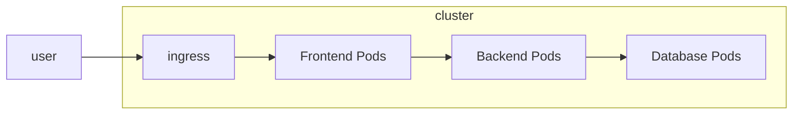

# Kubernetes Threat Model

Threat modeling is a **structured approach** that helps **identify** and **mitigate potential security threats** in a system. In the context of Kubernetes, it involves analyzing the architecture, components, and interactions within a Kubernetes cluster to identify vulnerabilities and risks.

## Kubernetes Trust Boundaries and Data Flows

### Trust Boundaries



Let's take a look at this diagram. The user interacts with the cluster through an ingress controller. The ingress controller routes the traffic to the frontend pod, which in turn communicates with the backend pod. The backend pod interacts with the database pod.

Now, let's say that the hacker compromises the frontend pod. The hacker can then use the compromised frontend pod to access the backend pod and potentially the database pod as well, because the diagram here **does not isolate the pods** and **no enforce specific security measures between them**.

<CustomMermaid chartDefinition={`
graph LR
  user --> ingress

  subgraph cluster
    subgraph g1
      ingress --> frontend
      frontend ---> backend --> db
      subgraph frontend[Frontend Pods]
        subgraph p1
          pp1[pod]
        end

        subgraph p2
          pp2[pod]
        end
      end

      subgraph backend[Backend Pods]
        subgraph b1
          bp1[pod]
        end

        subgraph b2
          bp2[pod]
        end
      end

      subgraph db[Database Pods]
        subgraph d1
          dp1[pod]
        end

        subgraph d2
          dp2[pod]
        end
      end
    end
  end
`} />

<Callout title="Important" type="important">
  These isolated areas are called **trust boundaries**. We have multiple trust boundaries.
  - Cluster boundary
  - Node boundary
  - Pod boundary
  - Namespace boundary
  - Container boundary
</Callout>

In this diagram, we have isolated them different groups of pods and enforce specific security measures between them (Pod). So, if the hacker compromise one part of the system, they will **not be able to compromise** the other parts of the system.

#### Cluster Boundary

<CustomMermaid chartDefinition={`
graph LR
  subgraph cluster1[Cluster Production]
    ingress --> p1[Frontend Pods]
    p1 --> p2[Backend Pods]
    p2 --> db[Database Pods]
  end

  subgraph cluster2[Cluster Development]
    ingress2[ingress] --> b1[Frontend Pods]
    b1 --> b2[Backend Pods]
    b2 --> dbb[Database Pods]
  end

  subgraph cluster3[Cluster Testing]
    ingress3[ingress] --> c1[Frontend Pods]
    c1 --> c2[Backend Pods]
    c2 --> dbc[Database Pods]
  end

  cluster1 -.->|isolated from| cluster2
  cluster2 -.->|isolated from| cluster3
`} />

<Callout title="Important" type="important">
  This setup will provide **top-level security** for your cluster. For example, the network traffic between the clusters will be **isolated**.
</Callout>

The cluster boundary is the **boundary between the clusters** in a Kubernetes setup. We know that the Kubernetes setup involves control-plane components and worker** nodes**, these items will be part of the **cluster boundary**. So, the best is **to separate or isolate the clusters** for **different environments**. For example, we can have a cluster for production, a cluster for development, and a cluster for testing. With this setup, we can ensure that the issues in one cluster will **not affect the other clusters**.

#### Node Boundary

<CustomMermaid chartDefinition={`
graph
  subgraph cluster[Cluster]
    direction LR
    subgraph node1[Node 1]
      pod1[Frontend pod]
      pod2[Frontend pod]
    end
    subgraph node2[Node 2]
      pod3[Backend pod]
      pod4[Backend pod]
    end
    subgraph node3[Node 3]
      pod5[Database pod]
      pod6[Database pod]
    end

    node1 -.->|isolated from| node2
    node2 -.->|isolated from| node3
  end
`} />

The node boundary is the **boundary between the nodes** in a Kubernetes cluster. It ensures that the pods running on one node are **isolated** from the pods running on another node. For example, if a frontend pod running on node 1 is compromised, the hacker will **not be able to access** the backend pods running on node 2 or the database pods running on node 3. This is because the **network traffic** between the nodes is **isolated**.

#### Pod Boundary

<CustomMermaid chartDefinition={`
graph TD
  subgraph cluster[Cluster]
    pod1[Frontend Pod 1]
    pod2[Frontend Pod 2]
    pod3[Backend Pod]
    pod5[Database Pod]

    pod1 -.->|cannot interact| pod2
    pod1 -.->|cannot interact| pod3
    pod1 -.->|cannot interact| pod5
  end
`} />

The pod boundary is the **boundary between the pods** in a Kubernetes cluster. Each pod typically runs one or more containers. Pods are **isolated** from each other using its own **network policies**, **runtime environment**, and **security context**, as these can be **defined at the pod level**.

By default, pods within the same namespace or cluster can communicate freely unless network policies are explicitly applied to restrict communication.

This ensures that pods are **not able to access** each other unless explicitly allowed by these policies.

#### Namespace Boundary

<CustomMermaid chartDefinition={`
graph LR
  subgraph namespace1[Frontend NS]
    pod1[Frontend Pod 1]
    pod2[Frontend Pod 2]
  end

  subgraph namespace2[Backend NS]
    pod3[Backend Pod]
  end

  subgraph namespace3[Database NS]
    pod5[Database Pod]
  end

  namespace1 -.->|isolated from| namespace2
  namespace2 -.->|isolated from| namespace3
`} />

The namespace boundary is the **boundary between the namespaces** in a Kubernetes cluster. Namespaces are used to **organize** and **isolate** resources within a cluster. Each namespace can have its own set of resources, such as pods, services, and config maps.

#### Container Boundary

<CustomMermaid chartDefinition={`
graph TD
  subgraph pod1[Frontend Pod]
    container1[Frontend Container 1]
    container2[Frontend Container 2]
  end

  container1 -.->|isolated from| container2
`} />

The container boundary is the **boundary between containers** within a pod. Containers in the same pod share the **same network namespace** and can communicate with each other via `localhost`. It provides **application-level isolation**. For example, if a container in a pod is compromised, the damange is limited to that container.

### Data Flows

Data flow is the **movement of data** between different components in a Kubernetes cluster. Understanding data flows is **crucial** for **identifying potential vulnerabilities** and **attack vectors**.

To protect the data flows, we can take the following measures:
- implement **network policies** to restrict communication between pods and namespaces
- use **encryption (TLS)** for data in transit and at REST
- secure the **ingress and egress** traffic
- implement **service mesh**, etc

## Persistence

Persistence is the **ability of a system** to **maintain its state** and **data** across different attacks by hackers. In Kubernetes, hacker can achieve persistence by **exploiting misconfigurations**, **reading secrets** or using **container vulnerabilities**.

There are several ways to mitigate **Persistence** risks:
- Use **RBAC** to restrict access to service accounts or sensitive resources like secrets.
- Use **PodSecurityPolicies** to 
  - **prevent containers** from **running as root** or **with privileged access**
  - **enforce security contexts** for pods and containers
  - **enforce read-only root filesystem**
- **Regular updates** and **patching** of container images.
- Implement **monitoring** and **auditing** of Kubernetes cluster activity to **detect** any suspicious activities and **audit** Kubernetes events regularly.
  - **Track changes** to RBAC policies, secrets, creation of new pods, network policies, and other security-related configurations.
  - **Alert** on any suspicious activities or changes to the cluster.

## Denial of Service

<Callout title="More Information">
  The hacker can **spam the API server with requests**, which can lead the service to become unavailable.
</Callout>

Denial of Service (DoS) attack is an attack that aims to **make a service unavailable** to its intended users. In Kubernetes, DoS attacks can be achieved by **overloading** the cluster with requests or by **exploiting vulnerabilities** in the cluster components.

We know that by default **pod has a service account**, which is used to **authenticate** the pod to the API server. If the hacker compromises the pod, they can use the service account token to **authenticate** to the API server and **start many containers or send many requests** in the cluster. This can lead to **resource (CPU & memory) exhaustion**.

There are several ways to mitigate **Denial of Service** risks:
- Setup **resource quota** and **limit range** for each **namespace**, which will limit the number of resources that can be used by the pods in that namespace.
- Setup **resource limits** and **requests** for each **pod**
- Setup **network policies** and **proper firewall configurations** to protect control plane endpoints and to control traffic flow within the cluster. For example, only allow trusted IP addresses to access the API server.
- Secure **service accounts** using **RBAC** to **restrict the permissions** of the service accounts. For example, can limit the service account to only be able to0 **read** the resources in the cluster, but not to **create** or **delete** them.
- Implement **monitoring and alerting** for **unusual traffic patterns** or **spikes** in resource.

## Malicious Code Execution

Malicious code execution is an attack that aims to **execute arbitrary (malicious) code** on a system. In Kubernetes, this can be achieved by **exploiting vulnerabilities** in the cluster components or by **compromising** the pods running in the cluster.

Here are the common steps to achieve this:
1. The hacker **compromises** a pod by **exploiting a vulnerability** in the application running in the pod.
2. The hacker **executes malicious code** in the compromised pod to install a **malicious software** to **steal sensitive data** or **perform other malicious activities**.
3. The hacker can poison image repository by **uploading a malicious image** to the repository. So if other clusters pull the image, they will be compromised as well.

---

<Callout>
  I want to emphasize more on this topic.
</Callout>

```yaml filename="sample-pod.yaml" {7}
apiVersion: v1
kind: Pod
metadata:
  name: example-hostpid-pod
  namespace: default
spec:
  hostPID: true
  containers:
  - name: example-container
    image: busybox
    command: ["sh", "-c", "ps aux"]
```

Hacker will **primarily focus** on **finding the pod** that enables `hostPID` and `SYS_PTRACE` capabilities. This is because these two features can be used to **compromise the host**.

If the container is running with `hostPID`, the hacker can **access the host process**, meaning that the hacker can **see all the processes** running on the host,  **interact** with the **host processes**, and potentially **compromise the host**.

If the container enables `SYS_PTRACE` capability, the hacker can **inspect** the host processes and **attach** to them. This can be used to **debug** the processes or **inject malicious code** into the host processes.

There are several ways to mitigate **Malicious Code Execution** risks:
- Secure **container image repositories** by ensuring that only **trusted images** are uploaded to the repository.
  - Use **image signing** to ensure that the images are **authentic** and **untampered**.
- Secure **image pull secrets** and restrict access to only necessary pods using **RBAC**.
- Use **PodSecurityPolicies** to prevent containers from running with `hostPID` and `SYS_PTRACE` capabilities.
- Use **signed images** to verify the **integrity of the images** before deploying them to the cluster.
- **Regular updates** and **patching** of container images.

## Access to sensitive data

Hacker can access to sensitive data can through multiple ways:
- One is **misconfigured RBAC policies**. The hacker can **exploit (use)** the **misconfigured RBAC policies** to **gain access** to sensitive data in the cluster.
- Second is **accessing and viewing sensitive data** in **logs**.
- Third is **eavesdropping (spy) on the network traffic** between the pods. The attacker can **intercept** the network traffic and **read** the sensitive data being transmitted between the pods if the network traffic is **not encrypted**.

There are several ways to mitigate **Access to sensitive data** risks:
- Ensure that **RBAC policies** are properly configured and **restrict access** to sensitive data.
- Ensure the **logs** do not log sensitive data. Restrict access to logs and use centralized logging solutions to provide **fine-grained access control** and **monitor** access to logs.
- Use **encryption (TLS)** for data in transit to protect sensitive data being transmitted between the pods.

## Privilege Escalation

Privilege escalation is an attack that aims to **gain elevated privileges** in a system. Here is the scenario, we might want to run a command using the root user privileges.

<Callout title="How can we do that if the root user login is disabled?" type="warn">
  Well, actually the preferred way is to use `sudo`. So, we will need to configure the user to have `sudo` privileges. This can be done by adding the user to the `sudo` group or by modifying the `/etc/sudoers` file.
</Callout>

```bash
visudo
```

```bash filename="/etc/sudoers"
# User privilege specification
root    ALL=(ALL:ALL) ALL

# Members of the admin group may gain root privileges
%admin ALL=(ALL) ALL

# Allow members of group sudo to execute any command
%sudo   ALL=(ALL:ALL) ALL

# See sudoers(5) for more information on "@include" directives:

anson   ALL=(ALL:ALL) ALL

# Allow KC to reboot the system
@includedir /etc/sudoers.d
kc      localhost=NOPASSWD: /sbin/reboot
```
Only users listed in the `/etc/sudoers` file can run commands with `sudo`. In this case, `anson` has complete privileges while `kc` can only run the `/sbin/reboot` command without a password.

| Field | Description |
| --- | --- |
| kc, %sudo (group) | user or group |
| ALL (default), localhost | Hosts |
| (ALL) (default), (All:All) | Users:Groups |
| ALL (default), /sbin/reboot | Commands |
