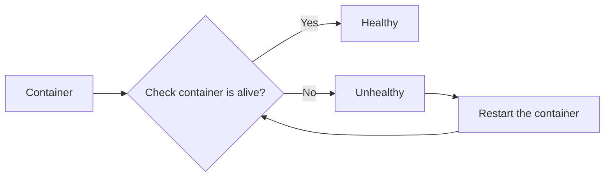

# Liveness Probes

<Callout type="info">
  All command is same as Readiness Probes, but the only difference is the `livenessProbe` field.
</Callout>

## Usage of Liveness Probes

[Reference](https://kubernetes.io/docs/tasks/configure-pod-container/configure-liveness-readiness-startup-probes/#define-a-liveness-command)

The concept of Liveness probes basically is to **determine whether a container is alive or not** by **performing some tests**. If the liveness probes are successful, then we know that container is going to run (healthy), else, it (kubelet) will **restart the container (unhealthy)**.



Let me give you one scenario, suppose you have a container running an API server, and the API server is **not responding** to the requests, but the **container still stay alive**. In this case, the liveness probe will help you to **restart the container**, so that a new container can be created and the API server can start responding to the requests.

**HTTP**
```yaml filename="liveness-probes.yaml"
apiVersion: v1
kind: Pod
metadata:
  name: sample-pod
spec:
  containers:
    - name: web-app
      image: webapp
      livenessProbe:
        httpGet:
          path: /api/v1/health
          port: 8000
        initialDelaySeconds: 5 # Number of seconds after the container has started before startup, that means it should wait for 5 seconds before performing the 1st probe
        periodSeconds: 3 # how often to perform the probe
        failureThreshold: 5 # default 3, if the application is not ready after 3 attempts, then the probe will stop
```

---
**TCP**
```yaml filename="liveness-probes.yaml"
apiVersion: v1
kind: Pod
metadata:
  name: sample-pod
spec:
  containers:
    - name: web-app
      image: webapp
      livenessProbe:
        tcpSocket:
          port: 8080
        initialDelaySeconds: 5 # Number of seconds after the container has started before startup, that means it should wait for 5 seconds before performing the 1st probe
        periodSeconds: 3 # how often to perform the probe
        failureThreshold: 5 # default 3, if the application is not ready after 3 attempts, then the probe will stop
```

**kubelet** will try to **open a socket** to the container on the specified port `8080`. If it can **establish the connection**, then the state is **healthy**.

---
**exec**
```yaml filename="liveness-probes.yaml"
apiVersion: v1
kind: Pod
metadata:
  name: sample-pod
spec:
  containers:
    - name: web-app
      image: webapp
      livenessProbe:
        exec:
          command:
            - cat
            - /app/healthy
        initialDelaySeconds: 5 # Number of seconds after the container has started before startup, that means it should wait for 5 seconds before performing the 1st probe
        periodSeconds: 3 # how often to perform the probe
        failureThreshold: 5 # default 3, if the application is not ready after 3 attempts, then the probe will stop
```

It will **return 0 status code** if the **command succeed**.
