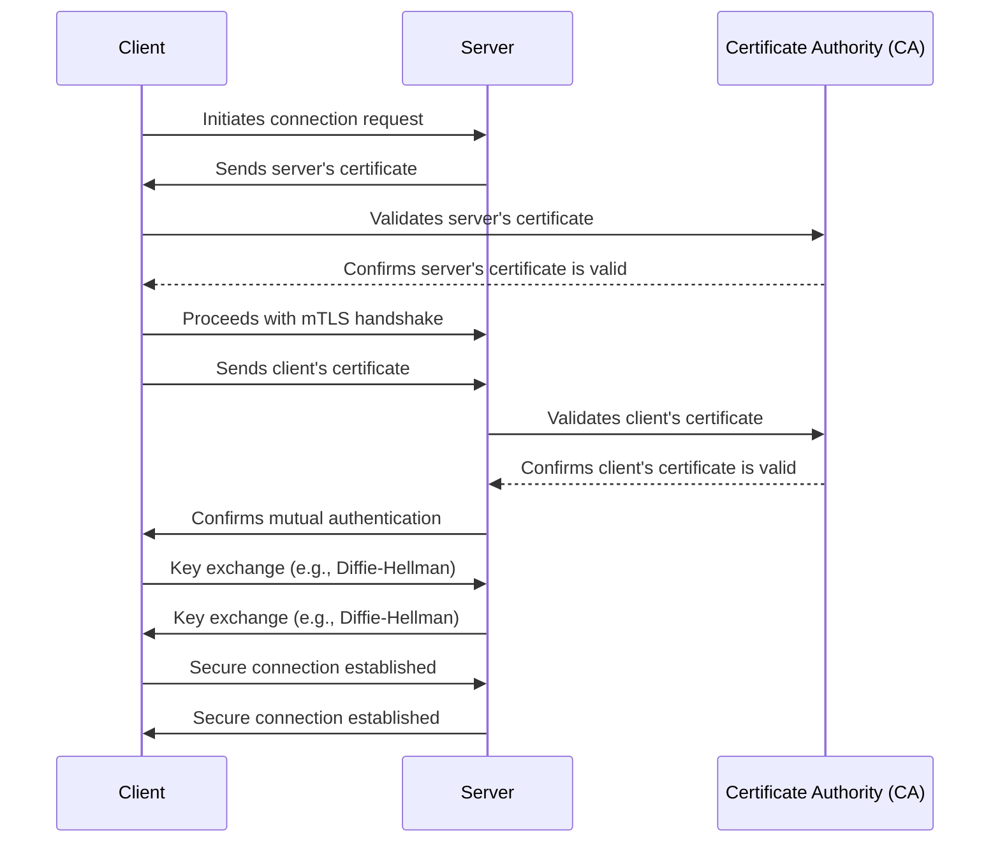

# Mutual TLS

## What is Mutual TLS?

**Mutual TLS (Transport Layer Security)** is a security protocol that ensures both the **client** and **server authenticate each other** during a secure connection. This is achieved through the exchange and validation of **digital certificates**, which include **public keys**. Each party also uses its **private key** to prove ownership of the certificate and establish trust.

In the **traditional TLS model**, **only the server's identity** is **verified/authenticated** by the **client**. In contrast, mutual TLS **requires both parties** to present and **validate their digital certificates**, establishing a two-way authentication process. The **private keys** remain securely stored and are used to sign data, while the **public keys** in the certificates are used for verification.

1. **Client Initiates Connection**: The client begins by **sending a request** to the server to establish a secure connection (e.g., using the TLS protocol).
2. **Server's Certificate**: The server **sends its digital certificate**, which includes its **public key**, to the client. The client will validate this certificate against its **trusted CA store**.
3. **Client Validates Server's Certificate**: The client **verifies the server's certificate** by **checking the signature** against the **trusted Certificate Authority (CA)** it has in its trusted store. This process confirms that the server's certificate is valid and trusted.
4. **Certificate Presentation**: If the server's certificate is valid, the client proceeds with the **mTLS handshake process**.
5. **Client Sends Its Certificate**: The client then **sends** its own **digital certificate**, which also contains its **public key**, to the server for validation.
6. **Server Validates Client's Certificate**: The server **checks** the **client’s certificate** against its **trusted CA store** to ensure it is valid and trusted.
7. **Mutual Authentication**: Once both the client and server validate each other's certificates, they can **confirm mutual authentication**.
8. **Key Exchange**: During the handshake, both the **client and server** use their **private keys** and a **key exchange algorithm** (e.g., Diffie-Hellman) to establish a **shared session key** for **encrypting subsequent traffic**.
9. **Secure Connection Established**: A secure, encrypted connection is established between the client and server, ensuring mutual trust and privacy.
