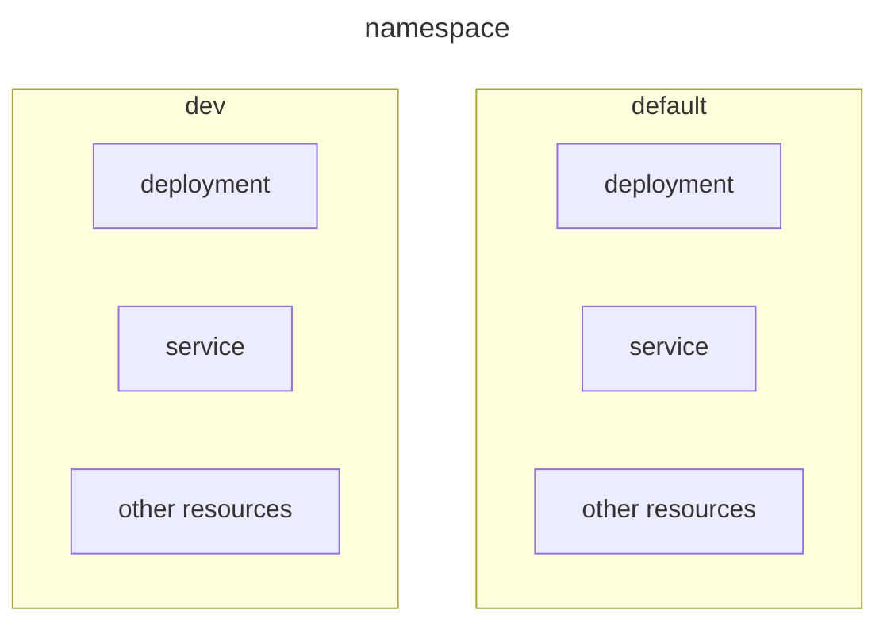
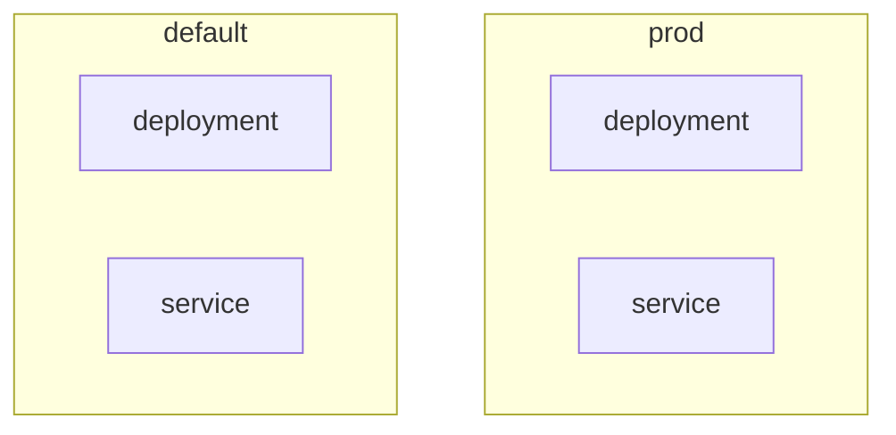

# Namespace

## What is Namespace?



Namespace used to **isolate the resources** within a single cluster. Therefore, each namespace can have its **own policies, permissions (RBAC), resource control**, etc. In other words, it is used to **isolate the users' accessibility**.

By default, Kubernetes will automatically create 4 default namespaces:
- **default**
  - This is the namespace you can start to deploy the resources **without creating** a new namespace, when you start using the new cluster.

- **kube-system**
  - This is the namespace for **objects created by the Kubernetes system** for itsa internal purpose, for example, kube-dns, kube-proxy, kubernetes-dashboard, ingresses, etc.

- **kube-public**
  - Basically this namespace **contains the resources that is readable** and **visible publicly** by all users **without any authentication**.
  - Mostly reserved for **cluster usage**. `kubectl cluster-info`
  - It contains a single **ConfigMap** object, basically the cluster info is mainly used for **aids discovery** and **security bootstrap**. `kubectl get configmap -n kube-public`

- **kube-node-lease**
  - This namespace holds **Lease objects** associated with each **node**. That means **node leases** will allow the **kubelet** to **send heartbeats** so that the **control plane** (Master Node `<-` Node controller) can **detect node failure**.
  - Basically this namespace related to **cluster scaling**.

## Namespace usage

### Commands

```bash
kubectl get <resource> -n <namespace-name>
kubectl get <resource> --namespace=<namespace-name>
kubectl get <resource> --all-namespaces

# example
kubectl get pods -n dev

# create namespace
kubectl create namespace dev
```

### Switch namespace in current context permanently

If we want to **switch to other namespace permanently**, we can do the following commands, so that we **don't have to specify** the namespace option.

```bash
kubectl config set-context $(kubectl config current-context) --namespace=<namespace-name>

kubectl get <resource> # it will by default show your namespace environment resources
```

Context is a **set of access parameters** that define a **cluster**, **namespace**, and **user** in Kubernetes. They actually stored in YAML file `kubeconfig`, and are used to **manage multiple clusters or environments** from the same management system.

### Create a namespace in YAML

```yaml
apiVersion: v1
kind: Namespace
metadata:
  name: dev
```

### Use namespace in resources YAML

```yaml
apiVersion: v1
kind: Pod
metadata:
  name: sample-nginx-pod
  namespace: dev
spec:
  containers:
    - name: nginx
      image: nginx
```

### Connect to other namespace services



If you want to **connect** to other **namespace services**, then you have to **reference** the **DNS** of the respective namespace, as a **DNS entry** will automatically added in this **format** when the service is created. Here is the format;
- Format: `<service-name>.<namespace>.svc.cluster.local`
- Example: `db-svc.prod.svc.cluster.local`
  - `cluster.local` = **default domain name** of the Kubernetes cluster

### Resource quota for namespace

You can **limit the resources** to be used within a namespace. You can set each namespace with a **guaranteed amount** and **not use more than** the limit.

- Scope: Applies to an **entire namespace**
- Purpose: Enforces **overrall resource usage limits** for all pods in a namespace
- Usage: Ensure that the **total resource usage consumption** (eg, CPU, memory, number of pods) in a namespace does **not exceed** the specified limits.

```yaml filename="resource-quota.yaml"
apiVersion: v1
kind: ResourceQuota
metadata:
  name: team-a-quota
  namespace: dev
spec:
  hard:
    pods: "15" # total pods cannot exceed 15
    requests.cpu: "2" # total CPU requests cannot exceed 2 cores
    requests.memory: 2Gi # total memory requests cannot exceed 2Gi
    limits.cpu: "4" # total CPU limits cannot exceed 4 cores
    limits.memory: 4Gi # total memory limits cannot exceed 4Gi
```

In this case, this `dev` namespace can only create a maximum of 15 pods. Each pod in the dev namespace will have 2 CPUs and 2G of memory, while the maximum CPU and memory limits are 4 and 4G, respectively.

You can **check the resource quota** by running the following command:
```bash
kubectl get quota -n dev
kubectl describe quota team-a-quota -n dev
```

### Limit range for namespace

<Callout title="Important" type="warn">
  The max and min values in a LimitRange apply to **both resource requests and limits**.
</Callout>

You can also set the default **minimum and maximum** limits for the resources like **CPU and memory** for pods in the namespace. With this setup, we can ensure that all the pods created in the namespace will have the same limits. Remember, if you just **create or change a limit range**, it will **not affect the existing pods**.

- Scope: Applies to **individual containers or pods** within a namespace
- Purpose: Sets **default, minimum, and maximum resource usage limits** for containers or pods
- Usage: Ensures that **each container or pod has resource requests** and **limits** within specified bounds, providing a way to **control resource allocation** at a **finer granularity**.

```yaml filename="cpu-limit-range.yaml"
apiVersion: v1
kind: LimitRange
metadata:
  name: cpe-resource-constraint
spec:
  limits:
    - default: # specify the default limits for containers
        cpu: 500m # Default CPU limit is 500m
        memory: 512Mi # Default memory limit is 512Mi
      defaultRequest: # specify the default request for containers
        cpu: 500m # Default CPU request is 500m
        memory: 512Mi # Default memory request is 512Mi
      max: # Specify the maximum limit for containers
        cpu: "1" # Maximum CPU limit is 1 core
        memory: 1Gi # Maximum memory limit is 1Gi
      min: # Specify the minimum limit for containers
        cpu: 100m # Minimum CPU limit is 100m
        memory: 256Mi # Minimum memory limit is 256Mi
      type: Container
```
With this setup, we specify the default CPU and memory limits for the pods in the namespace are `500m` and `512Mi`, respectively. The default request for CPU and memory are also set to `500m` and `512Mi`, respectively.

- `max` - the **maximum limit for CPU and memory** that can be set on a container
  - If you explicitly specify the resource requests and limits, they must not be higher than max values
- `min` - the **minimum limit for CPU and memory** that can be set on a container
  - If you explicitly specify the resource requests and limits, they must not be lower than min values

**Example Scenarios:**
- No resources specified:
  - The container will get 500m CPU and 512Mi memory (default values).
- Explicitly set 200m CPU and 300Mi memory:
  - This is valid because it is within the min and max range.
- Explicitly set 50m CPU and 200Mi memory:
  - This will fail because it is below the min values.
- Explicitly set 2 CPU and 2Gi memory:
  - This will fail because it exceeds the max values.

