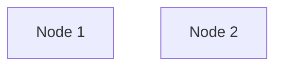

# Node Selectors

## Usage of Node Selectors

Node selectors are used to **specify the nodes where a pod should be scheduled** by using **labels**.



Assume you have a pod that **requires a GPU**, but we know that **Node 1 has GPU** and **Node 2 does not have a GPU**. So, in this case, we want to schedule this pod on Node 1. There are two ways to achieve this:
- **Node Selectors**
- **Node Affinity**

Before we dive into Node Selectors, let's first understand **how to label a node**.

```bash
kubectl label nodes <node-name> <label-key>=<label-value>
kubectl label nodes node1 gpu=large
```

Then we only customize the pod definition file to include the node selector.

```yaml filename="sample-pod.yaml"
apiVersion: v1
kind: Pod
metadata:
  name: sample-pod
spec:
  containers:
    - name: sample-container
      image: nginx
  nodeSelector:
    gpu: large
```

Now of course, this **node selector method is not flexible** enough to handle more complex scenarios. For example, if we want to schedule a pod on a node that **has a large or medium GPU**. We can't achieve this using node selectors. In this case, we need to use **Node Affinity**.
