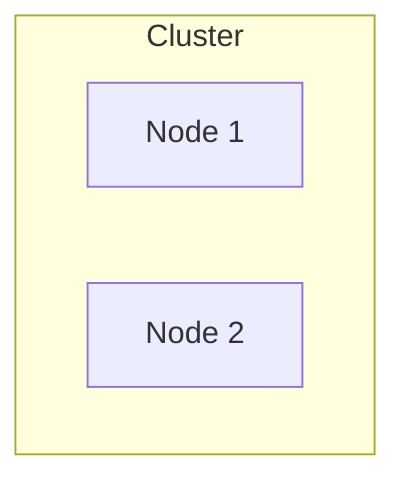

# OS Upgrades

Summary (Formula);
- **drain** = **terminate** + **schedule** + **cordoned**
- **cordon** = **cordoned**

## Introduction of OS Upgrades



Assume you have a cluster with 2 nodes. Now, you want to **upgrade one of the nodes to a new version**. If the **node** is **down** for **more than 5 minutes**, all the **pods** running on that node **will be dead**, else the pods will **come back online** when the `kubectl` process starts. If the pods are part of a replicaset, those pods will be provisioned on other nodes.

In this case, we need to upgrade the node in a safer way.

```bash
kubectl drain <node-name>
# For pods, you have to force it, but the pod will lose forever
kubectl drain <node-name> --force
kubectl drain <node-name> --ignore-daemonsets
```

What we are doing her is, we are **draining the node**. When we **drain the node**, the pods are **gracefully terminated from the node** and are **scheduled on other nodes** (it does not move from one node to another). Besides, the node is also marked as **unschedulable** or **cordoned**, that means no new pods will be scheduled on that node until you **uncordon** it.

```bash
kubectl uncordon <node-name>
```

When the node is come back online, you have to **uncordon** it, so that the node is not marked as **unschedulable**. Once you **uncordon** it, the pods can be **scheduled** on that node again.

One thing we have to keep in mind it, those pods that are scheduled on other nodes won't automatically come back to the original node.

---

```bash
kubectl cordon <node-name>
```

If you want to make the node **unschedulable** or **cordoned**, you can use this command. This will make sure that no new pods are scheduled on that node.
