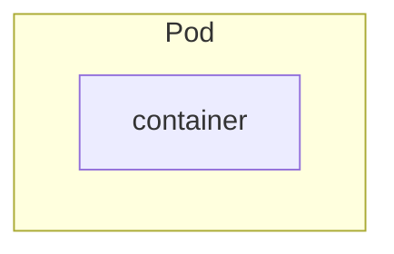
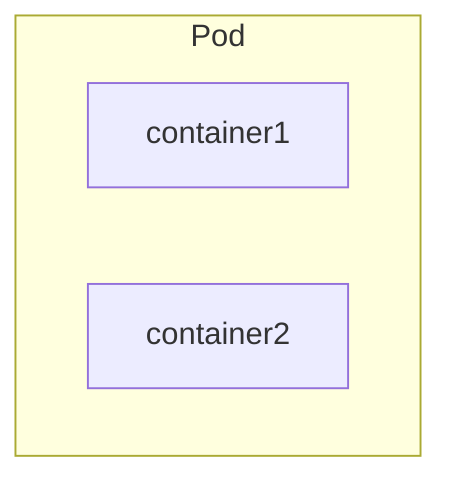
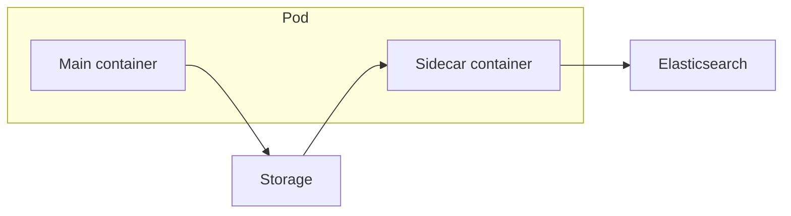
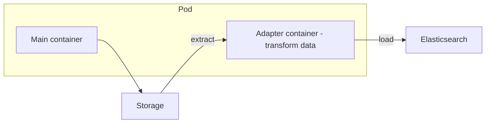
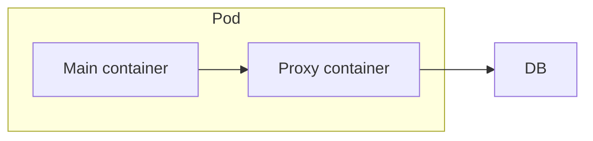

# Pod

## What is Pod?



Pod is a **single instance of an application** and is the **smallest unit** of a Kubernetes application. It basically **wraps container** or provides an abstraction layer over container. Normally, pod is only run one application container inside it (**one-to-one relationship**).

Each pod will **get its IP address** and when the **pod is recreated**, then the new IP address will be assigned to that pod. So, the pod can **use its IP address** to **communicate** with each other pods using its **internal IP address**.

The containers inside the pod can **communicate with each other** using `localhost` as they are **sharing the same network space**. They can also share the **same storage space**, which is called **volume**.

### Pods statuses

- **CrashLoopBackOff**
  - The pod is in a crash loop, meaning the container is **crashing repeatedly**.
  - The pod is trying to restart the container, but it keeps failing when it starts.

## Commands

```bash
# Deploy nginx image to pod with the pod-name "nginx"
kubectl run <pod-name> --image=<image>

# Example
kubectl run nginx --image=nginx
kubectl run nginx --image=nginx --port=8000 # container exposes port
kubectl run nginx --image=nginx --port=8080 --expose # Create a cluster IP associated with the pod port number

kubectl get pods
kubectl get pod <pod-name>
kubectl describe pod <pod-name>
kubectl delete pod <pod-name>

kubectl exec <pod-name> -- <command>
kubectl exec mypod -- /bin/bash

kubectl apply -f <filename>
kubectl create -f <filename>

kubectl edit pod <pod-name>

# extract pod definition to a file
kubectl get pod <pod-name> -o yaml > pod.yaml

# get more pod information like IP address, etc
kubectl get pods -o wide
```

## Pod YAML File

Here is the sample pod YAML file, to apply this file, you need to type `kubectl apply -f pod.yaml`.

| Kind | Version |
| ---- | ------- |
| Pod | v1 |
| Service | v1 |
| ReplicaSet | apps/v1 |
| Deployment | apps/v1 |

```yaml filename="pod.yaml"
apiVersion: v1
kind: Pod
metadata:
  name: myapp
  labels:
    name: myapp
spec:
  containers:
    - name: myapp
      image: nginx
      ports:
        - containerPort: 8080
```

## Restart Policy

Restart policy is used to **define the behavior of the pod when the container crashes**. There are three types of restart policy:
- **Always** (default): The container will always restart when it crashes or any termination.
- **OnFailure**: The container will restart only when it crashes (non-zero exit status).
- **Never**: The container will never restart when it crashes or any termination.

```yaml filename="pod.yaml"
apiVersion: v1
kind: Pod
metadata:
  name: myapp
spec:
  containers:
    - name: ubuntu
      image: ubuntu
  restartPolicy: Never
```
- In this case, the pod will never restart when the container job is done.


## Init Containers

Init container is a **special type of container** that **run before the main container**. It will be **run only once** and **must complete successfully** before the main container starts.

Use case:
- Wait for a database to be ready
- Prepare a configuration file
- Load data

```yaml filename="init-container.yaml"
apiVersion: v1
kind: Pod
metadata:
  name: sample-pod
spec:
  containers:
    - name: main-container
      image: api:1.0.0
  initContainers:
    - name: init-database
      image: mysql
      command: ['sh', '-c', 'mysql -h db -u root -p $MYSQL_ROOT_PASSWORD < /scripts/init.sql']
```
- If you specify multiple init containers, they will be **run in order**.

## Multi-container pods



Multi-container pods are like **helper containers**. The two or more containers can **communicate directly via localhost** as they **share the same network space**. Of course, they are **sharing the same storage space** and **same lifecycle (created and destroyed together)** as well.

### Design Patterns

#### Sidecar Pattern

Sidecar pattern is a **container attached to the main container** to **extend or enhance the main container**. For example, a sidecar container can **collect logs** from the main container, then can **forward them to a centralized logging system** like Elasticsearch.

Use case:
- Logging
- Monitoring
- Security
- Data synchronization



```yaml filename="sidecar.yml"
apiVersion: v1
kind: Pod
metadata:
  name: sample-pod
spec:
  containers:
    - name: app-container
      image: alpine
      command: ["/bin/sh"]
      args: ["-c", "while true; do date >> /var/log/index.html; sleep 2;done"]
      volumeMounts:
        - name: logs
          mountPath: /var/log
    - name: log-agent
      image: nginx
      ports:
        - containerPort: 80
      volumeMounts:
        - name: logs
          mountPath: /usr/share/nginx/html
  volumes:
    - name: logs
      emptyDir: {}
```
- In this case, when you port-forward to the port `80`, you will see the logs from the `app-container`.

#### Adapter Pattern

Adapter pattern is a container that **acts as a translator** between the main containers and the external systems. Basically, you can use this pattern to **manipulate and transform the data into a standardize format** before sending it to the external system.

For example, you have multiple applications that generated logs in different formats, then you can use the adapter pattern to transform the logs into a standardize format before sending them to the centralized logging system, so that the centralized logging system can easily parse and analyze the logs.

Use case:
- Data transformation
- Protocol translation
- API adaptation (Reverse Proxy)
- Standardize data format



```yaml filename="adapter.yml"
apiVersion: v1
kind: Pod
metadata:
  name: sample-pod
spec:
  containers:
    - name: app-container
      image: alpine
      command: ["/bin/sh"]
      args: ["-c", "while true; do date >> /var/log/debug.log; sleep 2;done"]
      volumeMounts:
        - name: logs
          mountPath: /var/log
    - name: log-adapter
      args: ["/bin/sh"]
      args: ["-c", "tail -f /var/log/debug.log|sed 's/^/DEBUG: /' > /var/log/transformed.log"]
      volumeMounts:
        - name: logs
          mountPath: /var/log
  volumes:
    - name: logs
      emptyDir: /var/log
```

#### Ambassador Pattern

Ambassador Pattern is a container that **acts as a proxy** to the external services. It is used to **hide the complexity of the external services** from the main container. Therefore, this ambassador container will **act as a client proxy (manage all incoming and outgoing network traffic)** between the main container and the external services. 

For example, your application need to connect to external database, now the application need to connect to different database based on the environment (development, staging, production) and you also need to make sure that the application connect to the correct database based on the environment, in this case, you can use the ambassador pattern to manage the connection to the database, so that the application only need to connect to the ambassador container as `localhost` and the ambassador container will manage the connection to the correct database based on the environment.



```yaml filename="ambassador.yml"
apiVersion: v1
kind: ConfigMap
metadata:
  name: db-config
data:
  development: "dev-db.example.com"
  staging: "staging-db.example.com"
  production: "prod-db.example.com"
---
apiVersion: v1
kind: Pod
metadata:
  name: sample-pod
  labels:
    app: ambassador
    environment: development # Change this based on the environment
spec:
  containers:
    - name: backend
      image: backend
      env:
        - name: DB_HOST
          value: "localhost"
      ports:
        - containerPort: 8080
    - name: ambassador
      image: ambassador-image
      env:
        - name: ENVIRONMENT
          valueFrom:
            fieldRef:
              fieldPath: metadata.labels.environment
        - name: DB_HOST
          valueFrom:
            configMapKeyRef:
              name: db-config
              key: $(ENVIRONMENT)
      ports:
        - containerPort: 80
```
- `ConfigMap` is used to store the database connection based on the environment.
- `ambassador` container reads the env variable and configures itself to connect to the correct database based on the environment.
- `backend` container connects to the `ambassador` container as `localhost`.
