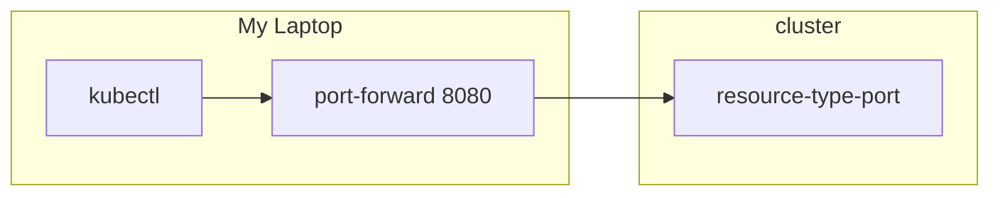

# Port Forward

## Concept and Usage of Port Forward



Port forwarding is a technique that **allows you to access a service** running in a Kubernetes cluster **from your local machine**. This is **useful for debugging purposes** or to access a service that is not exposed to the public internet.

```bash
kubectl port-forward <resource-type>/<name> <local-port>:<resource-type-name-port>

# examples
kubectl port-forward pod/my-pod 8080:80
kubectl port-forward deployment/my-deployment 8080:80
kubectl port-forward service/my-service 8080:80
```

In this case, we specify our local port as `8080` and the port of the resource we want to access as `80`. This means that we can access the service running in the Kubernetes cluster on port `80` by visiting `http://localhost:8080`.
