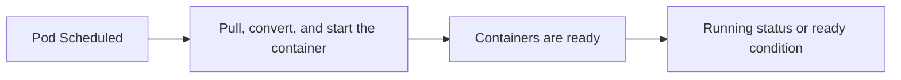
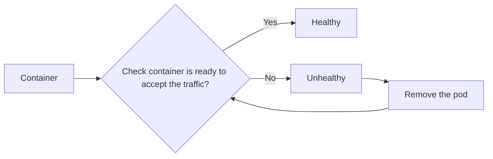

# Readiness Probes

## Pod setup process, status, and conditions

Before we straight away understand how to use **Readiness Probes**. Let's understand the **Pod** setup process, status, and conditions.

1. The scheduler will **determine** which node to place the pod.
2. Once the pod is scheduled on the right node, it will **pull** the images, **convert** it into a container, and the container will **start** after done pulling the image.
3. Then, the pod will go into a **running state** by making sure all the **containers are ready (ready conditions)**.



The **ready condition** actually **indicates** that the application running inside the pod is **now ready to accept the user traffic**, because by default, Kubernetes assumes when the container is created, it is ready to accept the user traffic, therefore it will set the **ready condition** to **true** for all the containers.

## Usage of Readiness Probes

[Reference](https://kubernetes.io/docs/tasks/configure-pod-container/configure-liveness-readiness-startup-probes/#define-readiness-probes)

The concept of Readiness probes basically is to **determine whether a container is ready to accept the traffic** by **performing some health checks**. If the readiness probes are successful, then we know that container is going to run and accept the traffic, else, it (kubelet) will remove the pod and try again.



Examples of Readiness Probes usage;
- **Test** the web application is **online**
- **Check** whether the Database TCP connection is **online** or **ready**
- **Run** the **exec command** to run a custom script that will determine the application is **ready**

**HTTP**
```yaml filename="readiness-probes.yaml"
apiVersion: v1
kind: Pod
metadata:
  name: sample-pod
spec:
  containers:
    - name: web-app
      image: webapp
      readinessProbe:
        httpGet:
          path: /api/v1/health
          port: 8000
        initialDelaySeconds: 5 # Number of seconds after the container has started before startup, that means it should wait for 5 seconds before performing the 1st probe
        periodSeconds: 3 # how often to perform the probe
        failureThreshold: 5 # default 3, if the application is not ready after 3 attempts, then the probe will stop
```

---
**TCP**
```yaml filename="readiness-probes.yaml"
apiVersion: v1
kind: Pod
metadata:
  name: sample-pod
spec:
  containers:
    - name: web-app
      image: webapp
      readinessProbe:
        tcpSocket:
          port: 8080
        initialDelaySeconds: 5 # Number of seconds after the container has started before startup, that means it should wait for 5 seconds before performing the 1st probe
        periodSeconds: 3 # how often to perform the probe
        failureThreshold: 5 # default 3, if the application is not ready after 3 attempts, then the probe will stop
```

**kubelet** will try to **open a socket** to the container on the specified port `8080`. If it can **establish the connection**, then the state is **healthy**.

---
**exec**
```yaml filename="readiness-probes.yaml"
apiVersion: v1
kind: Pod
metadata:
  name: sample-pod
spec:
  containers:
    - name: web-app
      image: webapp
      readinessProbe:
        exec:
          command:
            - cat
            - /app/healthy
        initialDelaySeconds: 5 # Number of seconds after the container has started before startup, that means it should wait for 5 seconds before performing the 1st probe
        periodSeconds: 3 # how often to perform the probe
        failureThreshold: 5 # default 3, if the application is not ready after 3 attempts, then the probe will stop
```

It will **return 0 status code** if the **command succeed**.
