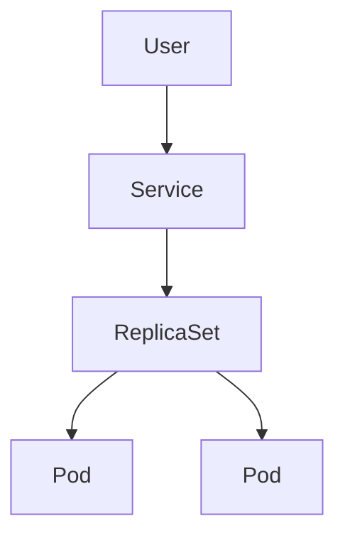

# ReplicaSet

## What is ReplicaSet ?

<Callout type="info">
  Replication Controller and ReplicaSet are the same, but ReplicaSet is the next generation of Replication Controller.
</Callout>

<Callout title="Explanation">
  - The user sends requests to a Service (like a LoadBalancer or ClusterIP).
  - The Service forwards the requests to the ReplicaSet.
  - The ReplicaSet manages a set of Pods, ensuring that the desired number of replicas are running.
</Callout>



Replicaset will **ensure a specified number of pod replicas** are **running**. It will **maintain the desired state** of the application by creating or deleting pods as needed to **match the defined number** of replicas. With this setup, it will ensure **high availability** and **fault tolerance** for applications.

Key features:
- **Self-healing**: If a pod fails, it will create a new pod to replace it. Therefore, it will **ensure the specified number of pods** are running at all times.
- **Scaling**: It can **scale up or down** the number of pods as needed.
- **Load Balancing**: It can **distribute the traffic (share the load)** to the pods.

## Replication Controller

```yaml filename="rc.yaml"
apiVersion: v1
kind: ReplicationController
metadata:
  name: rc
spec:
  replicas: 3
  template:
    metadata:
      name: pod-name
    spec:
      containers:
        - name: container-name
          image: web-server-image
```

```bash
kubectl get replicationcontroller
```

## ReplicaSet

<Callout type="info">
  When you perform the editing to the replicaset, you will need to **delete** the previous deployed pods first, as it **won't auto update** the pods.
</Callout>

The differences between **Replication Controller** and **ReplicaSet** is **ReplicaSet** needs a **selector** definition. The **selector** will be used to **identify the pods** that **ReplicaSet** will **manage**. Furthermore, ReplicaSet can also **manage pods** that were not created as part of the ReplicaSet creation, as it uses **label selectors to identify and manage pods**. So if you want to **create a new pod**, you have to **specify template** section.

```yaml filename="rc.yaml"
apiVersion: apps/v1
kind: ReplicaSet
metadata:
  name: replicaset-name
spec:
  replicas: 3
  selector:
    matchLabels: # matches the pod labels specified in the template section
      app: web-server
  template:
    metadata:
      name: pod-name
      labels:
        app: web-server
    spec:
      containers:
        - name: container-name
          image: web-server-image
```

```bash
kubectl get replicaset
kubectl scale --replicas=5 -f <file-name>
kubectl scale --replicas=5 replicaset <replicaset-name>
kubectl delete replicaset <replicaset-name>
```
