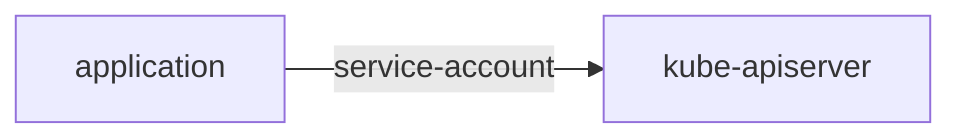

# Service Account

## Concept and Usage of Service Account

<Callout type="info">
  We can create a new user using service account mechanism in Kubernetes.
</Callout>

Service account is a **non-human account** that is used by **processes/application** running inside a pod to **interact** with the **Kubernetes API server**. It provides an **identity for processes** that run in a Pod. When you create a Pod, if you **do not specify a service account**, it is **automatically assigned** the **default service account** in the **same namespace**.

| Description | ServiceAccount | User or group |
| --- | --- | --- |
| Location | Kubernetes API (ServiceAccount object) | External |
| Access control	| Kubernetes RBAC or other authorization mechanisms	| Kubernetes RBAC or other identity and access management mechanisms |
| Intended use	| Workloads, automation, Third-party application	| People |



For example, assuming you have an application that needs to **pull data like pods, services, etc** by **making API calls to the Kubernetes API server** and display it on the UI. When the application **needs to make API calls** to the Kubernetes API server, it **needs to authenticate** itself. This is where **service accounts** come into the picture.

**Additional info:**
- Every **namespace** will auto create a **default service account**.
- By default, when you create a pod, it will use the **default service account** of the namespace and mount the **service account token** as a **volume** in the pod at the path `/var/run/secrets/kubernetes.io/serviceaccount`.
  - When you `kubectl exec -it <pod-name> -- ls /var/run/secrets/kubernetes.io/serviceaccount` you will see the **token, ca.crt, and namespace** files.
  - If you **don't want** the Kubernetes **auto mount the service account token**, you can set `automountServiceAccountToken` to `false` in the pod spec.
    ```yaml filename="pod.yaml" {9}
    apiVersion: v1
    kind: Pod
    metadata:
      name: my-pod
    spec:
      containers:
        - name: ubuntu
          image: ubuntu
      automountServiceAccountToken: false
    ```

- The **default service account** has **limited permissions** and it only use to run **basic Kubernetes API queries**.
- When you want to **change or edit the existing pod service account**, you must **delete the pod** and **recreate** it, but for **deployment** case, you can just **edit** the deployment, as it will **auto trigger** a new rollout.

<Steps>

### Step 1: Create Service Account

1. **Imperative way**
  ```bash
  kubectl create serviceaccount <name-of-service-account>
  kubectl create serviceaccount data-sa
  ```

2. **Declarative way**
  ```yaml filename="data-sa.yaml"
  apiVersion: v1
  kind: ServiceAccount
  metadata:
    name: data-sa
  ```

3. Get the service account list
  ```bash
  kubectl get serviceaccounts
  ```

### Step 2: Generate Token for Service Account

This token is used by the application to **authenticate itself** with the **Kubernetes API server**. Now, when you create token, it is important to set the time to live (TTL) for the token. By default, the token will be valid for 1 hour.

```bash
kubectl create token <name-of-service-account>
kubectl create token data-sa
kubectl create token data-sa --duration=30m
```

### Step 3: Use Service Account in Pod or make API calls

You can use `curl` and provide the token as a **bearer token** to make API calls. Besides, you can also **mount the service account token** as a **volume** in the pod if you want the make API calls from the pod.

```bash
curl https://<kube-apiserver>:6443/api --header "Authorization: Bearer <token>"
```

```yaml filename="pod.yaml" {9}
apiVersion: v1
kind: Pod
metadata:
  name: my-pod
spec:
  containers:
    - name: ubuntu
      image: ubuntu
  serviceAccountName: data-sa
```
- Let's say you want to make API calls from the pod, you need to provide the token in the header, but when you setup `serviceAccountName` in the pod spec, you **don't need to provide the token** in the header anymore as it will **auto mount the token as a volume** in the pod, which can auto authenticate the pod to the **kube-apiserver**.

</Steps>

## Manually creating a long-lived API token for a service account

[Reference](https://kubernetes.io/docs/tasks/configure-pod-container/configure-service-account/#manually-create-a-long-lived-api-token-for-a-serviceaccount)

If you want to create a **long-lived (non-expiring) token** for a service account, you have to create a **secret** and **associate** it with the **service account**.

<Steps>

### Step 1: Create a service account

```yaml filename="data-sa.yaml"
apiVersion: v1
kind: ServiceAccount
metadata:
  name: data-sa
```
- This method will not populate the `secrets` field in the service account object, as the `secrets` field is only populated with auto-generated secrets.

```yaml filename="data-sa.yaml"
apiVersion: v1
kind: ServiceAccount
metadata:
  name: data-sa
secrets:
  - name: data-sa-secret
```
- This method will populate the `secrets` field in the service account object.

### Step 2: Associate the secret with the service account

```yaml filename="data-sa-secret.yaml"
apiVersion: v1
kind: Secret
metadata:
  name: data-sa-secret
  annotations:
    kubernetes.io/service-account.name: data-sa # service account name
type: kubernetes.io/service-account-token
```

### Step 3: View the secret

```bash
kubectl get secret/data-sa-secret -o jsonpath='{.data.token}' | base64 -d
```
</Steps>

## Add ImagePullSecrets to Service Account

You can **add imagePullSecrets** to a **service account** so that any pod using that service account can use the specified secret to **pull images from a private registry**.

Assuming, you have a secret named `my-registry` that contains the credentials for your private Docker registry.

Now you can add this secret to your service account as follows:

```bash
kubectl patch serviceaccount <name-of-service-account> -p '{"imagePullSecrets": [{"name": "<secret-name>"}]}'
# example
kubectl patch serviceaccount data-sa -p '{"imagePullSecrets": [{"name": "my-registry"}]}'
```

---
Of course, you can also achieve the same output by editing the service account object directly:

```bash
kubectl edit serviceaccount <name-of-service-account>
# example
kubectl edit serviceaccount data-sa
```
This will open the service account in your default text editor. You can then add the `imagePullSecrets` field under the `secrets` field like this:

```yaml filename="data-sa.yaml" {6-7}
apiVersion: v1
kind: ServiceAccount
metadata:
  name: data-sa
  ...
imagePullSecrets:
  - name: my-registry
```

Now, you can cross-verify that `imagePullSecrets` are set for new pods using this service account:

```bash
kubectl run nginx --image=nginx --serviceaccount=data-sa
kubectl get pod nginx -o jsonpath='{.spec.imagePullSecrets[0].name}{"\n"}'
```
