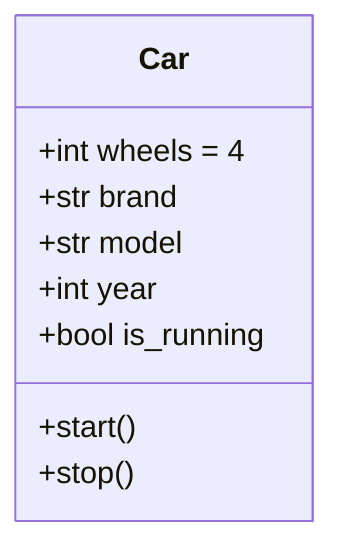
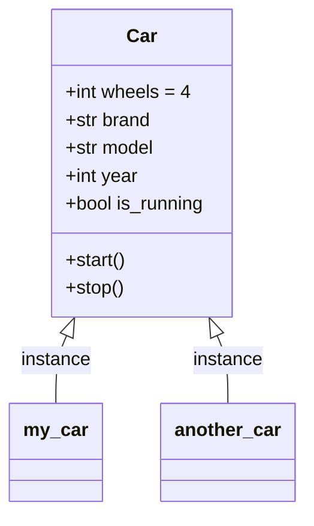

# Class & Object

## Concept

| Class | Object |
| ----- | ------ |
| A **blueprint or template for creating objects** | An **instance of a class** |
| Defines **attributes (data) and behaviours (method)** that the created objects will have | Contains **data and methods** defined by the class or has its **own set of attribute values** |
| Uses the `class` keyword | Created using the class name followed by parentheses |
| Contains the `__init__` method for initialization | Created by calling the class like a function |

## Implementation

Let's explore how to create classes and objects in Python.

<Steps>

### Create a Class

To create a class in Python, use the `class` keyword followed by the class name. By convention, class names are written in CamelCase.

`Car` is your blueprint for creating car objects. It defines the attributes and methods that each car object will have.



```python filename="car.py"
class Car:
  # Class attributes (shared by all instances)
  wheels = 4

  def __init__(self, brand, model, year):
    self.brand = brand # Instance attribute
    self.model = model # Instance attribute
    self.year = year # Instance attribute
    self.is_running = False # Instance attribute

  def start(self): # Instance method
    self.is_running = True
    print(f"{self.brand} {self.model} is now running.")
  
  def stop(self): # Instance method
    self.is_running = False
    print(f"{self.brand} {self.model} has stopped.")
```
- `__init__()` method: This is the **constructor** that **initializes the instance attributes** when a new object is created. It takes `self` (the instance itself) and other parameters to **set the initial state of the object**.
  - Attributes created in `__init__()` are called **instance attributes** and are unique to each object.

### Create an Object



```python filename="car.py" {20-21}
class Car:
  # Class attributes (shared by all instances)
  wheels = 4

  def __init__(self, brand, model, year):
    self.brand = brand # Instance attribute
    self.model = model # Instance attribute
    self.year = year # Instance attribute
    self.is_running = False # Instance attribute

  def start(self): # Instance method
    self.is_running = True
    print(f"{self.brand} {self.model} is now running.")
  
  def stop(self): # Instance method
    self.is_running = False
    print(f"{self.brand} {self.model} has stopped.")

# Creating objects (instances)
my_car = Car("BMW", "X5", 2020)
another_car = Car("Audi", "A4", 2021)

# Accessing attributes and methods
print(my_car.brand) # BMW
my_car.start() # BMW X5 is now running!
print(my_car.is_running) # True
```

</Steps>