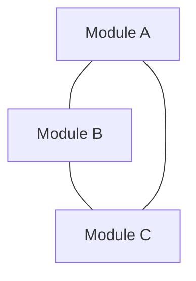
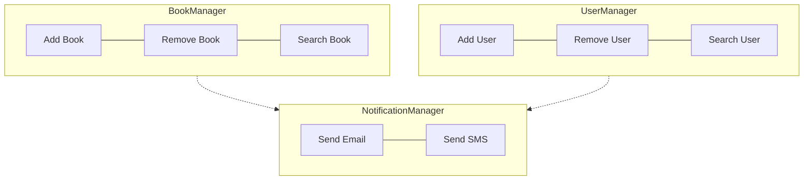

# Cohesion and Coupling

<Callout type="warn" title="Important">
  - **High coupling** and **low cohesion** can lead to **difficult-to-maintain code**
  - **Low coupling** and **high cohesion** can lead to **more maintainable, understandable, and flexible code**.
</Callout>

## Coupling

Coupling refers to the **degree of interdependence between software modules**. Meaning that **how closely connected modules are**, and **how much they rely on each other**.
- **High coupling** means **modules are tightly (closely) connected** and changes in one module can **significantly affect** others.
- **Low coupling** means **modules are independent** and changes in one module has **minimal impact** on others.

## Cohesion

Cohesion refers to the **degree to which elements of a module belong together**. Meaning that **how closely related and focused the responsibilities of a single module are**.
- **High cohesion** means that a module has a **single purpose, well-defined responsibility** and all its **elements are closely related**.
- **Low cohesion** means that a module has **multiple purposes, unrelated responsibilties** and its **elements are not closely related**.

## Differences of Cohesion and Coupling

| Aspect     | Coupling                                              | Cohesion                                               |
|------------|------------------------------------------------------|--------------------------------------------------------|
| Definition | Degree of interdependence between modules             | Degree to which elements within a module belong together|
| Purpose | Relationships between modules | Relationships within a module |
| Goal | Low coupling (loosely couple) | High cohesion (highly cohesive) |

Here's a real-life example using a **Library System** to illustrate low coupling and high cohesion.

**High Cohesion** - Each module has high cohesion (focused responsibilities):
- The `BookManager` module only manages books (add, remove, search).
Low Coupling:
- `BookManager`, `UserManager`, and `NotificationManager` work independently and interact through clear interfaces.

**Low Coupling** - The modules are loosely coupled:
- The **dashed arrows** show low coupling (modules interact but are not tightly bound).