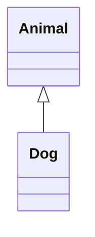
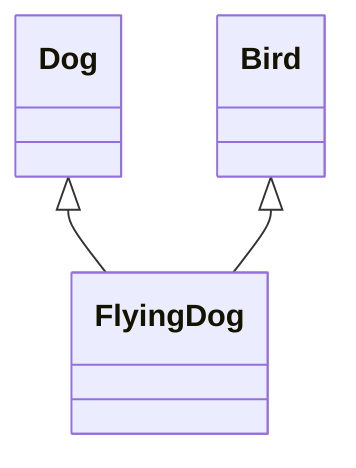
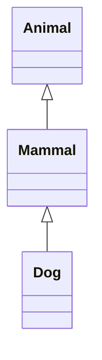
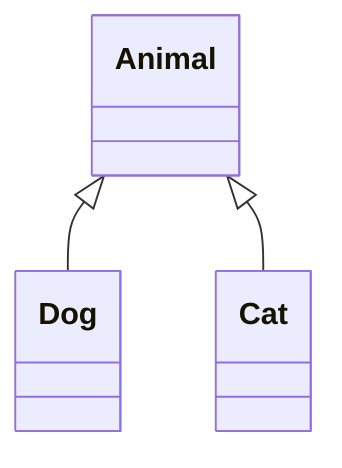
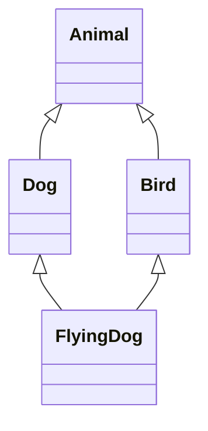

# Inheritance

## Concept

A mechanism to **create a new class (subclasses)** that **inherits attributes and methods** from an **existing class (parent classes)**. It allows for **code reuse** and establishes a **relationship** between classes.

| Type of Inheritance      | Description                                                                                      | Example                                      |
|-------------------------|--------------------------------------------------------------------------------------------------|----------------------------------------------|
| Single Inheritance      | A subclass inherits from one parent class.                                                       | `class Dog(Animal): pass`                    |
| Multiple Inheritance    | A subclass inherits from multiple parent classes.                                                | `class FlyingDog(Dog, Bird): pass`           |
| Multilevel Inheritance  | A subclass inherits from a parent class, which in turn inherits from another parent class.       | `Animal -> Mammal -> Dog`                    |
| Hierarchical Inheritance| Multiple subclasses inherit from a single parent class.                                          | `Animal -> Dog, Cat, Bird`                   |
| Hybrid Inheritance      | A combination of two or more types of inheritance.                                               | `class FlyingDog(Dog, Bird): pass` where `Dog` and `Bird` are subclasses of `Animal`. |

## Implementation

### Single Inheritance



```python filename="animal.py"
class Animal:
  def __init__(self, name, age):
    self.name = name
    self.age = age

  def speak(self):
    print("Animal speaks")

class Dog(Animal):
  def __init__(self, name, age):
    super().__init__(name, age)  # Call the parent class constructor

  def speak(self): # method overriding
    print("Woof!")

dog = Dog("Buddy", 3)
dog.speak()  # Output: Woof!
print(dog.name)  # Output: Buddy
print(dog.age)   # Output: 3
print(isinstance(dog, Animal))  # Output: True
```
- `super().__init__(name, age)` is used to call the constructor of the parent class (`Animal`) to initialize the inherited attributes.
- `isinstance(dog, Animal)` checks if `dog` is an instance of the `Animal` class or its subclasses.

### Multiple Inheritance



When a class inherits from multiple parent classes, the order is determined by the **Method Resolution Order (MRO)**, which follows the **C3 linearization algorithm**. This ensures a consistent order of method resolution. The MRO can be checked using the `__mro__` attribute or the `mro()` method. The MRO is a **depth-first, left-to-right traversal** of the class hierarchy.

```python filename="animal.py"
class Dog:
  def bark(self):
    print("Woof!")

class Bird:
  def fly(self):
    print("Bird flies")

class FlyingDog(Dog, Bird):
  pass

fd = FlyingDog()
fd.bark()  # Output: Woof!
fd.fly()   # Output: Bird flies
```

The MRO for this is `FlyingDog -> Dog -> Bird`

### Multilevel Inheritance



```python filename="animal.py"
class Animal:
  def eat(self):
    print("Animal eats")

class Mammal(Animal):
  pass

class Dog(Mammal):
  pass

dog = Dog()
dog.eat()  # Output: Animal eats
```

### Hierarchical Inheritance



```python filename="animal.py"
class Animal:
  def sleep(self):
    print("Animal sleeps")

class Dog(Animal):
  pass

class Cat(Animal):
  pass

dog = Dog()
cat = Cat()
dog.sleep()  # Output: Animal sleeps
cat.sleep()  # Output: Animal sleeps
```

### Hybrid Inheritance



```python filename="animal.py"
class Animal:
  def move(self):
    print("Animal moves")

class Dog(Animal):
  def bark(self):
    print("Woof!")

class Bird(Animal):
  def fly(self):
    print("Bird flies")

class FlyingDog(Dog, Bird):
  pass

fd = FlyingDog()
fd.move()  # Output: Animal moves
fd.bark()  # Output: Woof!
fd.fly()   # Output: Bird flies
```
