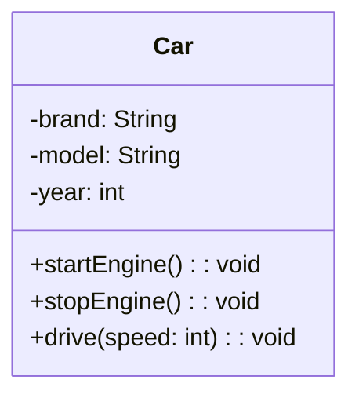
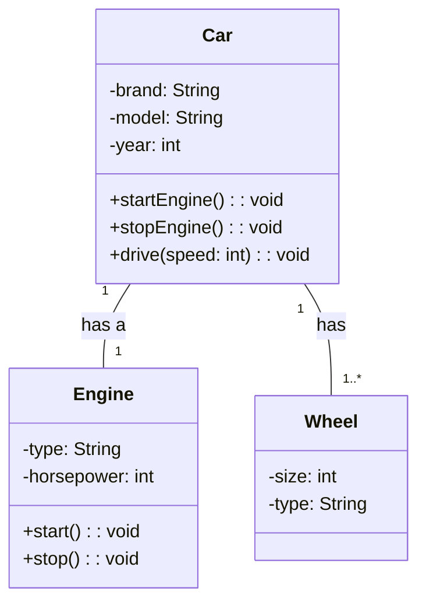
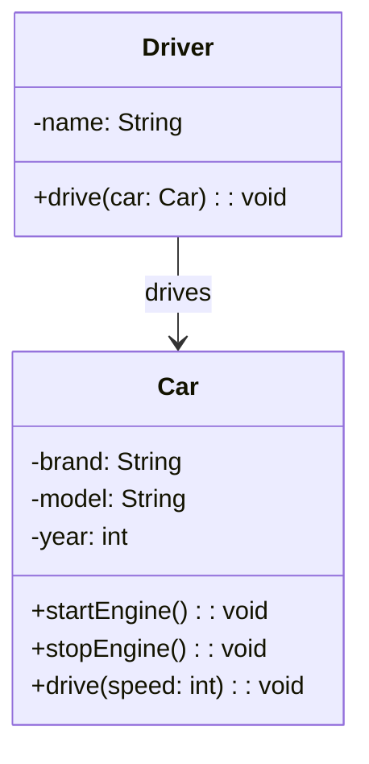
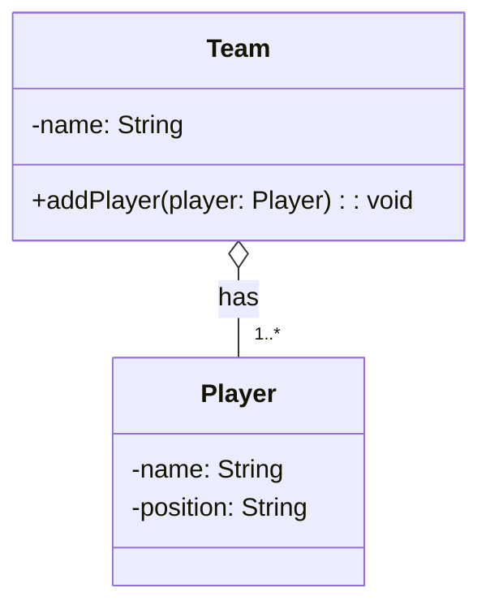
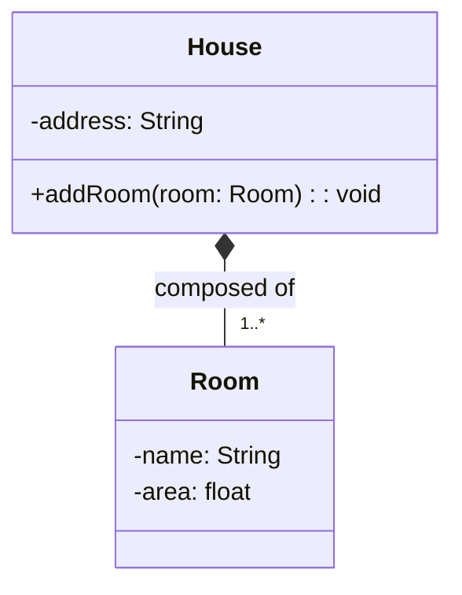
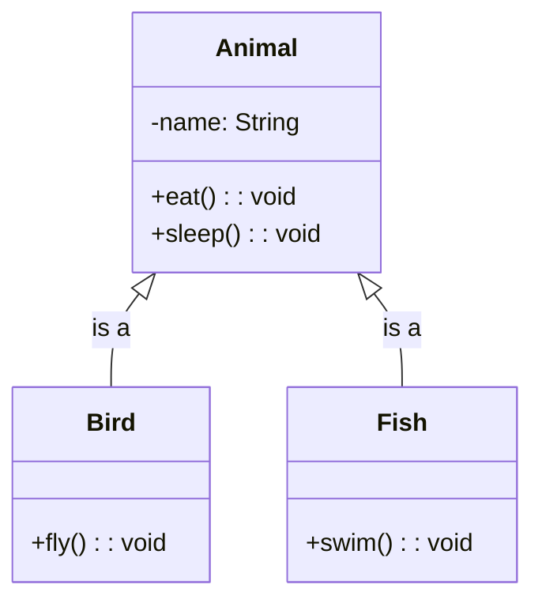
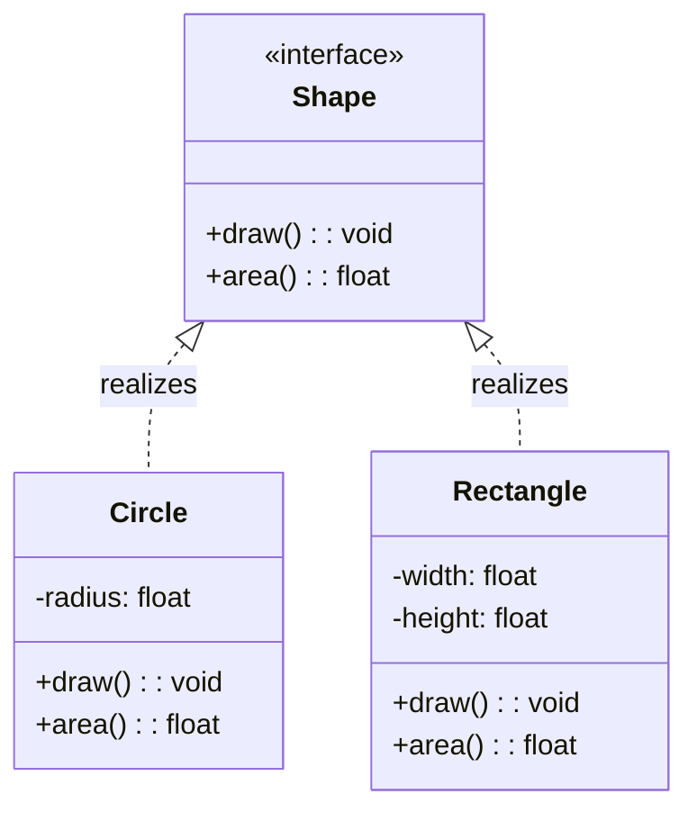
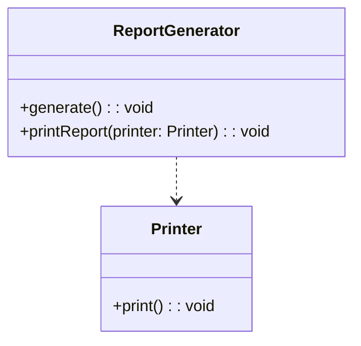
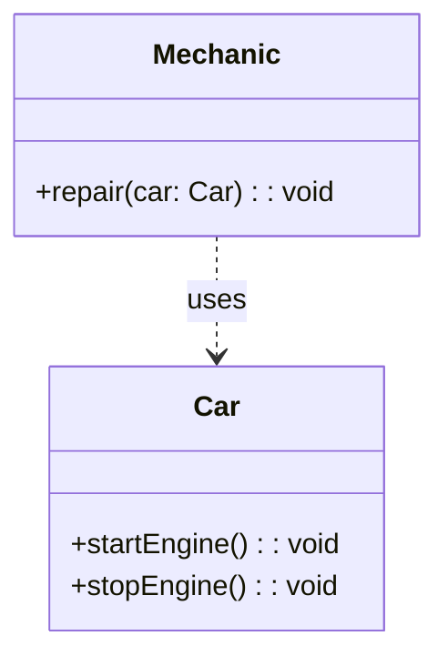
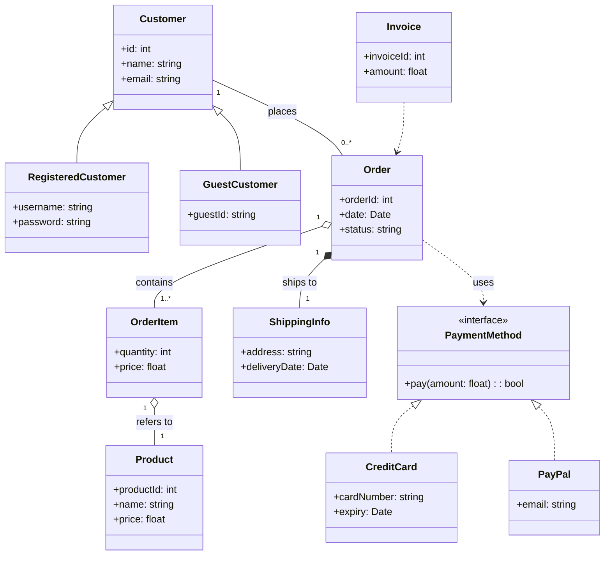

# UML Class Diagram

## What is a UML Class Diagram?

A UML (**Unified Modeling Language**) class diagram is a **visual representation of classes** and their **relationships** in an object-oriented system. It helps in **understanding the structure** of the system, showing **how classes interact** with each other.
- Class name
- Attributes (properties)
- Methods (functions)
- Relationships (associations, inheritance, etc.)

## UML Class Notation

The **class notation** includes:
- Class name
- Attributes
- Methods
- Visibility:
  - `+` Public
  - `-` Private
  - `#` Protected

## Relationships between Classes

### Association

**Association** represents a **bi-directional (two-ways relationship) relationship between two classes** where one class uses or interacts with another. It is a **one-to-one or one-to-many relationship**. It typically means **uses**, **has-a**, **works with**, or **belongs to**.
- **Permanent reference between classes**. This means one class holds a reference to another class as part of its state or structure, not just temporarily within a method

Example: Suppose a `Car` has a `Engine` and `Wheel`. This is an association because a car object is associated with an engine object and multiple wheel objects.
- Each `Car` has one `Engine` and each `Engine` **belongs to** one `Car`
- Each `Car` contains multiple `Wheels` and each `Wheel` **belongs to** one `Car`

Another example is that `Library` has many `Books`. The association is bi-directional, meaning the `Library` contains multiple `Books`, and each `Book` **belongs to** one `Library`.

### Directed Association

A **directed association** is a **one-way (unidirectional) relationship** where one class points to another, indicating that one class uses or interacts with another.

Example: Suppose a `Driver` drives a `Car`. The association is directed from `Driver` to `Car`, meaning the `Driver` uses the `Car`, but this car **does not necessarily belong** to the `Driver`.

Another example is that `Teacher` teaches this `Course`. The association is directed from `Teacher` to `Course`, meaning the `Teacher` teaches the `Course`, but this course **does not necessarily belong** to the `Teacher`.

### Aggregation

**Aggregation** represents a **part-of relationship** where one class is a **whole** and another class is a **part**. It is a **one-to-many relationship** where the part can **exist independently** of the whole.

Example: A `Team` consists of multiple `Players`. The `Team` is the whole, and the `Players` are the parts. If the `Team` is deleted, the `Players` can still exist independently.

Another example is that `Department` has many `Employees`. The `Department` is the whole, and the `Employees` are the parts. If the `Department` is deleted, the `Employees` can still exist independently.

### Composition

**Composition** is a special type of aggregation that represents a **strong part-of relationship** where the part **cannot exist independently** of the whole. It is a **one-to-many relationship** where the part is **tightly coupled** with the whole. If the **whole is deleted**, the **parts are also deleted**.

Example: A `House` consists of multiple `Rooms`. The `House` is the whole, and the `Rooms` are the parts. If the `House` is destroyed, the `Rooms` are also destroyed.

Another example is that `Book` has many `Chapters`. The `Book` is the whole, and the `Chapters` are the parts. If the `Book` is deleted, the `Chapters` are also deleted.

### Generalization (Inheritance)

**Generalization** (also known as **inheritance**) represents a **is-a relationship** where one class (subclass or child) && from another class (superclass or parent). The subclass inherits the attributes and methods of the superclass, allowing for **code reuse and polymorphism**. 

Example: A `Bird` is a type of `Animal`, and a `Fish` is also a type of `Animal`. Both `Bird` and `Fish` inherit from the `Animal` class.

Another example is that `Vehicle` is a type of `Transport`. The `Vehicle` class inherits from the `Transport` class, allowing it to reuse its attributes and methods.

### Realization (Interface)

Realization represents a **contract** between a class and an interface. A class that implements an interface must provide **concrete implementations** for the methods defined in the interface. This allows for **polymorphism** and **code flexibility**.

Example: A `Shape` interface defines methods for drawing and calculating the area, and classes like `Circle` and `Rectangle` implement this interface.

Another example is that `Vehicle` interface defines methods for starting and stopping, and classes like `Car` and `Bike` implement this interface.

### Dependency

**Dependency** represents a **depends on relationship** where one class **depends/relies on another class** to function correctly. Meaning that an object of one class might use an object of another class in the code of a method or temporarily within its code. It is considered a **weak relationship** because the dependent (Client) class is only affected if the supplier class changes. They are **not tightly coupled**, but changes in the supplier can **still impact the client**.
- If the **supplier class changes** (for example, its interface, method signatures, or behavior), the **client class may need to be updated** to work with those changes

<Callout title="More Information">
  You can consider dependency relationship is **loosely coupled**, as the client class uses the supplier class **temporarily** and **does not maintain a permanent reference** to it. This means the classes are **not tightly bound together**, making the relationship weak and flexible. However, changes in the supplier class (like method signatures) can **still require updates** in the client class.
</Callout>

Example: A `ReportGenerator` class generates reports and uses a `Printer` class to print the reports. The `ReportGenerator` depends on the `Printer` to perform its function.
- `ReportGenerator` - **Client**
- `Printer` - **Supplier**

Another example is that `Person` class depends on the `Book` class to read books. However, the `Book` class does not depend on the `Person` class, meaning the `Book` can exist independently without the `Person`.

### Usage (Dependency)

<Callout title="More Information">
  **Same concept as Dependency**, but with a **focus** on **temporary usage**.
</Callout>

**Usage Dependency** is a type of dependency where one class (the client) uses another class (the supplier) for a **specific purpose**, usually within a method or temporarily. The client does not maintain a permanent reference to the supplier.

Example: A `Mechanic` class repairs a `Car`. The `Mechanic` uses the `Car` to perform repairs, but the `Car` does not depend on the `Mechanic`.
- `Mechanic` - **Client**
- `Car` - **Supplier**

Another example is that `Chef` class cooks a `Dish`. The `Chef` uses the `Dish` to prepare a meal, but the `Dish` does not depend on the `Chef`.

## Full Example

### Order Management System

1. **Generalization (Inheritance)**
    - `RegisteredCustomer` and `GuestCustomer` both inherit from `Customer`.
    - Meaning: Both types of customers share common attributes (like id, name, email) but also have their own specific attributes.

2. **Realization (Interface Implementation)**
    - `PaymentMethod` is an interface.
    - `CreditCard` and `PayPal` implement the PaymentMethod interface.
      - Meaning: Both payment types must provide a `pay(amount: float): bool` method.

3. **Association**
    - `Customer "1" -- "0..*" Order : places`
      - Meaning: One customer can place multiple orders; each order is placed by one customer.

4. **Composition**
    - `Order "1" *-- "1" ShippingInfo : ships to`
      - Meaning: Each order has one shipping info, and if the order is deleted, its shipping info is also deleted (strong ownership).

5. **Aggregation**
    - `Order "1" o-- "1..*" OrderItem : contains`
      - Meaning: An order contains multiple order items, but order items can exist independently of the order.
    - `OrderItem "1" o-- "1" Product : refers to`
      - Meaning: Each order item refers to a product, but products exist independently of order items.

6. **Dependency**
    - `Invoice ..> Order`
      - Meaning: An invoice is generated from an order, but the invoice does not own the order.

7. **Usage Dependency**
    - `Order ..> PaymentMethod : uses`
      - Meaning: An order uses a payment method to process payment (The `Order` just needs a `PaymentMethod` to complete the payment operation), but does not own the payment method.
