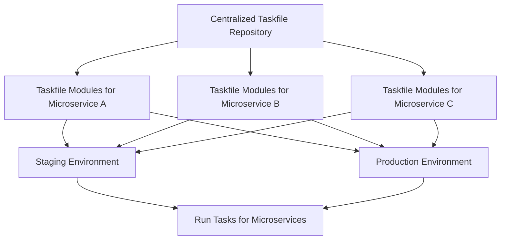

# Taskfile Overview

## What is Taskfile?

<Callout title="Repository">
  - https://github.com/go-task/task
  - https://taskfile.dev
</Callout>

Taskfile is a **simple task runner** for **automating** tasks in your **development workflow** and **streamline your tasks**. It is designed to be simpler and easier to use than other traditional tools like GNU Make.

## Benefits of Taskfile

- **Easy to installation**: It's written in **Go** and comes as a single binary **without any other dependencies**, which means, you just need to **download a single binary** and add it to your `$PATH` to get started.
- **Portability**: Taskfile is a **single binary** that can be run on any platform (Linux, macOS, Windows) without any dependencies.
- **Flexibility**: The developer can **choose which tasks to run and in which order**. You can also **define dependencies** between tasks, so that one task can **depend on the completion** of another task.

## Why Taskfile is important for DevOps Engineer in CI/CD?

We know that DevOps Engineer will be responsible for managing different deployment environment like **staging**, **production**, and **testing**. Sometimes, it could be a **pain** to **manage same/different tasks** in different environment.

Assuming, you have the project with multiple microservices in different environment, and each microservice has its **own set of tasks to run**. In this case, you can use **Taskfile** to define the tasks for each microservice in a single file, and then run the tasks for each microservice in the desired environment.

For example, you can centralize the **Taskfile modules** for different tasks in a **single repository**, and then you can **reuse** the **same Taskfile modules** for different microservices. This way, you can **avoid duplicating the same tasks in different microservices**, and you can also easily update the tasks in a single place. Also, you don't have to worry about managing the tasks for each microservice separately.
