import { Callout } from 'nextra/components';
import Comments from '@/components/Comments';

# Architecture

## Cluster Architecture

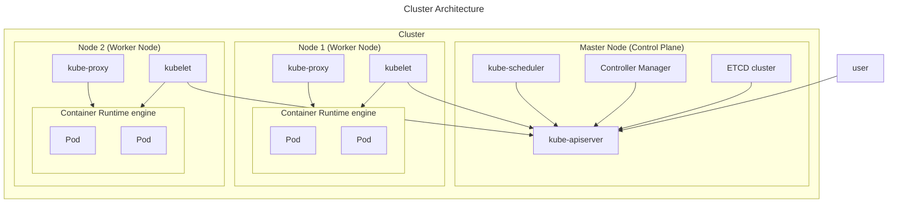


Each Kubernetes cluster has a **master node** (control plane) and one or more **worker nodes**. It's responsible for **managing the cluster**, while the worker nodes (Nodes) are responsible for **hosting application as containers** and **running the applications**.

<Callout type="info" emoji="ℹ️">
  Kubernetes supports other runtime engines that adhere to the OCI standards, like containerd or Rocket, so it is not necessary to install Docker before installing Kubernetes.
</Callout>

Here is an **overview** of Kubernetes cluster.
- The cluster has **master and worker nodes**, both serve different purposes.
- Master node
  - **ETCD Cluster** is used to **store information** regarding the **cluster**.
  - **kube-controller-manager** is used to **manage various controllers**, each controller, each controller has different functions to take care of its side.
  - **kube-scheduler** is used to **identify and schedule** the pods on nodes. It **only decides** which pod goes to which node.
  - **kube-apiserver** is used to **orchestrate (manage) all cluster operations** and it's the **primary management component** in Kubernetes which **acts as the frontend** to the cluster.
- Worker node
  - **kubelet** is used to **register the node** with the **kube-apiserver**. It will **create the pod** on the node when it **receives the instructions** from the **kube-apiserver**, and **monitor the node** and **container/pod state**.
  - **kube-proxy** is used to **create appropriate routing rules** when a new service is created to **establish communication** between containers via services within the cluster.

### Cluster

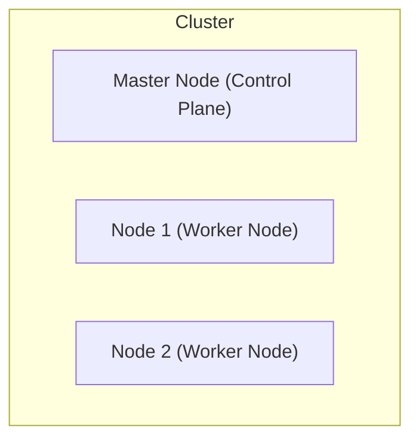

A cluster is a **set of nodes grouped**, with multiple nodes within a cluster, it can help to **distribute** or **share** the **workload** as well. As a result, your application will still be **accessible** even if one of the nodes **fails**.

### Nodes

A node is a **worker machine**, it can be either a physical or virtual one depending on the Kubernetes cluster. Each of the node is **managed by the control plane** (master node) and a node can have **multiple pods** within it. This is where **containers will be launched** by Kubernetes.

### Master node (Control Plane)

<Callout type="info" emoji="ℹ️">
  Master node can be **hosted** in the form of **containers**.
</Callout>

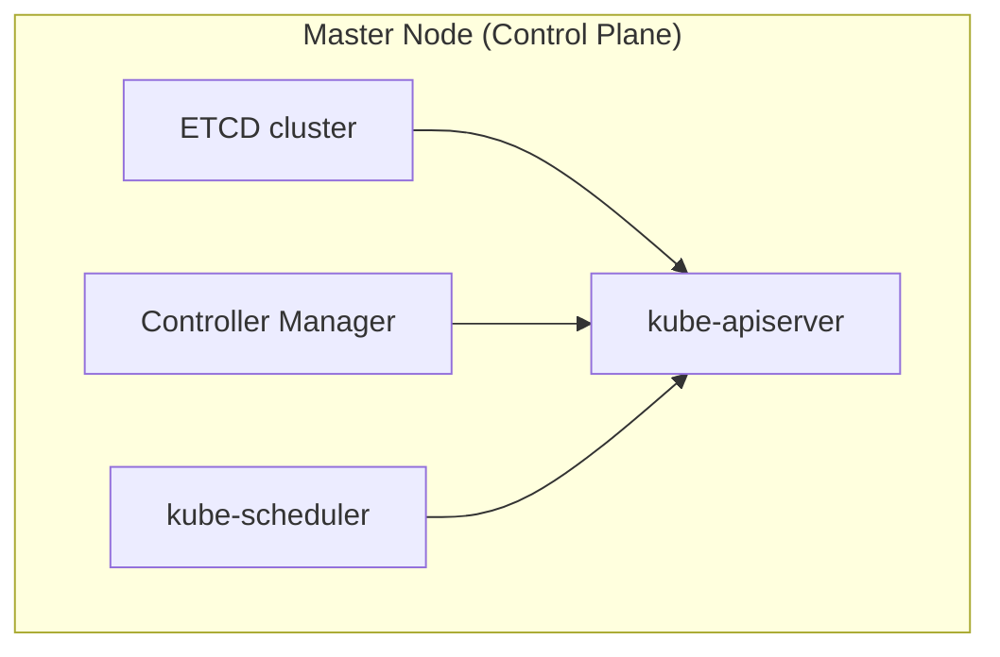

A master node is a **node** that is **responsible** for;

- **managing** the cluster
- **managing**, **planning**, **scheduling**, and **monitoring** the nodes
- **storing** the information regarding the **cluster** such as nodes, pods, configs, etc
- **transferring** the **workload** of the **failed node** to another **worker node**

These tasks are performed by the master node through a set of **components** known as the control plane components.

- ETCD Cluster
- kube controller manager
- scheduler (kube-scheduler)
- kube-apiserver

#### ETCD Cluster

[Reference](https://etcd.io/)

ETCD is a **distributed, reliable key-value stored database** to store **information** regarding the **cluster** such as the nodes, pods, configs, secrets, accounts, roles, bindings, and others in a **key-value format (JSON)**.

All information you see when you run the `kubectl get` command is from the **ETCD server**. Remember all changes made to the cluster like adding additional nodes, deploying pods, etc, will be **updated** in the **ETCD server**.

There are two ways to deploy ETCD in Kubernetes environment.

- Manual installation

  - [ETCD releases](https://github.com/etcd-io/etcd/releases)
  - [ETCD installation instructions](https://etcd.io/docs/v3.5/install/)
    - `--advertise-client-urls 'http://{IPADDRESS}:2379'` = This is the address that ETCD listens, `2379` is the **default port** of ETCD listens. `kube-apiserver` will use this URL when trying to connect to ETCD, so this URL has to be configured on **kube-apiserver configuration file**.

- kubeadm
  - 
    Normally, we set up our cluster using `kubeadm` tool, the `kubeadm` tool will auto-deploy the ETCD server as a Pod in the `kube-system` namespace. Of course, you can `exec` into that pod to use the `etcdctl` command.
    - `kubectl exec etcd-controlplane -n kube-system -- etcdctl get / --prefix --keys-only`. With this command, you can get all keys stored by Kubernetes, you will notice the root directory is the **registry**, and below that are various Kubernetes objects like nodes, pods, deployments, etc, as it stores data in a specific directory structure.

#### Kube Controller Manager

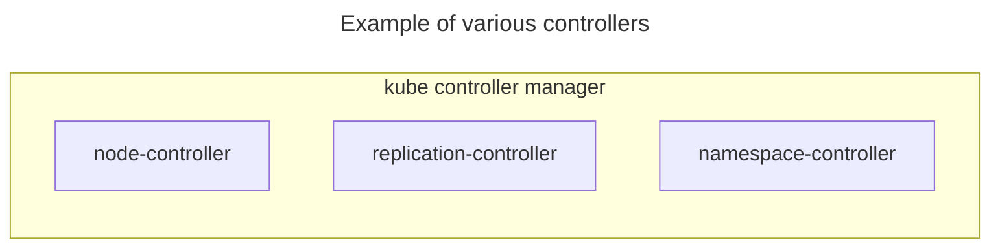

The kube controller manager **manage various controllers** in Kubernetes, for example;

- node-controller
- replication-controller
- namespace-controller
- deployment-controller
- endpoint-controller
- job-controller, etc

The controller is a **process** that is responsible for **monitoring the state** of various components and **resolving situations** as necessary to the **desired state**. There are two ways to deploy kube controller manager in Kubernetes environment.

- Manual installation

  - [kube controller manager releases](https://kubernetes.io/releases/download/)

- kubeadm
  - Similar to above, we can use `kubectl get pods -n kube-system` command to find the **kube controller manager pod**.
  - Run on control-plane (master node)
    - If you want to see the kube-controller-manager pod config options, then you have to `cat /etc/kubernetes/manifests/kube-controller-manager.yaml`.
    - If you want to see the kube-controller-manager service options, then you have to `cat /etc/systemd/system/kube-controller-manager.service`.
    - If you want to see the kube-controller-manager running process, then you have to `ps -aux | grep kube-controller-manager`.

##### Node-controller

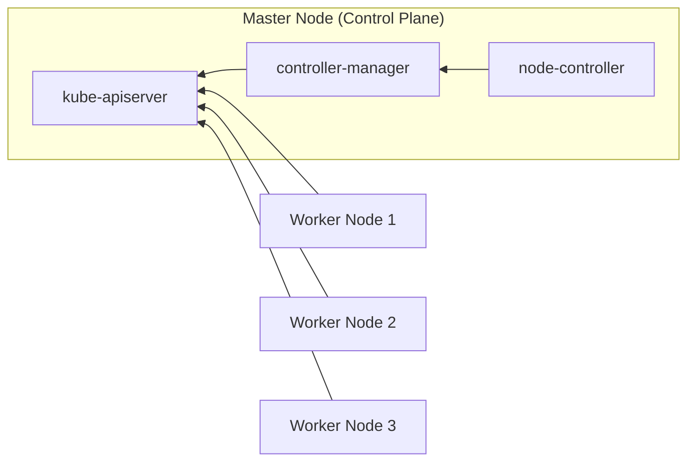

The node controller **monitors node status** and **takes necessary action** to ensure that **applications** are **running** through the **kube-apiserver**.


Nodes are **tested every 5 seconds** to ensure the node is **healthy** by the node controller. After **40 seconds** of **not receiving heartbeats** from a node, it **marks the node as unreachable**. The system **gives a node 5 minutes to return** after it has been marked unreachable. As a result, if the **PODs** are **part** of a **replicaset**, those pods will be **removed** from that node and will be **provisioned** those pods on the **healthy nodes**.

##### Replication-controller

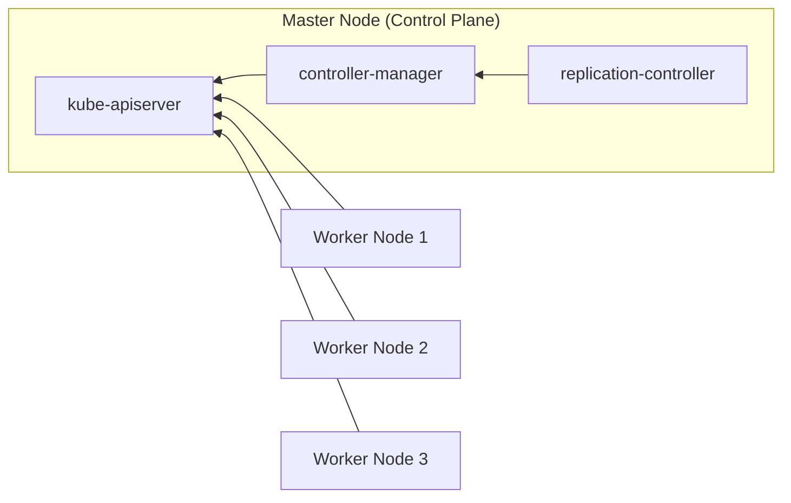

The replication controller **monitors the replicaset status** and **takes necessary action** to ensure that the **desired number of PODs** are **available** at all times within the replication group. The POD creates a new one if it dies.

#### Kube Scheduler

<Callout type="info" emoji="ℹ️">
  <div>It only **decides** which pod goes to which node. Additional add-on</div>
  <ul className="list-disc pl-9">
    <li>Taints and tolerations</li>
    <li>Node Selectors</li>
    <li>Node Affinity</li>
  </ul>
</Callout>

The kube scheduler **identifies** and **schedules** the **pods** on **nodes** based on the **pod resource requirements**, but it does **not place** the pod on the nodes. The **kubelet** is the one who will **place** and **create** the pod on the node.

The reason why we need a scheduler is because there could be **different sizes of nodes and pods**. You will need to ensure that the **node** has **sufficient resources** so that the **pod** can **proceed**. Therefore, each pod is **analyzed** by the scheduler to **determine the best node**.

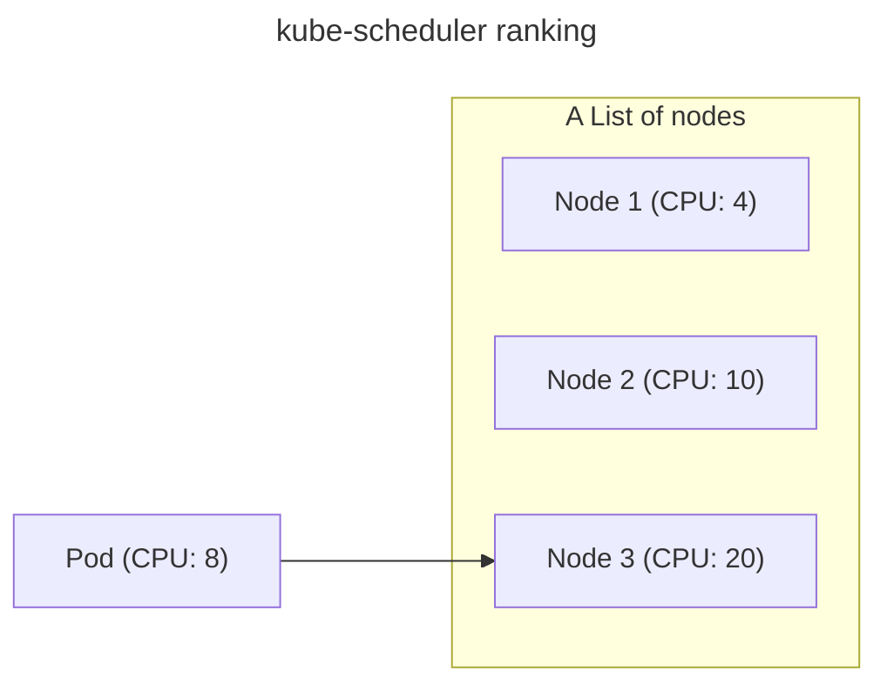
Here is an example, currently we have one pod with **CPU requirements of 10**. The kube scheduler will be going through **2 phases** to identify and schedule the pod on the **best node**.

1. The kube scheduler will **filter out** those **nodes** that **do not fit the requirements**. So in this case, node 1 will be filtered out as node 1 only has 4 CPUs.
2. (**Rank nodes**) By using a **priority function** or class, the kube scheduler **assigns a score** and **calculates** how much **free space** is available on the nodes after the pod is placed. The **highest score** after calculation will place the pod on that node.
   - Assuming the priority score is **5**
     - Score on node 2 = `10 - 5 = 5`
     - Score on node 3 = `20 - 5 = 15` (Win)

There are two ways to deploy kube scheduler in Kubernetes environment.

- Manual installation

  - [kube scheduler releases](https://kubernetes.io/releases/download/)

- kubeadm
  - Similar to above, we can use `kubectl get pods -n kube-system` command to find the **kube scheduler pod**.
  - Run on control-plane (master node)
    - If you want to see the kube-scheduler pod config options, then you have to `cat /etc/kubernetes/manifests/kube-scheduler.yaml`.
    - If you want to see the kube-scheduler running process, then you have to `ps -aux | grep kube-scheduler`.

#### Kube API Server

<Callout type="info" emoji="ℹ️">
  It **orchestrates (manage) all cluster operations**. The **Kubernetes API** is
  **exposed** for **external users** to **manage the cluster**, as well as for
  the **controllers** to **monitor the state of the cluster** and make the
  necessary changes, and for the **worker nodes** to **communicate with the
  server**.
</Callout>

In Kubernetes, the kube-apiserver is the **primary management component**, which **acts** as the **frontend** to the **cluster**, that means **all internal** (controller-manager, ETCD, kube-scheduler, kubelet) and **external communication** to the cluster is **via** the **kube-apiserver** component.

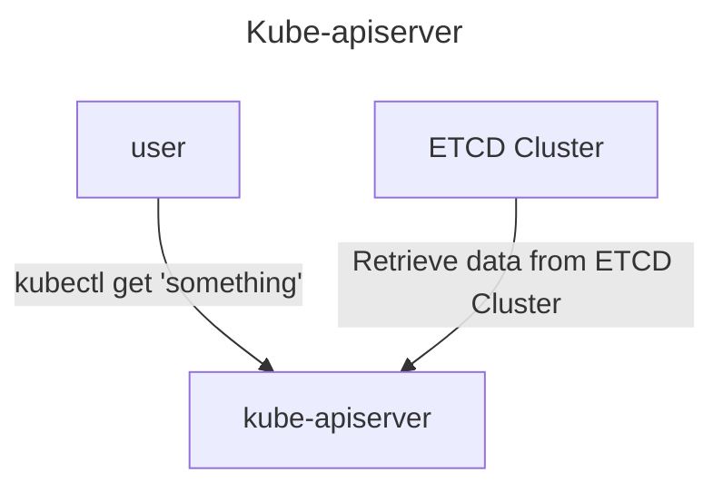

All the `kubectl` commands will first reach to the **kube-apiserver**. There are some steps that **kube-apiserver** to go through. These 3 steps normally are for `kubectl get <something>`.

1. **Authenticate** the request
2. **Validate** the request
3. **Retrieve** the data from **ETCD cluster** and returns the requested information

```bash
# Reference: https://kubernetes.io/docs/reference/kubernetes-api/workload-resources/pod-v1/
curl -X POST /api/v1/namespace/default/pods
```
Of course, you can interact with **kube-apiserver** by calling the API directly instead of using `kubectl` command. Here is an another example of creating a pod.

1. **Authenticate** the request
2. **Validate** the request
3. **Retrieve** the data from **ETCD cluster**
4. **Create** a Pod Object without the node assign, **update** the **information** in the **ETCD server**, and **return** the information (Pod has been created) back to the user
5. The **scheduler** will **identify and schedule** the pod on node by monitoring the kube-apiserver and **return** the information back to **kube-apiserver**. After that, the kube-apiserver will **update the information** in the **ETCD cluster**
6. The kube-apiserver will **send** that information to the **appropriate worker node** in the **kubelet**
    1. The **kubelet** will **create the pod** on the node and **tell the container runtime engine** to **deploy** the application image.
    2. After everything is completed, the **kubelet** will **update the status back** to the **kube-apiserver** and the kube-apiserver will **update the information** in the **ETCD cluster**

All these steps are very similar when every time a change is requested and the only component that **directly interacts** with **etcd** is **kube-apiserver**. **Scheduler**, **kube-controller manager**, and **kubelet** **use** the **kube-apiserver** to **perform updates** in their respective areas of the cluster. 

There are two ways to deploy kube-apiserver in Kubernetes environment.

- Manual installation

  - [kube-apiserver releases](https://kubernetes.io/releases/download/)

- kubeadm
  - Similar to above, we can use `kubectl get pods -n kube-system` command to find the **kube-apiserver pod**.
  - Run on control-plane (master node)
    - If you want to see the kube-apiserver pod config options, then you have to `cat /etc/kubernetes/manifests/kube-apiserver.yaml`.
    - If you want to see the kube-apiserver running process, then you have to `ps -aux | grep kube-apiserver`.
    - If you want to see the kube-apiserver service, then you have to `cat /etc/systemd/system/kube-apiserver.service`

### Worker node (Workers)

#### kubelet

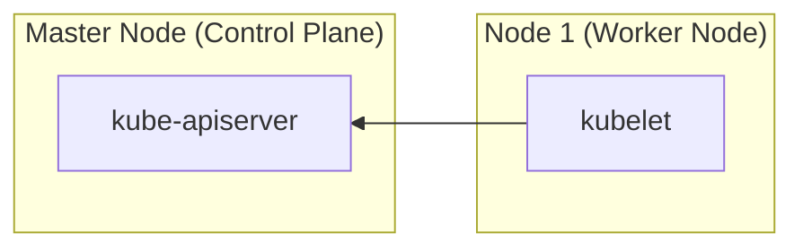

The **kubelet** is an **agent** that **runs** on **each node** in the **cluster**. It will **register the node** with the **kube-apiserver** when it exists in worker node. It will **listen the instructions** from the **kube-apiserver**, when it **receives the instructions** to **deploy a container** or **pod** on the node, it will **create the pod** on the node and **tell the container runtime engine** to **pull** the required image and **run** as an application instance. Lastly, after everything is completed, the kubelet will **update the status back** to the kube-apiserver and the kube-apiserver will **update the information** in the ETCD cluster.

Besides, the kube-api server **retrieves kubelet status reports** periodically to **monitor the node** and **container/pod state**. Lastly, kubelet **ensures a specific number of pods** are **available** on a single node.

Summary;
- Register node
- Create Pod
- Monitor node & PODs

By default, **kubelet** is **not automatically deploy** by **kubeadm** tool. So, you have to install it manually on the worker nodes. Refer to this link for [kubelet installation](https://kubernetes.io/docs/setup/production-environment/tools/kubeadm/install-kubeadm/#installing-kubeadm-kubelet-and-kubectl).

If you want to see the kubelet running process, then you have to `ps -aux | grep kubelet`.

#### kube-proxy

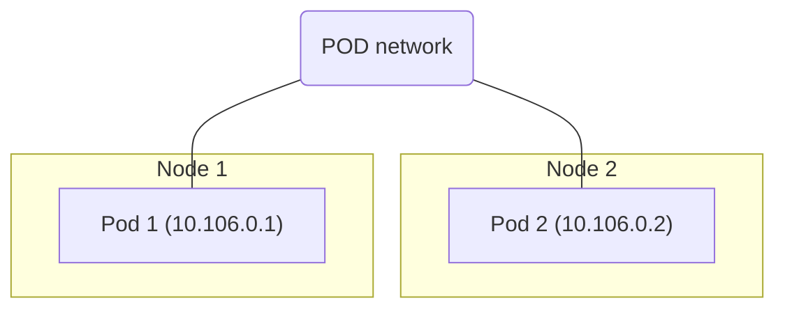

Every pod can **reach other pods** within a Kubernetes cluster by **deploying a pod networking solution**. A pod network is an **internal virtual network** connecting all nodes in a cluster so that the pods can **communicate with each other**. In this example, assuming Pod 1 is an API application and Pod 2 is the database. Pod 1 can access Pod 2 using the Pod 2 IP address, but the Pod 2 IP will **not be guaranteed** the same as always.

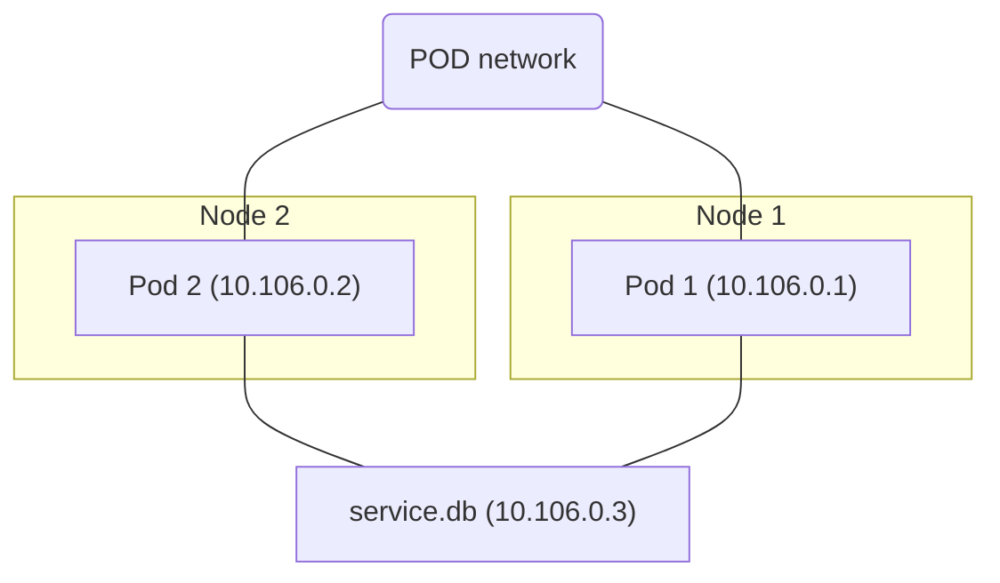

So, we have to create a Kubernetes **service** object that **exposes** the database across the cluster, which means Pod 1 (API application) can access Pod 2 (database) by using the **service name** and the **service** will also **assign an IP address**. 

<Callout type="warning" emoji="ℹ️">
  But how does the service get its IP address? Does the service join the same pod network as well?
</Callout>

Unfortunately, it **does not join the pod network**. Here is the explanation.
- Service objects are **not actually objects**: they have **no interfaces or active listening processes**, and they are **virtual components** within Kubernetes that only **live in memory**, so they cannot join the pod network.

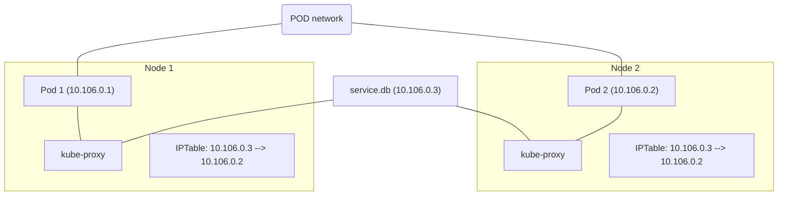

However, we also stated that the service should be accessible from any node in the cluster. With the help of **kube-proxy**, we can achieve that. Each node in the Kubernetes cluster **runs Kube-proxy**, which **looks for new services** and **creates appropriate routing rules** on the worker nodes to **forward traffic** to the **new services to pods** whenever a new service is created. It will ensure that the containers can **talk to each other via services** within the cluster.

This can be done through **IPTables rules**. It will **create an IPTable rules** on each node in the cluster to know that the Database service is actually **point** to Pod 2 (database), **10.106.0.3 ---> 10.106.0.2**. This is how kube-proxy configures a new service.

How to deploy kube-proxy?

- kubeadm
  - Similar to other Kubernetes components, we can use `kubectl get pods -n kube-system` command to find the **kube-proxy pod**.
  - Do take note that, kube-proxy is actually deployed as a **Daemonset**, so the kube-proxy pod **will always be deployed** on each new node in the cluster.
    - `kubectl get daemonset -n kube-system`

<Comments />
