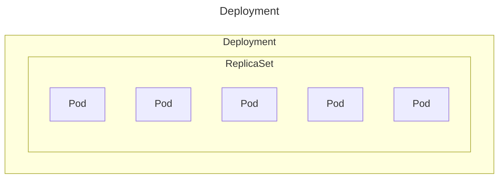
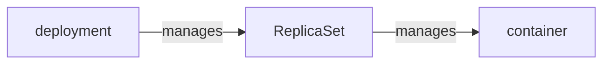
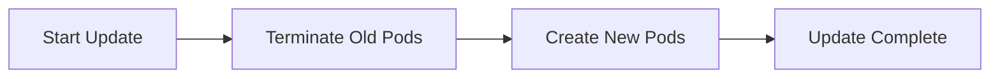
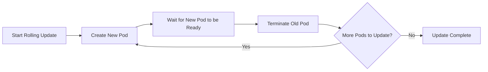

import { Callout } from 'nextra/components';
import Comments from '@/components/Comments';

# Deployment

## What is Deployment?



Deployment is a **higher-level abstraction** that **manages a set of replicas** of the application. It will ensure the desired number of replicas are running and available, just like ReplicaSet, but it offers **more features** like **rolling updates** and **rollbacks**.



Here is an example, currently you have 3 instances of an application, you want to upgrade them, but you don't want to upgrade all of them at once and you want to update it one by one. This is where Deployment comes into play and this upgrade process is called **rolling update**.

```yaml showLineNumbers filename="deployment.yaml"
apiVersion: apps/v1
kind: Deployment
metadata:
  name: app-deployment
spec:
  replicas: 3
  selector:
    matchLabels:
      app: backend
  template:
    metadata:
      name: app-pod
      labels:
        app: backend
    spec:
      containers:
        - name: backend-container
          image: backend:1.0
```

```bash
kubectl get deployments
kubectl create deployment <deployment-name> --image=<image-name> --replicas=<number-of-replicas>
kubectl create deployment backend --image=web:1.0 --replicas=3
```

## Rollout and Rollback (Revert/Undo)

Deployment **rollout** and **rollback** allows the developer to **update** the **application without downtime** and can **revert back to previous versions** as needed.

**Rollout**
- A process of **updating the application** to a new version.
- It will **gradually replace the old pods with new ones**, ensuring that the application remains available during the update.

**Rollback**
- A process of **reverting to a previous version** of the application **if something goes wrong** during the rollout.

Here is an process, when you first create a deployment, it will trigger a rollout. When you update the deployment, it will trigger another rollout. If something goes wrong, you can rollback to the previous version.

```bash
# get the status of rollout
kubectl rollout status deployment/<deployment-name>

# get the revisions and history of rollout
kubectl rollout history deployment/<deployment-name>

# Check the status of each revision individually
kubectl rollout history deployment/<deployment-name> --revision=<revision-number>
kubectl rollout history deployment/app-deploy --revision=1

# rolling update (rollout)
kubectl set image deployment/<deployment-name> <container-name>=<new-image-name>
kubectl set image deployment/app-deployment backend-container=backend:2.0

# in some cases, when you perform rollout history, you will see "change-cause" field is empty
# so, you can use --record flag to save the command used to create/update the deployment against the revision number
kubectl set image deployment/<deployment-name> <container-name>=<new-image-name> --record


# rollback (undo a change)
kubectl rollout undo deployment/<deployment-name>

# rollback to specific revision
kubectl rollout undo deployment/<deployment-name> --to-revision=<revision-number>
kubectl rollout undo deployment/app-deploy --to-revision=1
```

## Deployment Strategy

### Recreate Strategy



For recreate strategy, **all existing pods will be terminated** and **new pods** will be **created** with the **new configuration**. This will **cause downtime during the update**.

```yaml showLineNumbers filename="deployment.yaml"
apiVersion: apps/v1
kind: Deployment
metadata:
  name: app-deployment
spec:
  replicas: 3
  strategy:
    type: Recreate
  selector:
    matchLabels:
      app: backend
  template:
    metadata:
      name: app-pod
      labels:
        app: backend
    spec:
      containers:
        - name: backend-container
          image: backend:1.0
```

### Rolling update



Rolling update is the **default deployment strategy**. It will **gradually replaces old pods with new ones**. Therefore, it will **ensure the application available** during the **update process**, **minimizing downtime**.

```yaml showLineNumbers filename="deployment.yaml"
apiVersion: apps/v1
kind: Deployment
metadata:
  name: app-deployment
spec:
  replicas: 3
  strategy:
    type: RollingUpdate
    rollingUpdate:
      maxUnavailable: 1 # ensures that at most 1 pod can be unavailable during the update
      maxSurge: 1 # allows the deployment to create 1 additional pod above the desired number of replicas during the update.
  selector:
    matchLabels:
      app: backend
  template:
    metadata:
      name: app-pod
      labels:
        app: backend
    spec:
      containers:
        - name: backend-container
          image: backend:1.0
```

```bash
# rolling update (rollout)
kubectl set image deployment/<deployment-name> <container-name>=<new-image-name>
kubectl set image deployment/app-deployment backend-container=backend:2.0
```


<Comments />
