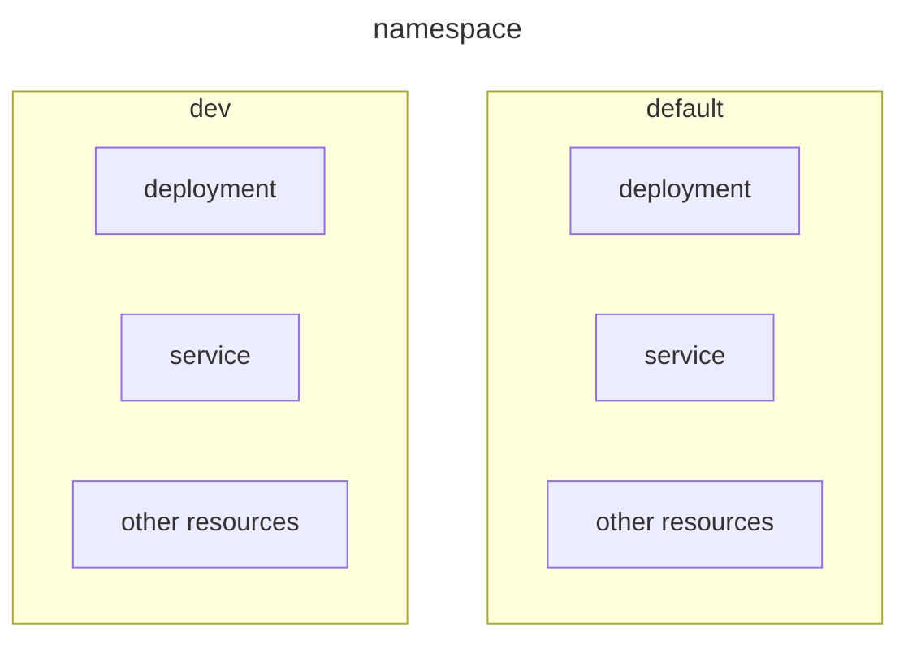
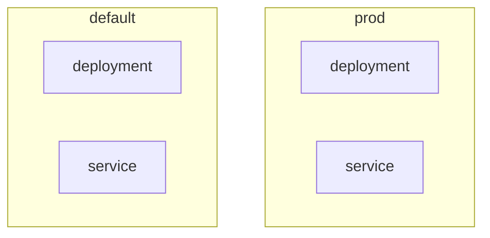

import Comments from '@/components/Comments';

# Namespace

## What is Namespace?



Namespace used to **isolate the resources** within a single cluster. Therefore, each namespace can have its **own policies, permissions (RBAC), resource control**, etc. In other words, it is used to **isolate the users' accessibility**.

By default, Kubernetes will automatically create 4 default namespaces:
- **default**
    - This is the namespace you can start to deploy the resources **without creating** a new namespace, when you start using the new cluster.

- **kube-system**
    - This is the namespace for **objects created by the Kubernetes system** for itsa internal purpose, for example, kube-dns, kube-proxy, kubernetes-dashboard, ingresses, etc.

- **kube-public**
    - Basically this namespace **contains the resources that is readable** and **visible publicly** by all users **without any authentication**.
    - Mostly reserved for **cluster usage**. `kubectl cluster-info`
    - It contains a single **ConfigMap** object, basically the cluster info is mainly used for **aids discovery** and **security bootstrap**. `kubectl get configmap -n kube-public`

- **kube-node-lease**
    - This namespace holds **Lease objects** associated with each **node**. That means **node leases** will allow the **kubelet** to **send heartbeats** so that the **control plane** (Master Node `<-` Node controller) can **detect node failure**.
    - Basically this namespace related to **cluster scaling**.

## Namespace usage

### Commands

```bash
kubectl get <resource> -n <namespace-name>
kubectl get <resource> --namespace=<namespace-name>
kubectl get <resource> --all-namespaces

# example
kubectl get pods -n dev

# create namespace
kubectl create namespace dev
```

### Switch namespace in current context permanently

If we want to **switch to other namespace permanently**, we can do the following commands, so that we **don't have to specify** the namespace option.

```bash
kubectl config set-context $(kubectl config current-context) --namespace=<namespace-name>

kubectl get <resource> # it will by default show your namespace environment resources
```

Context is a **set of access parameters** that define a **cluster**, **namespace**, and **user** in Kubernetes. They actually stored in YAML file `kubeconfig`, and are used to **manage multiple clusters or environments** from the same management system.

### Create a namespace in YAML

```yaml showLineNumbers
apiVersion: v1
kind: Namespace
metadata:
  name: dev
```

### Use namespace in resources YAML

```yaml showLineNumbers
apiVersion: v1
kind: Pod
metadata:
  name: sample-nginx-pod
  namespace: dev
spec:
  containers:
    - name: nginx
      image: nginx
```

### Connect to other namespace services



If you want to **connect** to other **namespace services**, then you have to **reference** the **DNS** of the respective namespace, as a **DNS entry** will automatically added in this **format** when the service is created. Here is the format;
- Format: `<service-name>.<namespace>.svc.cluster.local`
- Example: `db-svc.prod.svc.cluster.local`
  - `cluster.local` = **default domain name** of the Kubernetes cluster

### Resource quota for namespace

You can **limit the resources** to be used within a namespace. You can set each namespace with a **guaranteed amount** and **not use more than** the limit.

```yaml showLineNumbers
apiVersion: v1
kind: ResourceQuota
metadata:
  name: quota
  namespace: dev
spec:
  hard:
    pods: "15"
    requests.cpu: "2"
    requests.memory: 2Gi
    limits.cpu: "4"
    limits.memory: 4Gi
```

In this case, this `dev` namespace can only create a maximum of 15 pods. Each pod in the dev namespace will have 2 CPUs and 2G of memory, while the maximum CPU and memory limits are 4 and 4G, respectively.

<Comments />