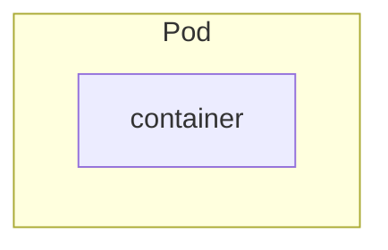
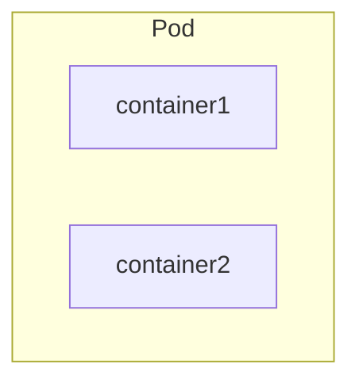

import Comments from '@/components/Comments';

# Pod

## What is Pod?



Pod is a **single instance of an application** and is the **smallest unit** of a Kubernetes application. It basically **wraps container** or provides an abstraction layer over container. Normally, pod is only run one application container inside it (**one-to-one relationship**).

Each pod will **get its IP address** and when the **pod is recreated**, then the new IP address will be assigned to that pod. So, the pod can **use its IP address** to **communicate** with each other pods using its **internal IP address**.

## Multi-container pods



Multi-container pods are like **helper containers**. The two or more containers can **communicate directly via localhost** as they **share the same network space**. Of course, they are **sharing the same storage space** as well.

## Commands

```bash
# Deploy nginx image to pod with the pod-name "nginx"
kubectl run <pod-name> --image=<image>

# Example
kubectl run nginx --image=nginx
kubectl run nginx --image=nginx --port=8000 # container exposes port
kubectl run nginx --image=nginx --port=8080 --expose # Create a cluster IP associated with the pod port number

kubectl get pods
kubectl get pod <pod-name>
kubectl describe pod <pod-name>
kubectl delete pod <pod-name>

kubectl exec <pod-name> -- <command>
kubectl exec mypod -- /bin/bash

kubectl apply -f <filename>
kubectl create -f <filename>

kubectl edit pod <pod-name>

# extract pod definition to a file
kubectl get pod <pod-name> -o yaml > pod.yaml

# get more pod information like IP address, etc
kubectl get pods -o wide
```

## Pod YAML File

Here is the sample pod YAML file, to apply this file, you need to type `kubectl apply -f pod.yaml`.

| Kind | Version |
| ---- | ------- |
| Pod | v1 |
| Service | v1 |
| ReplicaSet | apps/v1 |
| Deployment | apps/v1 |

```yaml showLineNumbers filename="pod.yaml"
apiVersion: v1
kind: Pod
metadata:
  name: myapp
  labels:
    name: myapp
spec:
  containers:
    - name: myapp
      image: nginx
      ports:
        - containerPort: 8080
```

<Comments />